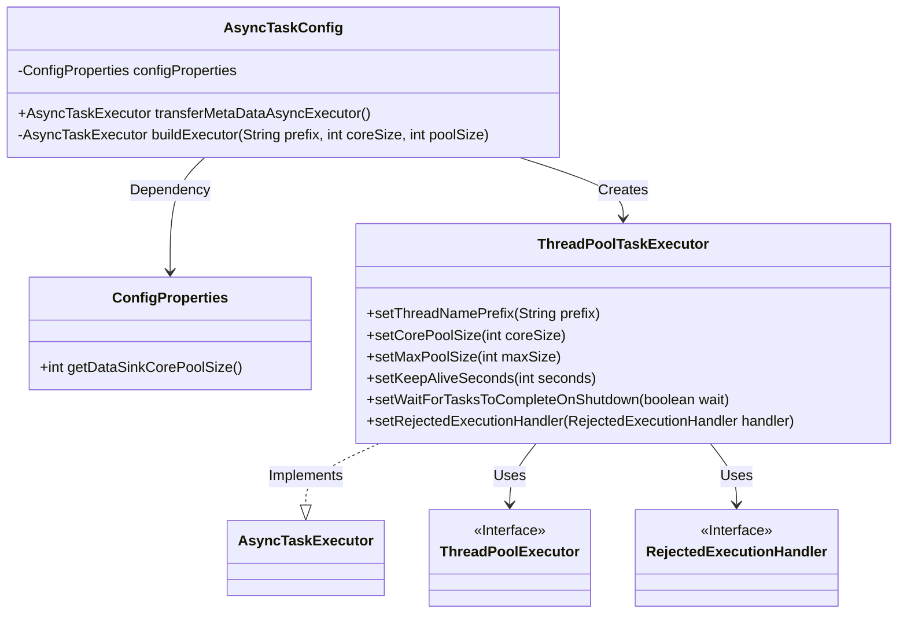
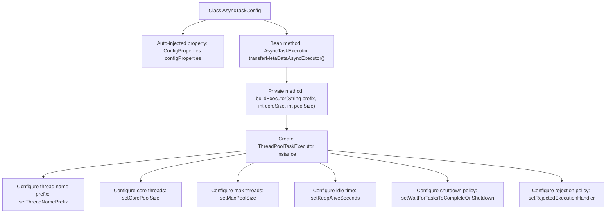

# Basic Information

|      |      |
|------|------|
| Name | AsyncTaskConfig |
| Language | .java |
| Code Path | WeFe/gateway/src/main/java/com/welab/wefe/gateway/config/AsyncTaskConfig.java |
| Package Name | com.welab.wefe.gateway.config |
| Dependencies | ['org.springframework.beans.factory.annotation.Autowired', 'org.springframework.context.annotation.Bean', 'org.springframework.context.annotation.Configuration', 'org.springframework.core.task.AsyncTaskExecutor', 'org.springframework.scheduling.concurrent.ThreadPoolTaskExecutor', 'java.util.concurrent.ThreadPoolExecutor'] |
| Brief Description | The configuration class AsyncTaskConfig defines an asynchronous task executor. The core thread count is retrieved from the configuration, the maximum thread count is the core count multiplied by 100, the thread name prefix is transferMetaDataAsyncExecutor-Thread-, it waits for tasks to complete upon shutdown, and the rejection policy is caller-runs. |

# Description

The configuration class defines an asynchronous task executor for handling data transfer tasks. It dynamically configures thread pool parameters, including core and maximum pool sizes, through injected configuration properties. The executor uses a custom thread name prefix, sets a 120-second keep-alive time for idle threads, and ensures task completion before shutdown. A caller-runs policy is adopted when tasks are rejected. This executor is optimized for metadata transfer tasks, with core threads determined by configuration and maximum threads set to 100 times the core thread count.

# Class Summary

| Name   | Type  | Description |
|-------|------|-------------|
| AsyncTaskConfig | class | The configuration class AsyncTaskConfig defines an asynchronous task executor named transferMetaDataAsyncExecutor. The core pool size and maximum pool size are determined by configuration properties, with the thread name prefix set as transferMetaDataAsyncExecutor-Thread-. It waits for tasks to complete upon shutdown, and the rejection policy is set to CallerRuns. |

## Class AsyncTaskConfig

|      |      |
|------|------|
| Access Modifier | @Configuration;public |
| Type | class |
| Name | AsyncTaskConfig |
| Description | The configuration class AsyncTaskConfig defines an asynchronous task executor named transferMetaDataAsyncExecutor. The core pool size and maximum pool size are determined by configuration properties, with the thread name prefix set as transferMetaDataAsyncExecutor-Thread-. It waits for tasks to complete upon shutdown, and the rejection policy is set to CallerRuns. |

### UML Class Diagram

This code demonstrates how the Spring configuration class AsyncTaskConfig creates a thread pool executor. The class injects ConfigProperties via @Autowired, uses the buildExecutor method to construct a ThreadPoolTaskExecutor instance, configures parameters such as thread name prefix, core/maximum thread count, and specifies the rejection policy as CallerRunsPolicy. The class diagram clearly illustrates the dependency relationships between the configuration class and thread pool components, as well as interface implementation relationships.

### Internal Method Call Graph

This code implements the Spring configuration class AsyncTaskConfig, whose primary function is to create and configure an asynchronous task executor. It obtains thread pool parameters through auto-injected ConfigProperties, invokes the buildExecutor method to construct a ThreadPoolTaskExecutor instance, and configures parameters such as thread name prefix, core/maximum thread count, idle keep-alive time, shutdown wait policy, and rejection policy. This configuration class provides a customizable thread pool solution suitable for scenarios requiring asynchronous task processing.

### Field List

| Name  | Type  | Description |
|-------|-------|------|
| configProperties | ConfigProperties | The code snippet uses @Autowired to automatically inject an instance of the ConfigProperties configuration class. |

### Method List

| Name  | Type  | Description |
|-------|-------|------|
| transferMetaDataAsyncExecutor | AsyncTaskExecutor | Create an asynchronous task executor named `transferMetaDataAsyncExecutor`, with the core thread count set to the configured `dataSinkCorePoolSize`, and the maximum queue capacity being 100 times the core thread count. |
| buildExecutor | AsyncTaskExecutor | Create a thread pool executor, configure the thread name prefix, core and maximum thread count, keep-alive time, shutdown wait for task completion, and rejection policy. |

