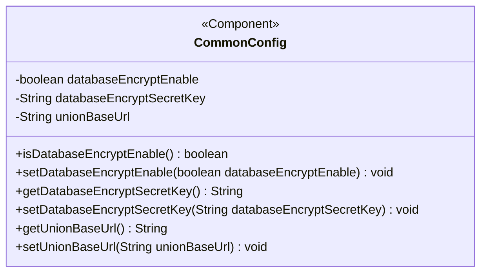
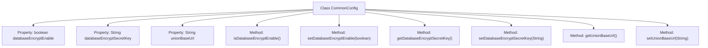

# Basic Information

|      |      |
|------|------|
| Name | CommonConfig |
| Language | .java |
| Code Path | WeFe/gateway/src/main/java/com/welab/wefe/gateway/config/CommonConfig.java |
| Package Name | com.welab.wefe.gateway.config |
| Dependencies | ['org.springframework.beans.factory.annotation.Value', 'org.springframework.boot.context.properties.ConfigurationProperties', 'org.springframework.context.annotation.PropertySource', 'org.springframework.stereotype.Component'] |
| Brief Description | The CommonConfig class includes configuration items for database encryption toggle, encryption keys, and federation base URLs, providing corresponding getter/setter methods. |

# Description

This is a Spring component class named CommonConfig, designed for managing common configurations. It includes three main configuration items: databaseEncryptEnable controls the database encryption feature switch (default off); databaseEncryptSecretKey stores the database encryption key; unionBaseUrl holds the base URL of the wefe alliance. The class provides getter and setter methods for each configuration item, enabling external access and modification of these parameters. All configurations are injected from external property files via the @Value annotation, with default values set.

# Class Summary

| Name   | Type  | Description |
|-------|------|-------------|
| CommonConfig | class | The CommonConfig class contains configuration items for database encryption toggle, keys, and base URLs, providing corresponding getter/setter methods. |

## Class CommonConfig

|      |      |
|------|------|
| Access Modifier | @Component("commonConfig");public |
| Type | class |
| Name | CommonConfig |
| Description | The CommonConfig class contains configuration items for database encryption toggle, keys, and base URLs, providing corresponding getter/setter methods. |

### UML Class Diagram

This code demonstrates a Spring component class `CommonConfig` designed to manage common configuration items for an application. The class contains three private fields: `databaseEncryptEnable` indicates whether database encryption is enabled, `databaseEncryptSecretKey` stores the encryption key, and `unionBaseUrl` holds the base URL for federation services. Access and modification of these configuration items are provided through getter and setter methods. The class is annotated with `@Component("commonConfig")`, marking it as a Spring-managed component that can be dependency-injected using the specified name "commonConfig". This configuration class primarily serves to centrally manage critical application parameters related to privacy protection and third-party service integration.

### Internal Method Call Graph

This code demonstrates a Spring component class CommonConfig, primarily used for managing application configuration parameters. The class contains three configuration properties injected via @Value annotation: database encryption switch (databaseEncryptEnable), database encryption key (databaseEncryptSecretKey), and union base URL (unionBaseUrl), each paired with corresponding getter and setter methods. These configuration items can be dynamically loaded from external configuration files, with default values set to false, empty string, and empty string respectively. This design achieves centralized configuration management and flexible modifications, adhering to Spring's dependency injection principles.

### Field List

| Name  | Type  | Description |
|-------|-------|------|
| unionBaseUrl | String | The code snippet defines a private String variable `unionBaseUrl`, which injects a value from the configuration property `wefe.union.base-url` via the `@Value` annotation, with an empty string as the default value. |
| databaseEncryptSecretKey | String | The code defines a private string variable `databaseEncryptSecretKey`, which is used to store the database encryption key with a default value of empty. |
| databaseEncryptEnable | boolean | Configuration item controls whether the database encryption feature is enabled, with a default value of false. |

### Method List

| Name  | Type  | Description |
|-------|-------|------|
| isDatabaseEncryptEnable | boolean | Check if database encryption is enabled, returns a boolean value. |
| setDatabaseEncryptEnable | void | Set the switch status of the database encryption function. |
| getUnionBaseUrl | String | The method returns the unionBaseUrl string value. |
| setDatabaseEncryptSecretKey | void | Method for setting the database encryption key, with the parameter being the key string. |
| setUnionBaseUrl | void | The method to set the joint base URL involves assigning the parameter unionBaseUrl to the class member variable unionBaseUrl. |
| getDatabaseEncryptSecretKey | String | The method to obtain the database encryption key, which returns a string-type key value. |

