# Basic Information

|      |      |
|------|------|
| Name | ConfigProperties |
| Language | .java |
| Code Path | WeFe/gateway/src/main/java/com/welab/wefe/gateway/config/ConfigProperties.java |
| Package Name | com.welab.wefe.gateway.config |
| Dependencies | ['org.springframework.beans.factory.annotation.Value', 'org.springframework.boot.context.properties.ConfigurationProperties', 'org.springframework.context.annotation.PropertySource', 'org.springframework.stereotype.Component'] |
| Brief Description | Configuration class, defining parameters such as gRPC port, message persistence type and directory, data write thread pool size, and batch insert data block size. |

# Description

This is a Java configuration class named ConfigProperties, designed to manage various configuration parameters of the application. The class extends CommonConfig and is annotated as a Spring component and configuration properties class. It loads configurations from external property files with UTF-8 encoding support. Key configurations include: internal and external port numbers for gRPC services; message persistence type (defaulting to local file system) and its corresponding temporary directory path; core thread pool size for big data processing (default 30); and data chunk fragment size (default 5M). The class provides getter and setter methods for each configuration field, supporting runtime modifications.

# Class Summary

| Name   | Type  | Description |
|-------|------|-------------|
| ConfigProperties | class | The configuration class ConfigProperties inherits from CommonConfig, defining attributes such as the gRPC port, message persistence type and directory, data write thread pool size, and batch insert data chunk size. |


## Class ConfigProperties

|      |      |
|------|------|
| Access Modifier | @Component;@PropertySource(value = {"file:${config.path}"}, encoding = "utf-8");@ConfigurationProperties;public |
| Type | class |
| Name | ConfigProperties |
| Description | The configuration class ConfigProperties inherits from CommonConfig, defining attributes such as the gRPC port, message persistence type and directory, data write thread pool size, and batch insert data chunk size. |


### UML Class Diagram

```mermaid
classDiagram
    class CommonConfig {
        <<abstract>>
    }

    class ConfigProperties {
        -Integer grpcServerInternalPort
        -Integer grpcServerExternalPort
        -String sendTransferMetaPersistentType
        -String sendTransferMetaPersistentTempDir
        -String recvTransferMetaPersistentType
        -String recvTransferMetaPersistentTempDir
        -int dataSinkCorePoolSize
        -double persistentStorageBatchInsertSize
        
        +String getSendTransferMetaPersistentTempDir()
        +void setSendTransferMetaPersistentTempDir(String)
        +String getSendTransferMetaPersistentType()
        +void setSendTransferMetaPersistentType(String)
        +String getRecvTransferMetaPersistentType()
        +void setRecvTransferMetaPersistentType(String)
        +String getRecvTransferMetaPersistentTempDir()
        +void setRecvTransferMetaPersistentTempDir(String)
        +int getDataSinkCorePoolSize()
        +void setDataSinkCorePoolSize(int)
        +double getPersistentStorageBatchInsertSize()
        +void setPersistentStorageBatchInsertSize(double)
        +Integer getGrpcServerInternalPort()
        +void setGrpcServerInternalPort(Integer)
        +Integer getGrpcServerExternalPort()
        +void setGrpcServerExternalPort(Integer)
    }

    CommonConfig <|-- ConfigProperties
    ConfigProperties --> "@Component" : Marked as Spring component
    ConfigProperties --> "@PropertySource" : Specifies configuration file
    ConfigProperties --> "@ConfigurationProperties" : Binds configuration properties
```

This code represents a Spring Boot configuration properties class that inherits from the abstract class CommonConfig. It centrally manages configuration parameters such as gRPC service ports, message persistence types/directories, and data sink thread pools. Property values are injected from external configuration files via @Value annotations, with complete getter/setter methods provided to support dynamic configuration updates. The class diagram illustrates its inheritance relationships, private fields, public methods, and associations with Spring annotations.


### Internal Method Call Graph

```mermaid
graph TD
    A["Class ConfigProperties"]
    B["Annotation: @Component"]
    C["Annotation: @PropertySource"]
    D["Annotation: @ConfigurationProperties"]
    E["Inheritance: CommonConfig"]
    F["Property: grpcServerInternalPort"]
    G["Property: grpcServerExternalPort"]
    H["Property: sendTransferMetaPersistentType"]
    I["Property: sendTransferMetaPersistentTempDir"]
    J["Property: recvTransferMetaPersistentType"]
    K["Property: recvTransferMetaPersistentTempDir"]
    L["Property: dataSinkCorePoolSize"]
    M["Property: persistentStorageBatchInsertSize"]
    N["Getter/Setter Methods"]

    A --> B
    A --> C
    A --> D
    A --> E
    A --> F
    A --> G
    A --> H
    A --> I
    A --> J
    A --> K
    A --> L
    A --> M
    A --> N
```



This flowchart illustrates the complete structure of the ConfigProperties class, a Spring configuration class that loads external property files through annotations and maps them to class attributes. The class inherits from CommonConfig and contains 7 main configuration properties (such as gRPC ports, persistence types, etc.), each implemented with @Value annotation for external configuration injection. All properties provide access interfaces through standard Getter/Setter methods, complying with JavaBean specifications. The annotation system enables modular and externalized configuration management.

### Field List

| Name  | Type  | Description |
|-------|-------|------|
| recvTransferMetaPersistentType | String | The configuration item `recvTransferMetaPersistentType` has a default value of `localFileSys`, which is used to set the persistence type for received transfer metadata. |
| sendTransferMetaPersistentTempDir | String | Configuration item: Temporary storage directory for sending transmission metadata, with path string injected via @Value. |
| grpcServerInternalPort | Integer | Configuration item: gRPC service internal port, injected via @Value, default value is empty, type is Integer. |
| grpcServerExternalPort | Integer | Configuration item `grpcServerExternalPort` injects the external gRPC service port number via `@Value`, with a default value of empty. |
| persistentStorageBatchInsertSize | double | The configuration item persistentStorageBatchInsertSize has a default value of 5, which is used for batch insert operations. |
| dataSinkCorePoolSize | int | The configuration item `data.sink.core.pool.size` has a default value of 30, defining the core size of the thread pool. |
| recvTransferMetaPersistentTempDir | String | Configuration item: Temporary storage directory for receiving transmission metadata, with the path string injected via the @Value annotation. |
| sendTransferMetaPersistentType | String | The configuration item `send.transfer.meta.persistent.type` has a default value of `localFileSys`, which is used to set the persistence type for sending transfer metadata. |

### Method List

| Name  | Type  | Description |
|-------|-------|------|
| getDataSinkCorePoolSize | int | Method to obtain the core thread count of the data pool, returns the value of dataSinkCorePoolSize. |
| setSendTransferMetaPersistentTempDir | void | Method for setting the temporary directory for sending transport metadata persistence. |
| setSendTransferMetaPersistentType | void | Set the persistence type method for sending transmission metadata, with the parameter being of string type. |
| setRecvTransferMetaPersistentTempDir | void | Method for setting the temporary directory for receiving and transmitting metadata persistence. |
| setPersistentStorageBatchInsertSize | void | Method for setting the batch insert size of persistent storage. |
| getRecvTransferMetaPersistentType | String | Obtain the persistence type method for receiving transmission metadata, returning a string type value. |
| getSendTransferMetaPersistentType | String | This method returns the persistence type string of the transmitted metadata. |
| getRecvTransferMetaPersistentTempDir | String | Get the persistent temporary directory path for receiving transmission metadata. |
| setDataSinkCorePoolSize | void | The method to set the core thread count of the data pool, with the parameter as dataSinkCorePoolSize. |
| getPersistentStorageBatchInsertSize | double | Get the public method for batch insertion size of persistent storage, returning a double type value. |
| getSendTransferMetaPersistentTempDir | String | Get the persistent temporary directory path for sending transmission metadata. |
| setRecvTransferMetaPersistentType | void | Method for setting the persistence type of received transmission metadata. |
| getGrpcServerInternalPort | Integer | Methods to obtain the internal port of a gRPC server, returning an integer port number. |
| setGrpcServerInternalPort | void | Methods for setting the internal port of a gRPC service. |
| getGrpcServerExternalPort | Integer | Methods to Obtain the External Port of a gRPC Server. |
| setGrpcServerExternalPort | void | Methods for setting the external port of a gRPC service. |


