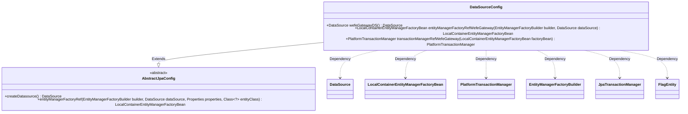
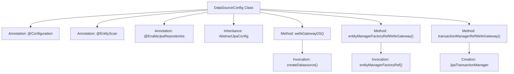

# Basic Information

|      |      |
|------|------|
| Name | DataSourceConfig |
| Language | .java |
| Code Path | WeFe/gateway/src/main/java/com/welab/wefe/gateway/config/DataSourceConfig.java |
| Package Name | com.welab.wefe.gateway.config |
| Dependencies | ['com.welab.wefe.common.data.mysql.config.AbstractJpaConfig', 'com.welab.wefe.gateway.GatewayServer', 'com.welab.wefe.gateway.entity.FlagEntity', 'org.springframework.beans.factory.annotation.Qualifier', 'org.springframework.boot.autoconfigure.domain.EntityScan', 'org.springframework.boot.context.properties.ConfigurationProperties', 'org.springframework.boot.orm.jpa.EntityManagerFactoryBuilder', 'org.springframework.context.annotation.Bean', 'org.springframework.context.annotation.Configuration', 'org.springframework.context.annotation.Primary', 'org.springframework.data.jpa.repository.config.EnableJpaRepositories', 'org.springframework.orm.jpa.JpaTransactionManager', 'org.springframework.orm.jpa.LocalContainerEntityManagerFactoryBean', 'org.springframework.transaction.PlatformTransactionManager', 'javax.sql.DataSource'] |
| Brief Description | Java configuration class DataSourceConfig defines the primary data source wefeGatewayDS, configures JPA entity scanning, repository enabling, and transaction management, and inherits AbstractJpaConfig to implement database-related Bean creation. |

# Description

This is a Java Spring Boot configuration class designed to set up data source and JPA-related configurations. The class is named DataSourceConfig and extends AbstractJpaConfig. The @EntityScan annotation is used to scan entity classes under the com.welab.gateway package. The @EnableJpaRepositories annotation enables JPA repositories, specifying the base package, entity manager factory, and transaction manager reference names. The primary data source wefeGatewayDS is configured using properties prefixed with db.mysql. It defines the primary entity manager factory bean and primary transaction manager bean for managing entities and transactions, respectively. The entire configuration is tailored for the GatewayServer application, with the FlagEntity class serving as the entity class.

# Class Summary

| Name   | Type  | Description |
|-------|------|-------------|
| DataSourceConfig | class | Java configuration class DataSourceConfig, defining the primary data source wefeGatewayDS, configuring JPA entity scanning, repository enabling, and transaction management, inheriting AbstractJpaConfig to implement database-related Bean creation. |

## Class DataSourceConfig

|      |      |
|------|------|
| Access Modifier | @Configuration;@EntityScan("com.welab.gateway");@EnableJpaRepositories(basePackageClasses = GatewayServer.class,;        entityManagerFactoryRef = "entityManagerFactoryRefWefeGateway",;        transactionManagerRef = "transactionManagerRefWefeGateway");public |
| Type | class |
| Name | DataSourceConfig |
| Description | Java configuration class DataSourceConfig, defining the primary data source wefeGatewayDS, configuring JPA entity scanning, repository enabling, and transaction management, inheriting AbstractJpaConfig to implement database-related Bean creation. |

### UML Class Diagram

This code represents a Spring Boot configuration class primarily used to configure JPA data sources, entity managers, and transaction managers. The `DataSourceConfig` class extends `AbstractJpaConfig` and provides three main bean definition methods: `wefeGatewayDS` for creating a data source, `entityManagerFactoryRefWefeGateway` for creating an entity manager factory, and `transactionManagerRefWefeGateway` for creating a transaction manager. These configurations integrate with the Spring framework through annotations, supporting JPA and database transaction management.

### Internal Method Call Graph

This code represents a Spring Boot configuration class for setting up data sources, JPA entity management, and transaction management. It is marked as a configuration class with `@Configuration`, specifies entity scanning paths using `@EntityScan`, and enables JPA repositories via `@EnableJpaRepositories`. The class defines three main methods: `wefeGatewayDS()` creates the primary data source, `entityManagerFactoryRefWefeGateway()` configures the entity manager factory, and `transactionManagerRefWefeGateway()` creates the transaction manager. These methods work together to provide comprehensive data access and transaction management capabilities for the application.

### Field List

| Name  | Type  | Description |
|-------|-------|------|

### Method List

| Name  | Type  | Description |
|-------|-------|------|
| entityManagerFactoryRefWefeGateway | LocalContainerEntityManagerFactoryBean | Define the primary entity manager factory bean, configured with the specified data source and entity classes. |
| wefeGatewayDS | DataSource | In the Spring configuration class, define the primary data source using properties prefixed with `db.mysql`, and return a DataSource instance created via the `createDatasource` method. |
| transactionManagerRefWefeGateway | PlatformTransactionManager | Define the primary transaction manager, creating a JPA transaction manager using the specified entity manager factory. |

