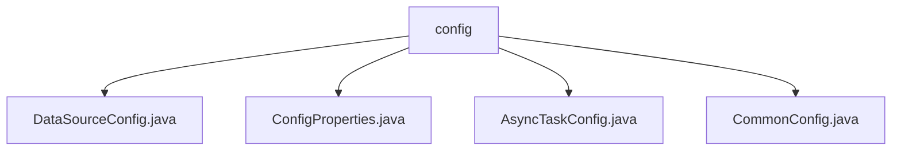

# Basic Information

|      |      |
|------|------|
| Name | config |
| Language | .java |
| Code Path | WeFe/gateway/src/main/java/com/welab/wefe/gateway/config |
| Package Name | docs.gateway.src.main.java.com.welab.wefe.gateway.config |
| Brief Description | Java Spring Boot Configuration Classes Collection: DataSourceConfig for configuring data sources and JPA; ConfigProperties for managing application parameters; AsyncTaskConfig for defining asynchronous task executors; CommonConfig for handling general settings. |

# Description

## Overview  
This module serves as the core configuration system of GatewayServer, implemented using the Java Spring Boot framework. It is responsible for data source management, asynchronous task scheduling, and global parameter configuration. Through a layered design (e.g., the AbstractJpaConfig inheritance hierarchy), it achieves configuration reuse, akin to modular power management. Key data structures include the FlagEntity class, thread pool parameter objects, and encrypted key fields. External dependencies involve MySQL databases, gRPC services, and the local file system. For example, DataSourceConfig defines the JPA entity scanning scope, while AsyncTaskConfig dynamically adjusts thread pool sizes.  

## Core Business Scenarios  
The module supports three major scenarios for gateway services: 1) Database operations, such as entity persistence via the primary data source `wefeGatewayDS`; 2) Asynchronous task processing, e.g., metadata transfer tasks using customized thread pools; 3) Runtime configuration hot-reloading, such as dynamically adjusting gRPC ports via ConfigProperties. It adopts a centralized configuration management model, similar to Kubernetes ConfigMap, integrating JPA transaction management, thread pool optimization, and encryption toggle features. Typical applications include: sensitive data protection based on database encryption switches and handling traffic spikes through thread pool configurations.

### Package Internal Structure View

This flowchart illustrates the four configuration class files under the config directory in the WeFe gateway project. All files are directly subordinate to the config node with no deeper nesting hierarchy. These configuration classes handle data source configuration, property configuration, asynchronous task configuration, and common configuration functionalities respectively, collectively forming the core configuration module of the gateway project.

# File List

| Name   | Type  | Description |
|-------|------|-------------|
| [DataSourceConfig.java](DataSourceConfig.md) | file | The Java configuration class DataSourceConfig defines the primary data source wefeGatewayDS, configures JPA entity scanning, repository enabling, and transaction management, and inherits AbstractJpaConfig to implement database-related Bean creation. |
| [ConfigProperties.java](ConfigProperties.md) | file | Configuration class, defining parameters such as gRPC port, message persistence type and directory, data write thread pool size, and batch insert data block size. |
| [AsyncTaskConfig.java](AsyncTaskConfig.md) | file | The configuration class AsyncTaskConfig defines an asynchronous task executor, with the core thread count retrieved from the configuration, the maximum thread count set as the core count multiplied by 100, the thread name prefix as transferMetaDataAsyncExecutor-Thread-, waiting for task completion upon shutdown, and the rejection policy set as caller-runs. |
| [CommonConfig.java](CommonConfig.md) | file | The CommonConfig class includes configuration items for database encryption switch, encryption key, and federation base URL, providing corresponding getter/setter methods. |

