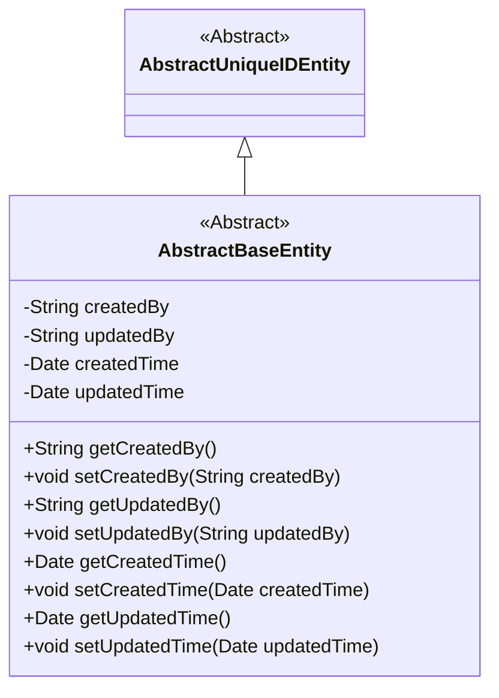

# Basic Information

|      |      |
|------|------|
| Name | AbstractBaseEntity |
| Language | .java |
| Code Path | WeFe/gateway/src/main/java/com/welab/wefe/gateway/entity/AbstractBaseEntity.java |
| Package Name | com.welab.wefe.gateway.entity |
| Dependencies | ['com.welab.wefe.common.data.mysql.entity.AbstractUniqueIDEntity', 'java.util.Date'] |
| Brief Description | The abstract class AbstractBaseEntity extends AbstractUniqueIDEntity, containing fields for creation/update user and timestamps along with their getter/setter methods. |

# Description

This is an abstract base class AbstractBaseEntity, which inherits from AbstractUniqueIDEntity. It defines four core attributes: createdBy represents the user who created the entity, updatedBy represents the user who last updated the entity, createdTime indicates the creation time (default value is the current time), and updatedTime indicates the last update time. The class provides standard getter and setter methods for each attribute, with the methods for createdTime and updatedTime marked as @Override, indicating they override the parent class's methods. This class is primarily used to record the creation and update information of entities.

# Class Summary

| Name   | Type  | Description |
|-------|------|-------------|
| AbstractBaseEntity | class | The abstract class AbstractBaseEntity extends AbstractUniqueIDEntity, containing fields for creation/update users and timestamps along with their corresponding getter/setter methods. |

## Class AbstractBaseEntity

|      |      |
|------|------|
| Access Modifier | public abstract |
| Type | class |
| Name | AbstractBaseEntity |
| Description | The abstract class AbstractBaseEntity extends AbstractUniqueIDEntity, containing fields for creation/update users and timestamps along with their corresponding getter/setter methods. |

### UML Class Diagram

This class diagram illustrates an inheritance relationship where the abstract class AbstractBaseEntity extends AbstractUniqueIDEntity. AbstractBaseEntity contains four private fields (createdBy, updatedBy, createdTime, updatedTime) along with their corresponding getter and setter methods, designed to track the creation and update information of entities. The createdTime field is initialized with the current date by default, reflecting the default value setting for entity creation time.

### Internal Method Call Graph

```mermaid
graph TD
    A["Abstract Class AbstractBaseEntity"]
    B["Inherits From: AbstractUniqueIDEntity"]
    C["Attribute: String createdBy"]
    D["Attribute: String updatedBy"]
    E["Attribute: Date createdTime = new Date()"]
    F["Attribute: Date updatedTime"]
    G["Method: String getCreatedBy()"]
    H["Method: void setCreatedBy(String)"]
    I["Method: String getUpdatedBy()"]
    J["Method: void setUpdatedBy(String)"]
    K["Overridden Method: Date getCreatedTime()"]
    L["Overridden Method: void setCreatedTime(Date)"]
    M["Overridden Method: Date getUpdatedTime()"]
    N["Overridden Method: void setUpdatedTime(Date)"]

    A --> B
    A --> C
    A --> D
    A --> E
    A --> F
    A --> G
    A --> H
    A --> I
    A --> J
    A --> K
    A --> L
    A --> M
    A --> N
```

This code defines an abstract class `AbstractBaseEntity`, which inherits from `AbstractUniqueIDEntity` and is primarily used for managing entity creation and update information. The class includes four core attributes: `createdBy` (creator), `updatedBy` (updater), `createdTime` (creation time, defaulting to the current time), and `updatedTime` (update time), along with corresponding getter and setter methods. The methods for `createdTime` and `updatedTime` override the parent class's implementations, demonstrating extended functionality for timestamp management.

### Field List

| Name  | Type  | Description |
|-------|-------|------|
| updatedBy | String | Private string variable, recording the updater information. |
| updatedTime | Date | Updated date type variable. |
| createdTime = new Date() | Date | Declare a private Date-type variable named createdTime, initialized to the current system time. |
| createdBy | String | Private string type variable, recording creator information. |

### Method List

| Name  | Type  | Description |
|-------|-------|------|
| setCreatedBy | void | This is a Java method used to set the creator property of an object. The method accepts a string parameter `createdBy` and assigns it to the class member variable `this.createdBy`. |
| getCreatedBy | String | Methods to obtain creator information, returns the value of the createdBy field. |
| getCreatedTime | Date | This is a Java method that overrides getCreatedTime() to return the createdTime date object. |
| setUpdatedBy | void | Method to set the updater field, with the parameter being the updatedBy string. |
| getUpdatedBy | String | This is a Java method that returns the value of the updatedBy field. |
| setCreatedTime | void | Rewrite the setCreatedTime method to assign the passed Date type parameter to the createdTime property of the class. |
| getUpdatedTime | Date | The method getUpdatedTime returns the updatedTime date object. |
| setUpdatedTime | void | Rewrite the setUpdatedTime method to set the value of the updatedTime property. |

