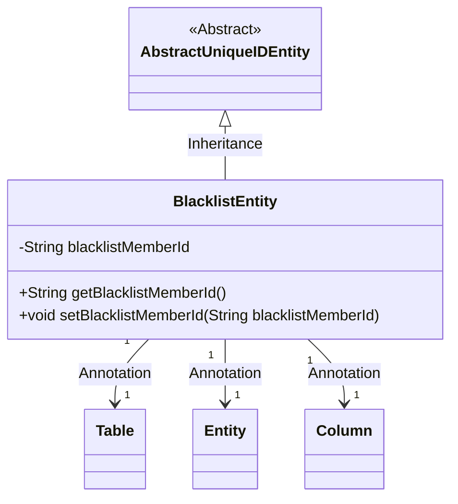
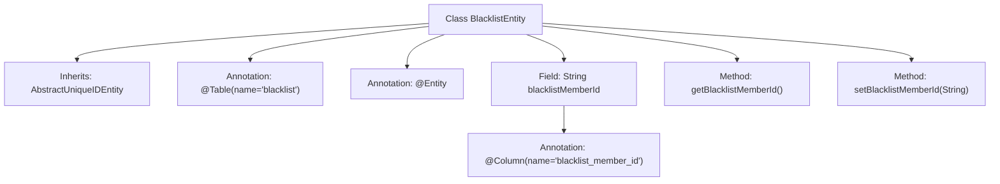

# Basic Information

|      |      |
|------|------|
| Name | BlacklistEntity |
| Language | .java |
| Code Path | WeFe/gateway/src/main/java/com/welab/wefe/gateway/entity/BlacklistEntity.java |
| Package Name | com.welab.wefe.gateway.entity |
| Dependencies | ['com.welab.wefe.common.data.mysql.entity.AbstractUniqueIDEntity', 'javax.persistence.Column', 'javax.persistence.Entity', 'javax.persistence.Table'] |
| Brief Description | Blacklist entity class, containing member ID field and getter/setter methods. |

# Description

The content describes a Java entity class named BlacklistEntity, which maps to the database table blacklist. This class inherits from AbstractUniqueIDEntity and includes a private string attribute blacklistMemberId, representing the ID of the member added to the blacklist. The attribute is mapped to the table column blacklist_member_id via the @Column annotation and provides corresponding getter and setter methods for accessing and modifying the attribute value.

# Class Summary

| Name   | Type  | Description |
|-------|------|-------------|
| BlacklistEntity | class | Blacklist entity class, containing member ID field and getter/setter methods. |

## Class BlacklistEntity

|      |      |
|------|------|
| Access Modifier | @Table(name = "blacklist");@Entity;public |
| Type | class |
| Name | BlacklistEntity |
| Description | Blacklist entity class, containing member ID field and getter/setter methods. |

### UML Class Diagram

This code demonstrates a JPA entity class `BlacklistEntity`, which inherits from the abstract base class `AbstractUniqueIDEntity`, representing blacklist data. The class is marked as a persistent entity with `@Entity`, specifies the database table name with `@Table`, and maps fields to table columns with `@Column`. The core attribute `blacklistMemberId` stores the ID of the blacklisted member, accessible via getter/setter methods. This design exemplifies typical usage of JPA entity inheritance and annotation configuration, suitable for scenarios requiring unique identifiers and database mapping.

### Internal Method Call Graph

This code illustrates a class diagram of the JPA entity BlacklistEntity, which inherits from AbstractUniqueIDEntity and is annotated with @Entity and @Table. The core field blacklistMemberId is mapped to a database column via @Column, with standard getter/setter methods provided. The flowchart clearly presents the entity's inheritance relationship, annotation configurations, and member methods, suitable for analyzing the data persistence structure of JPA entity classes.

### Field List

| Name  | Type  | Description |
|-------|-------|------|
| blacklistMemberId | String | Database field mapping: blacklistMemberId corresponds to the table column blacklist_member_id. |

### Method List

| Name  | Type  | Description |
|-------|-------|------|
| getBlacklistMemberId | String | Method to obtain the ID of a blacklisted member, returns the member ID as a string. |
| setBlacklistMemberId | void | The method to set the blacklist member ID assigns the parameter value to the class variable `blacklistMemberId`. |

