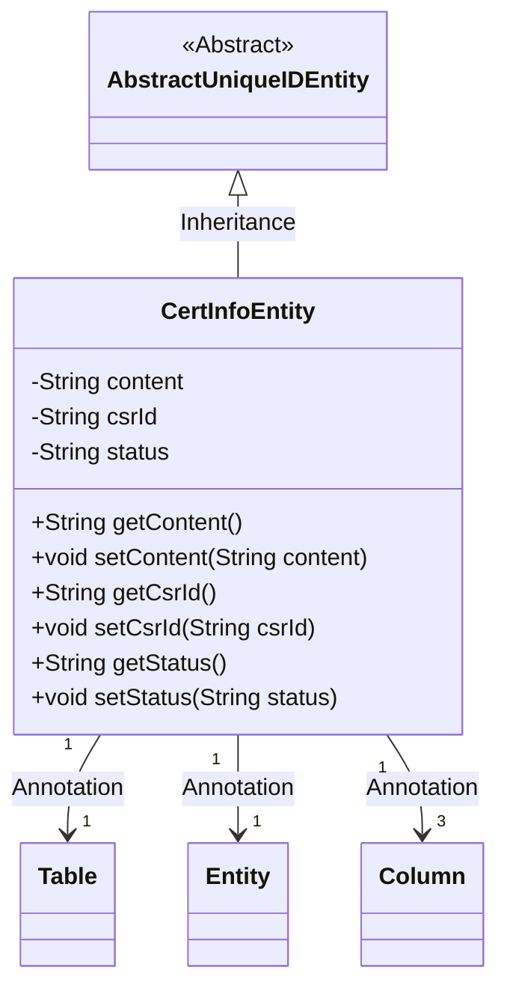
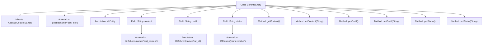

# Basic Information

|      |      |
|------|------|
| Name | CertInfoEntity |
| Language | .java |
| Code Path | WeFe/gateway/src/main/java/com/welab/wefe/gateway/entity/CertInfoEntity.java |
| Package Name | com.welab.wefe.gateway.entity |
| Dependencies | ['com.welab.wefe.common.data.mysql.entity.AbstractUniqueIDEntity', 'javax.persistence.Column', 'javax.persistence.Entity', 'javax.persistence.Table'] |
| Brief Description | The CertInfoEntity class maps to the cert_info table and includes fields such as content, csrId, status, along with their corresponding getter/setter methods. |

# Description

This is a Java entity class named CertInfoEntity, mapped to the database table cert_info. It inherits from AbstractUniqueIDEntity and contains three fields: content stores certificate content, csrId associates with the certificate signing request ID, and status records the certificate status. Each field has corresponding getter and setter methods and is mapped to the column names of the database table via the @Column annotation.

# Class Summary

| Name   | Type  | Description |
|-------|------|-------------|
| CertInfoEntity | class | The CertInfoEntity entity class maps to the cert_info table and includes fields such as content, csrId, and status, along with their corresponding getter/setter methods. |

## Class CertInfoEntity

|      |      |
|------|------|
| Access Modifier | @Table(name = "cert_info");@Entity;public |
| Type | class |
| Name | CertInfoEntity |
| Description | The CertInfoEntity entity class maps to the cert_info table and includes fields such as content, csrId, and status, along with their corresponding getter/setter methods. |

### UML Class Diagram

This code defines a JPA entity class named CertInfoEntity, which inherits from the abstract class AbstractUniqueIDEntity. The class is marked as a database entity using @Entity and @Table annotations, and contains three private fields (content, csrId, status) along with their corresponding getter/setter methods. Each field is mapped to a specific column in the database table via @Column annotations, storing certificate content, CSR request ID, and status information respectively. The class diagram clearly illustrates the inheritance relationship and the usage of JPA annotations.

### Internal Method Call Graph

This code defines a JPA entity class named CertInfoEntity, which inherits from AbstractUniqueIDEntity and maps to the cert_info table in the database. The class contains three fields: content (certificate content), csrId (associated CSR ID), and status (status), each with corresponding getter and setter methods. These fields are mapped to database table columns via the @Column annotation. The @Table and @Entity annotations indicate this is a JPA entity class corresponding to the cert_info table in the database.

### Field List

| Name  | Type  | Description |
|-------|-------|------|
| status | String | Database field mapping: the status attribute corresponds to the status column in the table. |
| csrId | String | Database field mapping: csrId corresponds to the table column csr_id. |
| content | String | The database field cert_content is mapped to the string-type variable content. |

### Method List

| Name  | Type  | Description |
|-------|-------|------|
| setStatus | void | This is a Java method used to set the value of the status property of an object. |
| setContent | void | Method for setting content, assigns the input string to the class's content variable. |
| getStatus | String | Methods to obtain the current status, returning a string-type status value. |
| setCsrId | void | The method to set the CSR ID assigns the input parameter to the member variable csrId. |
| getCsrId | String | Public method to obtain csrId, returns a string type. |
| getContent | String | This is a Java method that returns the value of the string-type variable `content`. |

