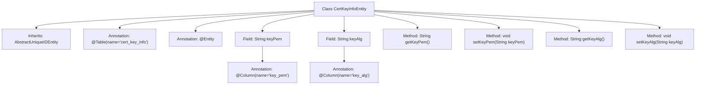

# Basic Information

|      |      |
|------|------|
| Name | CertKeyInfoEntity |
| Language | .java |
| Code Path | WeFe/gateway/src/main/java/com/welab/wefe/gateway/entity/CertKeyInfoEntity.java |
| Package Name | com.welab.wefe.gateway.entity |
| Dependencies | ['com.welab.wefe.common.data.mysql.entity.AbstractUniqueIDEntity', 'javax.persistence.Column', 'javax.persistence.Entity', 'javax.persistence.Table'] |
| Brief Description | The CertKeyInfoEntity entity class maps to the cert_key_info table and includes the keyPem and keyAlg fields along with their getter/setter methods. |

# Description

This is a JPA entity class named CertKeyInfoEntity, mapped to the database table cert_key_info. It inherits from AbstractUniqueIDEntity and contains two fields: keyPem stores the PEM-formatted string of the key, and keyAlg stores the name of the key algorithm. Both fields have corresponding getter and setter methods and are explicitly mapped to table column names via the @Column annotation.

# Class Summary

| Name   | Type  | Description |
|-------|------|-------------|
| CertKeyInfoEntity | class | The CertKeyInfoEntity class maps to the cert_key_info table and includes the keyPem and keyAlg fields along with their getter/setter methods. |


## Class CertKeyInfoEntity

|      |      |
|------|------|
| Access Modifier | @Table(name = "cert_key_info");@Entity;public |
| Type | class |
| Name | CertKeyInfoEntity |
| Description | The CertKeyInfoEntity class maps to the cert_key_info table and includes the keyPem and keyAlg fields along with their getter/setter methods. |


### UML Class Diagram

```mermaid
classDiagram
    class AbstractUniqueIDEntity {
        <<Abstract>>
    }
    
    class CertKeyInfoEntity {
        -String keyPem
        -String keyAlg
        +String getKeyPem()
        +void setKeyPem(String keyPem)
        +String getKeyAlg()
        +void setKeyAlg(String keyAlg)
    }
    
    CertKeyInfoEntity --|> AbstractUniqueIDEntity : Inheritance
    CertKeyInfoEntity ..> "@Entity" : Annotation
    CertKeyInfoEntity ..> "@Table" : Annotation
```

This code demonstrates a JPA entity class `CertKeyInfoEntity` that inherits from the abstract base class `AbstractUniqueIDEntity`. The class is designed to store certificate key information, containing two private fields: `keyPem` (key in PEM format) and `keyAlg` (key algorithm), along with corresponding getter/setter methods. The `@Entity` and `@Table` annotations indicate this is a persistent entity mapped to the database table "cert_key_info". The class diagram clearly illustrates the inheritance relationship and the annotation labeling approach, reflecting the fundamental structure of entity classes in an ORM framework.


### Internal Method Call Graph



This code defines a JPA entity class named CertKeyInfoEntity, which inherits from AbstractUniqueIDEntity. The class is mapped to the database table cert_key_info and contains two fields: keyPem (stores the key in PEM format) and keyAlg (stores the key algorithm), mapped to the table columns key_pem and key_alg respectively via @Column annotations. The class provides standard getter and setter methods for accessing and modifying the properties, demonstrating the basic structure and data persistence features of a JPA entity class.

### Field List

| Name  | Type  | Description |
|-------|-------|------|
| keyAlg | String | The database column name key_alg corresponds to the private string variable keyAlg. |
| keyPem | String | The database column name key_pem corresponds to the private string variable keyPem. |

### Method List

| Name  | Type  | Description |
|-------|-------|------|
| setKeyPem | void | Set the key PEM string. |
| getKeyPem | String | The method to obtain the keyPem string. |
| getKeyAlg | String | String method for obtaining the key algorithm, returns the value of the keyAlg variable. |
| setKeyAlg | void | Define the method `setKeyAlg` to set the value of the `keyAlg` property. |


