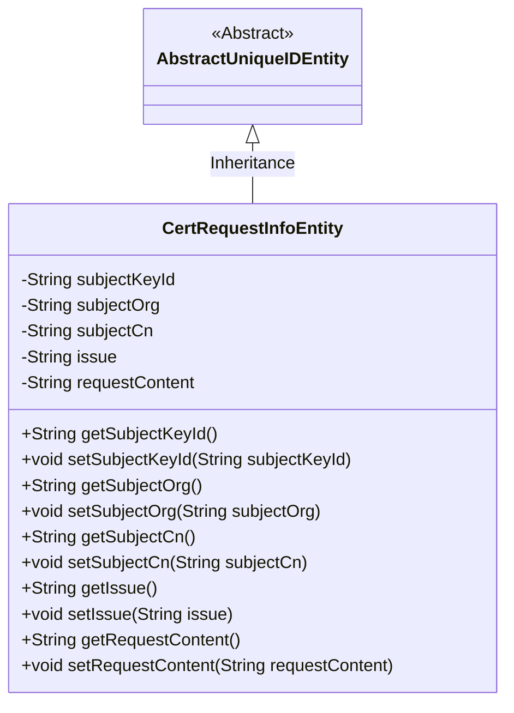

# Basic Information

|      |      |
|------|------|
| Name | CertRequestInfoEntity |
| Language | .java |
| Code Path | WeFe/gateway/src/main/java/com/welab/wefe/gateway/entity/CertRequestInfoEntity.java |
| Package Name | com.welab.wefe.gateway.entity |
| Dependencies | ['com.welab.wefe.common.data.mysql.entity.AbstractUniqueIDEntity', 'javax.persistence.Column', 'javax.persistence.Entity', 'javax.persistence.Table'] |
| Brief Description | This is a JPA entity class named CertRequestInfoEntity, which maps to the database table cert_request_info. It includes fields such as subjectKeyId, subjectOrg, subjectCn, issue, and requestContent, along with their corresponding getter and setter methods. |

# Description

The content describes a Java entity class named CertRequestInfoEntity, which maps to the database table cert_request_info. This class inherits from AbstractUniqueIDEntity and includes five fields: subjectKeyId (subject key ID), subjectOrg (subject organization), subjectCn (subject common name), issue (issuer), and requestContent (certificate request content). Each field has corresponding getter and setter methods for accessing and modifying the field values. These fields are mapped to the columns of the database table via the @Column annotation.

# Class Summary

| Name   | Type  | Description |
|-------|------|-------------|
| CertRequestInfoEntity | class | This is a JPA entity class CertRequestInfoEntity, which maps to the database table cert_request_info. It includes fields such as subject key ID, organization, common name, issuance information, and certificate request content, along with their corresponding getter/setter methods. |

## Class CertRequestInfoEntity

|      |      |
|------|------|
| Access Modifier | @Table(name = "cert_request_info");@Entity;public |
| Type | class |
| Name | CertRequestInfoEntity |
| Description | This is a JPA entity class CertRequestInfoEntity, which maps to the database table cert_request_info. It includes fields such as subject key ID, organization, common name, issuance information, and certificate request content, along with their corresponding getter/setter methods. |

### UML Class Diagram

Class Diagram Description: The CertRequestInfoEntity class inherits from the AbstractUniqueIDEntity abstract class, representing a certificate request information entity. It contains private fields such as subjectKeyId and subjectOrg, along with corresponding getter/setter methods for storing and manipulating certificate request-related data. The @Entity and @Table annotations indicate this is a JPA entity class mapped to the cert_request_info table in the database.

### Internal Method Call Graph

```mermaid
graph TD
    A["Class CertRequestInfoEntity"]
    B["Inherits: AbstractUniqueIDEntity"]
    C["Annotation: @Table(name='cert_request_info')"]
    D["Annotation: @Entity"]
    E["Field: String subjectKeyId"]
    F["Annotation: @Column(name='subject_key_id')"]
    G["Field: String subjectOrg"]
    H["Annotation: @Column(name='subject_org')"]
    I["Field: String subjectCn"]
    J["Annotation: @Column(name='subject_cn')"]
    K["Field: String issue"]
    L["Annotation: @Column(name='issue')"]
    M["Field: String requestContent"]
    N["Annotation: @Column(name='cert_request_content')"]
    O["Method: getSubjectKeyId()"]
    P["Method: setSubjectKeyId(String)"]
    Q["Method: getSubjectOrg()"]
    R["Method: setSubjectOrg(String)"]
    S["Method: getSubjectCn()"]
    T["Method: setSubjectCn(String)"]
    U["Method: getIssue()"]
    V["Method: setIssue(String)"]
    W["Method: getRequestContent()"]
    X["Method: setRequestContent(String)"]

    A --> B
    A --> C
    A --> D
    A --> E
    E --> F
    A --> G
    G --> H
    A --> I
    I --> J
    A --> K
    K --> L
    A --> M
    M --> N
    A --> O
    A --> P
    A --> Q
    A --> R
    A --> S
    A --> T
    A --> U
    A --> V
    A --> W
    A --> X
```

This code defines a JPA entity class named CertRequestInfoEntity, which inherits from AbstractUniqueIDEntity. The class is mapped to the database table cert_request_info and contains five fields: subjectKeyId, subjectOrg, subjectCn, issue, and requestContent, each annotated with @Column to specify the corresponding database column name. The class provides getter and setter methods for each field to access and modify their values. This is a typical implementation of a JPA entity class representing certificate request information.

### Field List

| Name  | Type  | Description |
|-------|-------|------|
| subjectOrg | String | The database field subject_org is mapped to the private string variable subjectOrg. |
| subjectKeyId | String | Database field mapping: subjectKeyId corresponds to the table column subject_key_id, with a string type. |
| subjectCn | String | Database table field mapping: subjectCn corresponds to the column name subject_cn, with a string type. |
| issue | String | Database table field mapping: issue corresponds to the private string variable issue. |
| requestContent | String | Database field mapping: cert_request_content corresponds to the requestContent string. |

### Method List

| Name  | Type  | Description |
|-------|-------|------|
| setSubjectKeyId | void | The method `setSubjectKeyId` is used to set the value of the `subjectKeyId` field, with the parameter being of string type. |
| getSubjectCn | String | Methods to obtain the Chinese subject, returning the value of the subjectCn variable. |
| getSubjectOrg | String | Methods to obtain the subjectOrg string. |
| setIssue | void | This is a Java method used to set the value of the issue attribute in a class. The method takes a string parameter named issue and assigns it to the member variable this.issue of the class. |
| getSubjectKeyId | String | Method to obtain the string value of subjectKeyId. |
| setSubjectOrg | void | This is a Java method used to set the value of the subjectOrg property in an object. The method takes a string parameter subjectOrg and assigns it to the property of the same name in the current object. |
| setSubjectCn | void | This is a Java method used to set the Chinese subject name. The method is named setSubjectCn, which accepts a string parameter subjectCn and assigns it to the class member variable subjectCn. |
| getIssue | String | Public methods for obtaining issue values. |
| getRequestContent | String | The method returns the requested content string. |
| setRequestContent | void | This is a Java method used to set the value of the requestContent property of a class. The method takes a string parameter and assigns it to the member variable requestContent of the class. |

