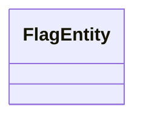

# Basic Information

|      |      |
|------|------|
| Name | FlagEntity |
| Language | .java |
| Code Path | WeFe/gateway/src/main/java/com/welab/wefe/gateway/entity/FlagEntity.java |
| Package Name | com.welab.wefe.gateway.entity |
| Dependencies | [] |
| Brief Description | The class FlagEntity defines an empty entity class. |

# Description

FlagEntity is an empty public class that currently does not define any attributes or methods. It exists as a foundational class structure, potentially intended for future extension or as a parent class for other classes. The design intent of this class remains unclear and requires further contextual analysis to determine its purpose.

# Class Summary

| Name   | Type  | Description |
|-------|------|-------------|
| FlagEntity | class | FlagEntity is an empty public class. |

## Class FlagEntity

|      |      |
|------|------|
| Access Modifier | public |
| Type | class |
| Name | FlagEntity |
| Description | FlagEntity is an empty public class. |

### UML Class Diagram

This class diagram depicts an empty class named FlagEntity, which currently has no defined attributes or methods. FlagEntity may serve as a base entity class, with functionality to be extended later through inheritance or composition. Such a simple structure is commonly seen in DDD design as marker interfaces or base classes reserved for future expansion. The current diagram only displays the class name, indicating it is a simple entity structure awaiting implementation.

### Internal Method Call Graph

This flowchart depicts an empty class structure named FlagEntity. The diagram contains only a single node representing the class name, with no definitions of attributes, methods, or constructors. The chart clearly shows that this class is currently an empty shell structure without any members, serving as a foundational framework for future expansion. Since the class body is empty, the flowchart only needs to display this basic information of the class name, aligning with the current minimal implementation state of the code.

### Field List

| Name  | Type  | Description |
|-------|-------|------|

### Method List

| Name  | Type  | Description |
|-------|-------|------|

