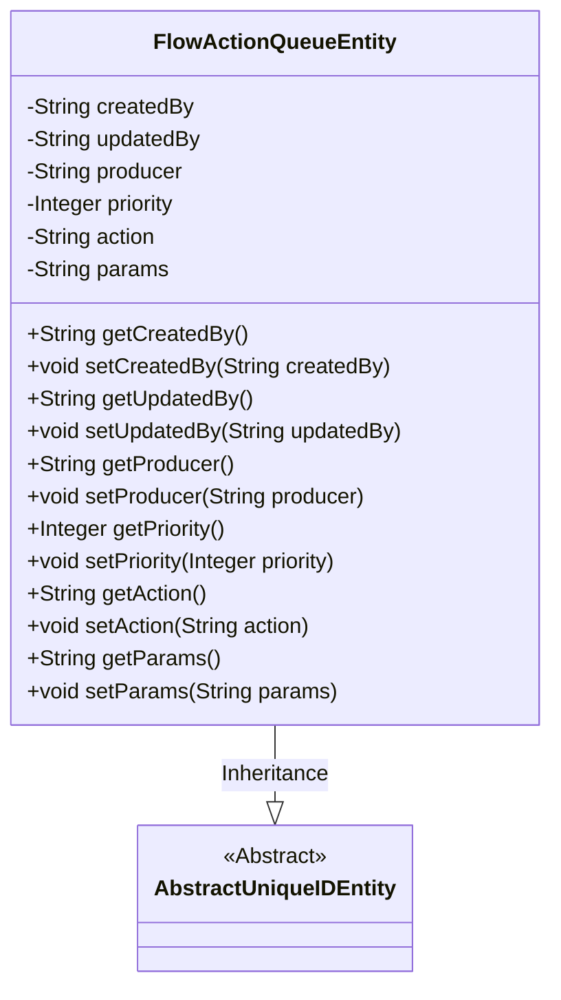

# Basic Information

|      |      |
|------|------|
| Name | FlowActionQueueEntity |
| Language | .java |
| Code Path | WeFe/gateway/src/main/java/com/welab/wefe/gateway/entity/FlowActionQueueEntity.java |
| Package Name | com.welab.wefe.gateway.entity |
| Dependencies | ['com.welab.wefe.common.data.mysql.entity.AbstractUniqueIDEntity', 'javax.persistence.Column', 'javax.persistence.Entity', 'javax.persistence.Table'] |
| Brief Description | The FlowActionQueueEntity entity class includes fields such as creator, updater, producer, priority, action, and parameters, and is used for process action queue management. |

# Description

The code defines a JPA entity class named FlowActionQueueEntity, mapped to the database table flow_action_queue. It inherits from AbstractUniqueIDEntity and includes fields such as creator, updater, message producer, priority, action type, and action parameters. Each field has corresponding getter and setter methods for data access and modification. The default priority is 0, with higher values indicating higher priority.

# Class Summary

| Name   | Type  | Description |
|-------|------|-------------|
| FlowActionQueueEntity | class | FlowActionQueueEntity is a JPA entity class that includes fields such as creator, updater, producer, priority, action, and parameters, used for managing process action queues. |

## Class FlowActionQueueEntity

|      |      |
|------|------|
| Access Modifier | @Table(name = "flow_action_queue");@Entity;public |
| Type | class |
| Name | FlowActionQueueEntity |
| Description | FlowActionQueueEntity is a JPA entity class that includes fields such as creator, updater, producer, priority, action, and parameters, used for managing process action queues. |

### UML Class Diagram

This code defines a JPA entity class named FlowActionQueueEntity, which inherits from the abstract class AbstractUniqueIDEntity. The class represents a flow action queue and includes fields such as creator, updater, producer, priority, action type, and parameters, all with corresponding getter and setter methods. The @Entity and @Table annotations indicate this is a database entity, while the @Column annotation maps database fields. This class is primarily used for persisting flow action-related data, with the priority field defaulting to 0, indicating higher-priority actions are consumed first.

### Internal Method Call Graph

```mermaid
graph TD
    A["Class FlowActionQueueEntity"]
    B["Inherits: AbstractUniqueIDEntity"]
    C["Attribute: String createdBy"]
    D["Attribute: String updatedBy"]
    E["Attribute: String producer"]
    F["Attribute: Integer priority"]
    G["Attribute: String action"]
    H["Attribute: String params"]
    I["Method: getCreatedBy/setCreatedBy"]
    J["Method: getUpdatedBy/setUpdatedBy"]
    K["Method: getProducer/setProducer"]
    L["Method: getPriority/setPriority"]
    M["Method: getAction/setAction"]
    N["Method: getParams/setParams"]

    A --> B
    A --> C
    A --> D
    A --> E
    A --> F
    A --> G
    A --> H
    A --> I
    A --> J
    A --> K
    A --> L
    A --> M
    A --> N
```

This code defines a JPA entity class named FlowActionQueueEntity, which inherits from AbstractUniqueIDEntity. The class contains 7 main attributes (createdBy, updatedBy, producer, priority, action, params) and their corresponding getter/setter methods, representing the data structure of a flow action queue. Each attribute is mapped to the corresponding field in the database table via the @Column annotation, where the priority field indicates consumption priority, action represents the action type, and params stores action parameters.

### Field List

| Name  | Type  | Description |
|-------|-------|------|
| producer | String | Database field mapping: the producer column corresponds to the String-type producer variable. |
| createdBy | String | Database field mapping: createdBy corresponds to the column name created_by, with the type String. |
| priority | Integer | Database field mapping, named priority, with the type Integer. |
| updatedBy | String | The database field updatedBy is mapped to the column name updated_by, with a string type. |
| params | String | Database field mapping, params corresponds to the table column params, with the type String. |
| action | String | Database field mapping: the action column corresponds to the string-type variable action. |

### Method List

| Name  | Type  | Description |
|-------|-------|------|
| getCreatedBy | String | Methods to obtain creator information, returning a string-type variable createdBy. |
| getProducer | String | Methods for obtaining producer names. |
| getUpdatedBy | String | This is a Java method that returns the value of the updatedBy variable of type String. |
| setProducer | void | Java method: Set the producer name, with the parameter being a string 'producer', assigned to the class member variable 'this.producer'. |
| setCreatedBy | void | This is a Java method used to set the creator property of an object. The method accepts a string parameter `createdBy` and assigns it to the class member variable `this.createdBy`. |
| getPriority | Integer | Methods for obtaining priority values, returning an integer-type priority value. |
| setPriority | void | The method to set the object's priority, with the parameter being an integer `priority`, directly assigns the value to the member variable `priority`. |
| setUpdatedBy | void | The method setUpdatedBy is used to set the value of the updatedBy field. |
| getAction | String | The method returns the value of the action variable of type string. |
| setAction | void | The method to set the action attribute assigns the passed string to the class's action member variable. |
| getParams | String | The method returns the value of the params variable as a string type. |
| setParams | void | Methods for setting string parameters, assigning input parameters to the class member variable params. |

