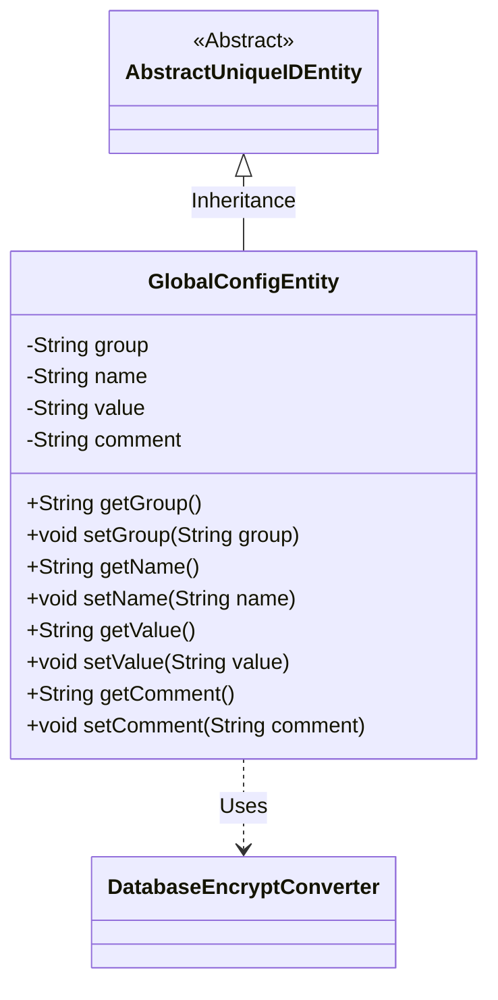

# Basic Information

|      |      |
|------|------|
| Name | GlobalConfigEntity |
| Language | .java |
| Code Path | WeFe/gateway/src/main/java/com/welab/wefe/gateway/entity/GlobalConfigEntity.java |
| Package Name | com.welab.wefe.gateway.entity |
| Dependencies | ['com.welab.wefe.common.data.mysql.entity.AbstractUniqueIDEntity', 'com.welab.wefe.gateway.util.DatabaseEncryptConverter', 'javax.persistence.Column', 'javax.persistence.Convert', 'javax.persistence.Entity', 'javax.persistence.Table'] |
| Brief Description | The `GlobalConfigEntity` class represents a global configuration item, containing a group name, configuration name, encrypted value, and description, and inherits from `AbstractUniqueIDEntity`. |

# Description

This is a JPA entity class named GlobalConfigEntity, mapped to the database table global_config. It inherits from AbstractUniqueIDEntity and contains four fields: group indicates the group to which the configuration item belongs, name represents the name of the configuration item, value stores the configuration value and uses DatabaseEncryptConverter for encryption conversion, and comment is the description of the configuration item. Each field has corresponding getter and setter methods.

# Class Summary

| Name   | Type  | Description |
|-------|------|-------------|
| GlobalConfigEntity | class | The `GlobalConfigEntity` class represents a global configuration item, containing fields such as group name, configuration name, encrypted value, and description, and provides getter/setter methods. |

## Class GlobalConfigEntity

|      |      |
|------|------|
| Access Modifier | @Table(name = "global_config");@Entity;public |
| Type | class |
| Name | GlobalConfigEntity |
| Description | The `GlobalConfigEntity` class represents a global configuration item, containing fields such as group name, configuration name, encrypted value, and description, and provides getter/setter methods. |

### UML Class Diagram

This code defines a JPA entity class named `GlobalConfigEntity`, which inherits from the abstract base class `AbstractUniqueIDEntity`. The class is used to store global configuration items and includes four core fields: configuration group (group), configuration name (name), encrypted stored value (value), and description (comment). The database encryption conversion for the value field is implemented via the `@Convert` annotation, relying on the `DatabaseEncryptConverter` converter. All fields provide standard getter/setter methods, complying with JavaBean specifications. The overall structure reflects a typical data entity design pattern in ORM frameworks.

### Internal Method Call Graph

```mermaid
graph TD
    A["Class GlobalConfigEntity"]
    B["Inherits: AbstractUniqueIDEntity"]
    C["Annotation: @Table(name='global_config')"]
    D["Annotation: @Entity"]
    E["Field: String group"]
    F["Annotation: @Column(name='`group`')"]
    G["Field: String name"]
    H["Field: String value"]
    I["Annotation: @Convert(converter=DatabaseEncryptConverter.class)"]
    J["Field: String comment"]
    K["Method: getGroup()"]
    L["Method: setGroup(String group)"]
    M["Method: getName()"]
    N["Method: setName(String name)"]
    O["Method: getValue()"]
    P["Method: setValue(String value)"]
    Q["Method: getComment()"]
    R["Method: setComment(String comment)"]

    A --> B
    A --> C
    A --> D
    A --> E
    E --> F
    A --> G
    A --> H
    H --> I
    A --> J
    A --> K
    A --> L
    A --> M
    A --> N
    A --> O
    A --> P
    A --> Q
    A --> R
```

This code defines a JPA entity class named GlobalConfigEntity, which inherits from AbstractUniqueIDEntity. The class is mapped to the database table "global_config" and contains four main fields: group (with special column name annotation), name, value (using database encryption converter), and comment. Each field has corresponding getter and setter methods. The flowchart clearly illustrates the class inheritance relationship, field annotation configurations, and method structure, particularly highlighting the encryption conversion feature of the value field, reflecting the design intent of this entity class for storing globally configurable items that require encryption.

### Field List

| Name  | Type  | Description |
|-------|-------|------|
| group | String | Database field mapping: group corresponds to the table column group, with a string type. |
| value | String | The field value is encrypted and converted using the DatabaseEncryptConverter class. |
| name | String | Private string variable name. |
| comment | String | Private string type variable comment. |

### Method List

| Name  | Type  | Description |
|-------|-------|------|
| setComment | void | This is a Java method used to set the value of the comment property of an object. The method takes a string parameter comment and assigns it to the comment field of the current object. |
| setName | void | Methods for setting the object name, assigning the input parameter `name` to the `name` property of the object. |
| getGroup | String | Methods to obtain the group string. |
| getValue | String | This is a Java method that returns the value of the member variable "value" of type String. |
| getName | String | Methods to obtain the name, returning the value of the string-type name variable. |
| setGroup | void | Set the grouping properties of the object. |
| setValue | void | This is a Java method used to set the value of a class member variable `value`. The method accepts a string parameter `value` and assigns it to the `value` property of the current object. |
| getComment | String | Methods to obtain the comment string. |

