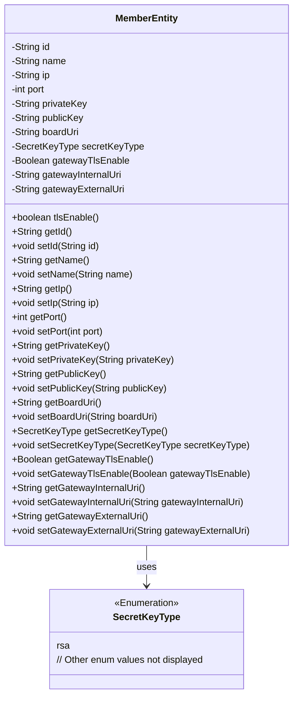

# Basic Information

|      |      |
|------|------|
| Name | MemberEntity |
| Language | .java |
| Code Path | WeFe/gateway/src/main/java/com/welab/wefe/gateway/entity/MemberEntity.java |
| Package Name | com.welab.wefe.gateway.entity |
| Dependencies | ['com.welab.wefe.common.constant.SecretKeyType', 'java.io.Serializable'] |
| Brief Description | The MemberEntity class includes attributes such as member ID, name, IP, port, public/private keys, key type, internal/external gateway addresses, and TLS activation status. |

# Description

The MemberEntity class is a serializable Java class used to represent member information. It includes attributes such as member ID, name, IP address, port, private key, public key, and panel service base address. The key type defaults to RSA, and the gateway TLS feature is disabled by default. It provides fields for both internal and external gateway addresses along with corresponding getter/setter methods. The class includes a method `tlsEnable` to check whether TLS is enabled. All attributes support read and write operations, and the structure comprehensively covers basic member information and network configuration requirements.

# Class Summary

| Name   | Type  | Description |
|-------|------|-------------|
| MemberEntity | class | The MemberEntity class includes attributes such as member ID, name, IP, port, public/private keys, board service address, key type, gateway TLS switch, and internal/external network addresses. |

## Class MemberEntity

|      |      |
|------|------|
| Access Modifier | public |
| Type | class |
| Name | MemberEntity |
| Description | The MemberEntity class includes attributes such as member ID, name, IP, port, public/private keys, board service address, key type, gateway TLS switch, and internal/external network addresses. |

### UML Class Diagram

This code defines a `MemberEntity` class implementing the `Serializable` interface, representing member entity information. The class includes attributes such as member ID, name, IP address, port, public/private keys, board service address, along with TLS-related configurations and gateway address information. The `secretKeyType` field uses the `SecretKeyType` enumeration type (simplified to show only the rsa value). The class provides getter/setter methods for all attributes and a `tlsEnable()` method to check TLS activation status. This is a typical Data Transfer Object (DTO) design for serializing and transmitting member information over network communication.

### Internal Method Call Graph

This code defines a class named MemberEntity that implements the Serializable interface, primarily used to represent member entity information. The class contains multiple private attributes such as id, name, ip, port, etc., along with corresponding getter and setter methods. Additionally, there is a tlsEnable() method to check if gateway TLS is enabled. This class may be used for storing and transmitting member information in distributed systems, with serialization enabling network transmission or persistent storage.

### Field List

| Name  | Type  | Description |
|-------|-------|------|
| name | String | private String variable name |
| publicKey | String | The private string variable publicKey is used to store the public key. |
| id | String | Private string type variable id |
| gatewayExternalUri | String | External Gateway URI String Variable |
| gatewayTlsEnable = false | Boolean | The private boolean variable gatewayTlsEnable is set to false by default, indicating that the gateway TLS feature is disabled by default. |
| gatewayInternalUri | String | The private string variable gatewayInternalUri is used to store the gateway's internal URI. |
| privateKey | String | The private string variable privateKey is used to store the private key. |
| secretKeyType = SecretKeyType.rsa | SecretKeyType | The key type is set to RSA. |
| port | int | The private integer variable `port` is used to store the port number. |
| ip | String | Declare a private string variable ip. |
| boardUri | String | Private string variable boardUri |

### Method List

| Name  | Type  | Description |
|-------|-------|------|
| getBoardUri | String | The method getBoardUri returns the boardUri value of type string. |
| getId | String | Methods to obtain the object ID, returning the ID value as a string type. |
| setPrivateKey | void | Methods for setting a private key, assigning the input string to the class's private key variable. |
| getPort | int | The method returns the port number. |
| getIp | String | Methods to obtain the IP address, returning a string-type ip variable. |
| getSecretKeyType | SecretKeyType | Method to obtain the key type, returns secretKeyType. |
| setPort | void | This is a Java method used to set the port number, which assigns the incoming `port` parameter to the class's member variable `port`. |
| getName | String | This is a Java method that returns the value of the string-type variable named "name". |
| getPublicKey | String | Methods to obtain the public key, returns a publicKey string. |
| getPrivateKey | String | Methods to obtain the private key, returns the value of the privateKey variable. |
| setId | void | Methods for setting object ID: Assign the parameter id to the id property of the current object. |
| setBoardUri | void | The method to set boardUri assigns the parameter boardUri to the boardUri property of the current object. |
| tlsEnable | boolean | The method tlsEnable checks whether gatewayTlsEnable is TRUE and returns a boolean value. |
| setIp | void | The method to set the IP address assigns the parameter ip to the class member variable ip. |
| setGatewayTlsEnable | void | A public method for setting the gateway TLS enable state, with a boolean parameter `gatewayTlsEnable`. |
| getGatewayInternalUri | String | Public method to obtain the internal gateway URI, returning a string-type variable gatewayInternalUri. |
| setGatewayInternalUri | void | The method to set the gateway internal URI assigns the parameter value to the class member variable `gatewayInternalUri`. |
| getGatewayExternalUri | String | Methods to obtain the external URI of the gateway, returning the gatewayExternalUri string. |
| setGatewayExternalUri | void | The method to set the gateway external URI assigns the input parameter to the class member variable gatewayExternalUri. |
| getGatewayTlsEnable | Boolean | A boolean method to obtain the TLS enablement status of the gateway. |
| setName | void | Methods for setting object names, assigning the parameter `name` to the object's `name` property. |
| setPublicKey | void | The method to set the public key assigns the input string to the `publicKey` member variable of the class. |
| setSecretKeyType | void | Methods for setting the key type, assigning the parameter secretKeyType to the class property of the same name. |

