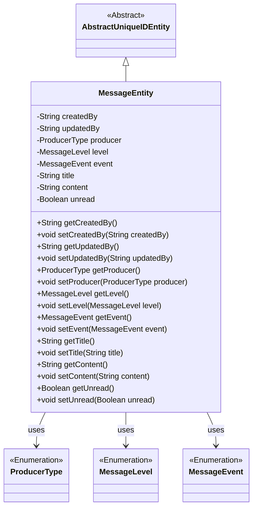

# Basic Information

|      |      |
|------|------|
| Name | MessageEntity |
| Language | .java |
| Code Path | WeFe/gateway/src/main/java/com/welab/wefe/gateway/entity/MessageEntity.java |
| Package Name | com.welab.wefe.gateway.entity |
| Dependencies | ['com.welab.wefe.common.data.mysql.entity.AbstractUniqueIDEntity', 'com.welab.wefe.common.wefe.enums.MessageEvent', 'com.welab.wefe.common.wefe.enums.MessageLevel', 'com.welab.wefe.common.wefe.enums.ProducerType', 'javax.persistence'] |
| Brief Description | Message entity class, containing fields such as creator, updater, producer type, message level, associated event, title, content, and unread status. |

# Description

This is a JPA entity class named MessageEntity, mapped to the database table message. It inherits from AbstractUniqueIDEntity and includes fields such as creator, updater, message producer type, message level, associated event, title, content, and unread status. All enumeration types are stored as strings, and each field has corresponding getter and setter methods.

# Class Summary

| Name   | Type  | Description |
|-------|------|-------------|
| MessageEntity | class | Message entity class, containing fields such as creator, updater, producer type, message level, event, title, content, and unread status, inheriting from the abstract unique ID entity class. |

## Class MessageEntity

|      |      |
|------|------|
| Access Modifier | @Table(name = "message");@Entity;public |
| Type | class |
| Name | MessageEntity |
| Description | Message entity class, containing fields such as creator, updater, producer type, message level, event, title, content, and unread status, inheriting from the abstract unique ID entity class. |

### UML Class Diagram

This code defines a message entity class MessageEntity, which inherits from the abstract base class AbstractUniqueIDEntity. It includes attributes such as creator, updater, message producer type, message level, associated event, title, content, and unread status. The class is mapped to the database table "message" using JPA annotations and utilizes enumeration types ProducerType, MessageLevel, and MessageEvent to constrain the value ranges of specific fields. All fields are provided with standard getter and setter methods, implementing encapsulation and access control for entity properties.

### Internal Method Call Graph

```mermaid
graph TD
    A["Class MessageEntity"]
    B["Inherits: AbstractUniqueIDEntity"]
    C["Annotation: @Table(name='message')"]
    D["Annotation: @Entity"]
    E["Field: String createdBy"]
    F["Field: String updatedBy"]
    G["Field: ProducerType producer"]
    H["Field: MessageLevel level"]
    I["Field: MessageEvent event"]
    J["Field: String title"]
    K["Field: String content"]
    L["Field: Boolean unread"]
    M["Getter/Setter methods"]

    A --> B
    A --> C
    A --> D
    A --> E
    A --> F
    A --> G
    A --> H
    A --> I
    A --> J
    A --> K
    A --> L
    A --> M
```

This flowchart illustrates the complete structure of the MessageEntity class, including its inheritance relationship, class annotations, all fields, and method groups. As a JPA entity class, it implements ORM mapping through @Table and @Entity annotations, containing 8 core fields (including 3 enum-type fields) and corresponding Getter/Setter methods. All fields are configured for database columns via @Column or @Enumerated annotations, with the producer/level/event enum fields adopting a string storage strategy.

### Field List

| Name  | Type  | Description |
|-------|-------|------|
| createdBy | String | Database field mapping: createdBy corresponds to the table column created_by, with the type String. |
| unread | Boolean | Database field mapping: unread (Boolean type, indicates unread status) |
| content | String | Database field mapping: content corresponds to the String-type content attribute. |
| title | String | Database field mapping: the title column corresponds to the title variable of String type. |
| event | MessageEvent | The enumeration type field `event` is stored in string format. |
| level | MessageLevel | The entity class field `level` uses the enumeration type `MessageLevel`, with the database column name as `level`, storing the enumeration string value. |
| producer | ProducerType | The database field `producer` stores the enum type `ProducerType` in string format. |
| updatedBy | String | The database field updatedBy is mapped to updated_by, with the type being String. |

### Method List

| Name  | Type  | Description |
|-------|-------|------|
| getProducer | ProducerType | Methods for obtaining the producer type, returning a producer object. |
| setLevel | void | The method to set the message level assigns the input parameter 'level' to the 'level' property of the current object. |
| getTitle | String | Methods to obtain the title, returning the value of the title variable as a string type. |
| getUpdatedBy | String | This is a Java method that returns the value of the string-type variable updatedBy. |
| getCreatedBy | String | Methods to obtain creator information, returning a string-type variable createdBy. |
| setTitle | void | This is a Java method used to set the title property of an object. The method accepts a string parameter `title` and assigns it to the `title` member variable of the current object. |
| getContent | String | Methods for obtaining content strings. |
| setContent | void | Methods for setting content attributes, which assign the input parameters to the class's content member variable. |
| getUnread | Boolean | The method returns a boolean value `unread`, indicating the unread status. |
| setUnread | void | Method for setting unread status, with a boolean parameter unread used to update the unread property of the current object. |
| setUpdatedBy | void | Method to set the updater field, with the parameter being a string updatedBy. |
| setProducer | void | Method to set the producer object, which assigns the passed producer parameter to the producer property of the current object. |
| getLevel | MessageLevel | Methods for obtaining the message level, which returns the value of the level attribute. |
| setEvent | void | Set the event method to assign the passed MessageEvent to the event property of the current object. |
| setCreatedBy | void | This is a Java method used to set the creator property of an object. The method accepts a string parameter `createdBy` and assigns it to the class member variable `this.createdBy`. |
| getEvent | MessageEvent | Methods to obtain the event object, returning an instance of the MessageEvent type. |

