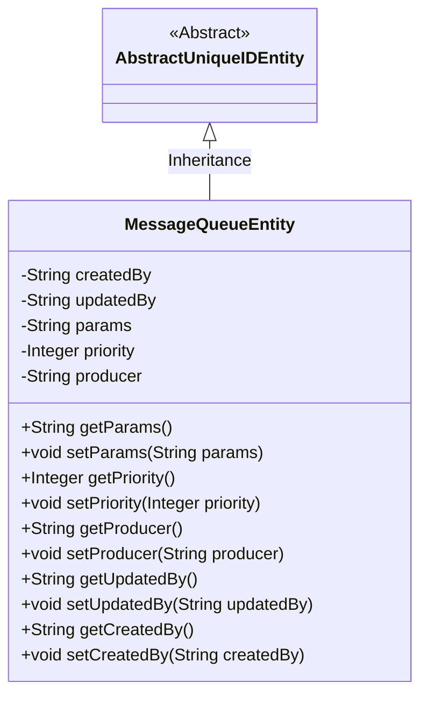

# Basic Information

|      |      |
|------|------|
| Name | MessageQueueEntity |
| Language | .java |
| Code Path | WeFe/gateway/src/main/java/com/welab/wefe/gateway/entity/MessageQueueEntity.java |
| Package Name | com.welab.wefe.gateway.entity |
| Dependencies | ['com.welab.wefe.common.data.mysql.entity.AbstractUniqueIDEntity', 'javax.persistence.Column', 'javax.persistence.Entity', 'javax.persistence.Table'] |
| Brief Description | Message queue entity class, containing fields for creator, updater, parameters, priority, and producer, with getter and setter methods provided for each field. |

# Description

This is a JPA entity class named MessageQueueEntity, mapped to the database table message_queue. It inherits from AbstractUniqueIDEntity and contains five fields: createdBy records the creator, updatedBy records the updater, params stores parameters, priority indicates the priority level, and producer identifies the producer. Each field has corresponding getter and setter methods for accessing and modifying property values. This entity class is primarily used for the persistent storage of message queue data.

# Class Summary

| Name   | Type  | Description |
|-------|------|-------------|
| MessageQueueEntity | class | Message queue entity class, including creator, updater, parameters, priority, and producer fields, with getter and setter methods provided for each attribute. |

## Class MessageQueueEntity

|      |      |
|------|------|
| Access Modifier | @Table(name = "message_queue");@Entity;public |
| Type | class |
| Name | MessageQueueEntity |
| Description | Message queue entity class, including creator, updater, parameters, priority, and producer fields, with getter and setter methods provided for each attribute. |

### UML Class Diagram

Class Diagram Description:  
The MessageQueueEntity class inherits from the AbstractUniqueIDEntity abstract class and is a JPA entity class mapped to the message_queue table in the database. It contains five private fields: createdBy (creator), updatedBy (updater), params (parameters), priority (priority level), and producer (producer), each with corresponding getter and setter methods. The class is marked as a persistent entity with the @Entity annotation, while @Table and @Column annotations define the database mapping relationships, reflecting the standard JPA entity class design pattern.

### Internal Method Call Graph

```mermaid
graph TD
    A["Class MessageQueueEntity"]
    B["Inherits: AbstractUniqueIDEntity"]
    C["Annotation: @Table(name='message_queue')"]
    D["Annotation: @Entity"]
    E["Property: String createdBy"]
    F["Property: String updatedBy"]
    G["Property: String params"]
    H["Property: Integer priority"]
    I["Property: String producer"]
    J["Method: getParams()"]
    K["Method: setParams(String params)"]
    L["Method: getPriority()"]
    M["Method: setPriority(Integer priority)"]
    N["Method: getProducer()"]
    O["Method: setProducer(String producer)"]
    P["Method: getUpdatedBy()"]
    Q["Method: setUpdatedBy(String updatedBy)"]
    R["Method: getCreatedBy()"]
    S["Method: setCreatedBy(String createdBy)"]

    A --> B
    A --> C
    A --> D
    A --> E
    A --> F
    A --> G
    A --> H
    A --> I
    A --> J
    A --> K
    A --> L
    A --> M
    A --> N
    A --> O
    A --> P
    A --> Q
    A --> R
    A --> S
```

This code defines a JPA entity class named MessageQueueEntity, which inherits from AbstractUniqueIDEntity and maps to the database table 'message_queue'. The class includes 5 properties (createdBy, updatedBy, params, priority, producer) along with their corresponding getter and setter methods. Each property is mapped to a column in the database table via the @Column annotation. The class also uses @Entity and @Table annotations to identify it as a JPA entity and specify the corresponding database table name.

### Field List

| Name  | Type  | Description |
|-------|-------|------|
| priority | Integer | Database field mapping: `priority` corresponds to the private integer variable `priority`. |
| params | String | Database field mapping: params corresponds to the table column params, with a type of String. |
| updatedBy | String | Database field mapping: updatedBy corresponds to the updated_by column in the table, with a string type. |
| createdBy | String | Database field mapping: createdBy corresponds to the created_by column in the table, with a string type. |
| producer | String | Database table field mapping: the producer column corresponds to the String-type producer attribute. |

### Method List

| Name  | Type  | Description |
|-------|-------|------|
| setProducer | void | Methods for setting the producer name. |
| getProducer | String | Methods to obtain the producer name, returning producer information as a string. |
| setPriority | void | Methods for setting priority, where the parameter is an integer `priority`, which is assigned to the class attribute of the same name. |
| setUpdatedBy | void | Method to set the updater field, with the parameter being the updatedBy string. |
| setParams | void | This is a Java method used to set the value of the class member variable params. The method takes a string parameter params and assigns it to the params property of the current object. |
| getCreatedBy | String | String method for obtaining creator information. |
| getParams | String | Get the string value of the params parameter. |
| getPriority | Integer | Methods for obtaining priority values, returns an integer-type priority value. |
| getUpdatedBy | String | This is a Java method that returns the value of the updatedBy variable of type String. |
| setCreatedBy | void | This is a Java method used to set the value of the createdBy property. The method takes a string parameter named createdBy and assigns it to the property of the same name in the current object. |

