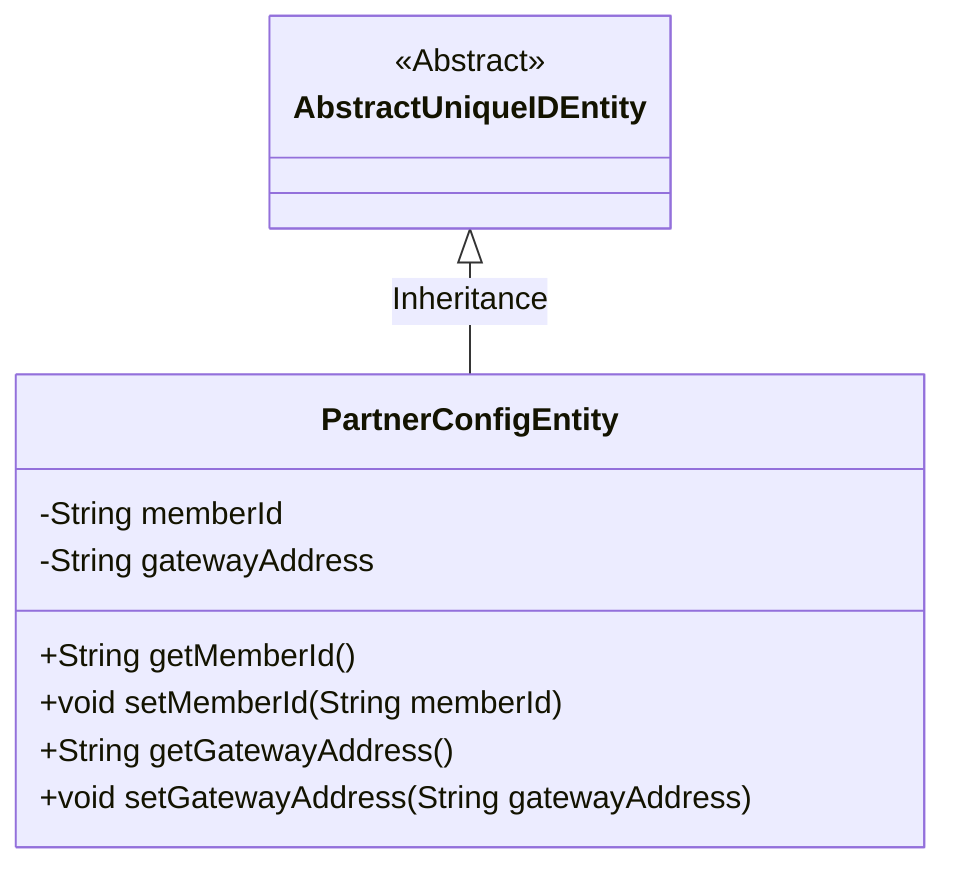
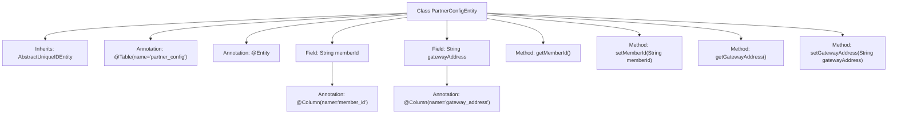

# Basic Information

|      |      |
|------|------|
| Name | PartnerConfigEntity |
| Language | .java |
| Code Path | WeFe/gateway/src/main/java/com/welab/wefe/gateway/entity/PartnerConfigEntity.java |
| Package Name | com.welab.wefe.gateway.entity |
| Dependencies | ['com.welab.wefe.common.data.mysql.entity.AbstractUniqueIDEntity', 'javax.persistence.Column', 'javax.persistence.Entity', 'javax.persistence.Table'] |
| Brief Description | The PartnerConfigEntity class maps to the partner_config table, containing the memberId and gatewayAddress fields along with their getter/setter methods, and inherits from AbstractUniqueIDEntity. |

# Description

PartnerConfigEntity is a JPA entity class mapped to the database table partner_config. It inherits from AbstractUniqueIDEntity and contains two fields: memberId and gatewayAddress, corresponding to the member_id and gateway_address columns in the table respectively. This class provides getter and setter methods for these two fields to access and modify their values.

# Class Summary

| Name   | Type  | Description |
|-------|------|-------------|
| PartnerConfigEntity | class | The PartnerConfigEntity entity class, mapped to the partner_config table, includes member ID and gateway address fields, and inherits from AbstractUniqueIDEntity. |

## Class PartnerConfigEntity

|      |      |
|------|------|
| Access Modifier | @Table(name = "partner_config");@Entity;public |
| Type | class |
| Name | PartnerConfigEntity |
| Description | The PartnerConfigEntity entity class, mapped to the partner_config table, includes member ID and gateway address fields, and inherits from AbstractUniqueIDEntity. |

### UML Class Diagram

This code defines an entity class named PartnerConfigEntity, which inherits from the abstract class AbstractUniqueIDEntity. PartnerConfigEntity contains two private fields, memberId and gatewayAddress, representing the member ID and gateway address respectively, along with corresponding getter and setter methods. The class uses JPA annotations @Entity and @Table, indicating it is a database entity mapped to a table named "partner_config". The class diagram clearly illustrates the inheritance relationship and the structure of class members.

### Internal Method Call Graph

This code defines a JPA entity class named PartnerConfigEntity, which inherits from AbstractUniqueIDEntity. The class contains two main fields: memberId and gatewayAddress, mapped to database table columns via @Column annotations. Standard getter and setter methods are provided for field access and modification. The entity class is marked as a persistent object through @Entity and @Table annotations, corresponding to the partner_config table in the database.

### Field List

| Name  | Type  | Description |
|-------|-------|------|
| gatewayAddress | String | Database field mapping: gatewayAddress corresponds to the table column gateway_address. |
| memberId | String | Database table field mapping: Member ID, corresponding column name member_id, type is string. |

### Method List

| Name  | Type  | Description |
|-------|-------|------|
| getGatewayAddress | String | Methods to obtain the gateway address, returns the gatewayAddress string. |
| setMemberId | void | The method to set the member ID assigns the input string to the member variable memberId. |
| getMemberId | String | This is a Java method that returns a member ID string. |
| setGatewayAddress | void | The method for setting the gateway address assigns the input parameter gatewayAddress to the class member variable gatewayAddress. |

