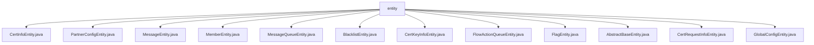

# Basic Information

|      |      |
|------|------|
| Name | entity |
| Language | .java |
| Code Path | WeFe/gateway/src/main/java/com/welab/wefe/gateway/entity |
| Package Name | docs.gateway.src.main.java.com.welab.wefe.gateway.entity |
| Brief Description | CertInfoEntity stores certificate content, CSR ID, and status. PartnerConfigEntity records member ID and gateway address. MessageEntity manages message producers, levels, content, etc. MemberEntity contains member information, network configuration, and TLS status. MessageQueueEntity handles message queue data. BlacklistEntity stores blacklisted member IDs. CertKeyInfoEntity saves key PEM and algorithm. FlowActionQueueEntity manages action queues. FlagEntity is an empty class. AbstractBaseEntity defines creation/update information. CertRequestInfoEntity stores certificate request details. GlobalConfigEntity manages encryption configuration items. |

# Description

## Overview  
This module serves as the data persistence layer for the gateway system, with its core responsibilities including managing entity data such as member information, certificate management, message queues, and global configurations. All entity classes inherit from `AbstractUniqueIDEntity` and utilize JPA annotations for database table mapping, following a standard implementation pattern similar to ORM frameworks. Key data structures include certificate content (`CertInfoEntity`), key information (`CertKeyInfoEntity`), member network configuration (`MemberEntity`), and encrypted global configurations (`GlobalConfigEntity`). External dependencies primarily consist of the JPA specification and the database encryption component `DatabaseEncryptConverter`. For example, `CertKeyInfoEntity` stores PEM-format keys, while `GlobalConfigEntity` employs an encryption converter to protect sensitive configurations.  

## Core Business Scenarios  
The module supports certificate issuance processes in multi-party collaboration scenarios, such as `CertRequestInfoEntity` recording CSR requests and `CertInfoEntity` storing issuance results. Message processing adopts a priority queue mechanism, where `MessageQueueEntity` and `FlowActionQueueEntity` implement message prioritization via the `priority` field. Member management scenarios cover TLS configuration checks (`MemberEntity.tlsEnable`) and blacklist control (`BlacklistEntity`). Global configurations are stored in encrypted groups, resembling the implementation pattern of a configuration center. API types are centralized around basic CRUD operations for entities. Integration examples include certificate chain management (association between `CertInfoEntity` and `CertKeyInfoEntity`) and cross-node message routing (collaboration between `MessageEntity` and `MessageQueueEntity`).

### Package Internal Structure View

This flowchart illustrates the structure of all entity class files under the `entity` directory in the WeFe gateway project. The root node is the `entity` folder, which contains 12 distinct entity class files. These files are directly subordinate to the `entity` directory without any deeper subdirectory hierarchy. Each entity class file represents a different data model in the gateway system, such as core business entities like member information, certificate information, message queues, etc.

# File List

| Name   | Type  | Description |
|-------|------|-------------|
| [CertInfoEntity.java](CertInfoEntity.md) | file | The CertInfoEntity class maps to the cert_info table and includes fields such as content, csrId, status, along with their corresponding getter/setter methods. |
| [PartnerConfigEntity.java](PartnerConfigEntity.md) | file | The PartnerConfigEntity class maps to the partner_config table, containing the memberId and gatewayAddress fields along with their getter/setter methods, and inherits from AbstractUniqueIDEntity. |
| [MessageEntity.java](MessageEntity.md) | file | Message entity class, including fields such as creator, updater, producer type, message level, associated event, title, content, and unread status. |
| [MemberEntity.java](MemberEntity.md) | file | The MemberEntity class includes attributes such as member ID, name, IP, port, public/private keys, key type, gateway internal/external addresses, and TLS activation status. |
| [MessageQueueEntity.java](MessageQueueEntity.md) | file | Message queue entity class, including creator, updater, parameters, priority, and producer fields, with getter and setter methods provided for each field. |
| [BlacklistEntity.java](BlacklistEntity.md) | file | Blacklist entity class, containing member ID field and getter/setter methods. |
| [CertKeyInfoEntity.java](CertKeyInfoEntity.md) | file | The CertKeyInfoEntity entity class maps to the cert_key_info table and includes the keyPem and keyAlg fields along with their getter/setter methods. |
| [FlowActionQueueEntity.java](FlowActionQueueEntity.md) | file | The FlowActionQueueEntity entity class includes fields such as creator, updater, producer, priority, action, and parameters, and is used for process action queue management. |
| [FlagEntity.java](FlagEntity.md) | file | The class FlagEntity defines an empty entity class. |
| [AbstractBaseEntity.java](AbstractBaseEntity.md) | file | The abstract class AbstractBaseEntity extends AbstractUniqueIDEntity, containing fields for creation/update user and timestamps along with their getter/setter methods. |
| [CertRequestInfoEntity.java](CertRequestInfoEntity.md) | file | This is a JPA entity class named CertRequestInfoEntity, which maps to the database table cert_request_info. It includes fields such as subjectKeyId, subjectOrg, subjectCn, issue, and requestContent, along with their corresponding getter and setter methods. |
| [GlobalConfigEntity.java](GlobalConfigEntity.md) | file | The `GlobalConfigEntity` class represents a global configuration item, containing a group name, configuration name, encrypted value, and description, and inherits from `AbstractUniqueIDEntity`. |

