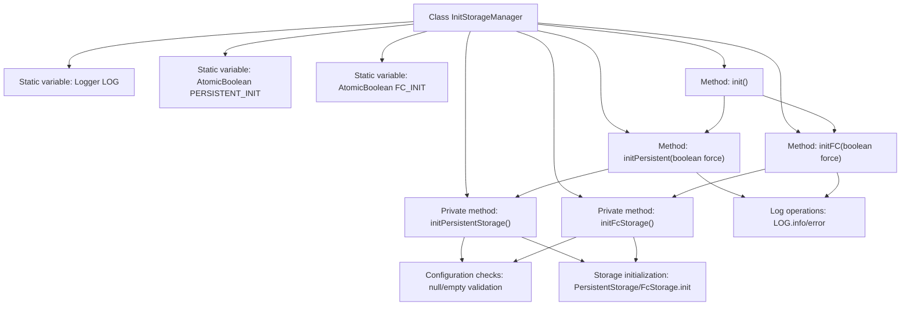

# Basic Information

|      |      |
|------|------|
| Name | InitStorageManager |
| Language | .java |
| Code Path | WeFe/gateway/src/main/java/com/welab/wefe/gateway/init/InitStorageManager.java |
| Package Name | com.welab.wefe.gateway.init |
| Dependencies | ['com.welab.wefe.common.data.storage.service.fc.FcStorage', 'com.welab.wefe.common.data.storage.service.fc.aliyun.AliyunOssConfig', 'com.welab.wefe.common.data.storage.service.fc.tencent.TencentCosConfig', 'com.welab.wefe.common.data.storage.service.persistent.PersistentStorage', 'com.welab.wefe.common.util.StringUtil', 'com.welab.wefe.common.wefe.dto.global_config.calculation_engine.fc.AliyunFunctionComputeConfigModel', 'com.welab.wefe.common.wefe.dto.global_config.calculation_engine.fc.FunctionComputeBaseConfigModel', 'com.welab.wefe.common.wefe.dto.global_config.calculation_engine.fc.TencentServerlessCloudFunctionConfigModel', 'com.welab.wefe.common.wefe.dto.global_config.storage.ClickHouseStorageConfigModel', 'com.welab.wefe.common.wefe.dto.storage.ClickhouseConfig', 'com.welab.wefe.common.wefe.enums.FcCloudProvider', 'com.welab.wefe.gateway.GatewayServer', 'com.welab.wefe.gateway.service.GlobalConfigService', 'org.slf4j.Logger', 'org.slf4j.LoggerFactory', 'java.util.concurrent.atomic.AtomicBoolean'] |
| Brief Description | The InitStorageManager class is used to initialize persistent storage and FC storage services, incorporating features such as forced retry and configuration checks, with support for Alibaba Cloud and Tencent Cloud configurations. |

# Description

The `InitStorageManager` class is responsible for initializing persistent storage and function compute storage services. It provides the `initPersistent` and `initFC` methods for initializing these two types of storage services respectively, supporting forced reinitialization. The initialization process checks the validity of configurations and logs success or failure. Persistent storage uses ClickHouse configuration, while function compute supports both Alibaba Cloud and Tencent Cloud configurations. The initialization state is maintained via an `AtomicBoolean` variable to ensure thread safety.

# Class Summary

| Name   | Type  | Description |
|-------|------|-------------|
| InitStorageManager | class | The InitStorageManager class provides initialization functionality for persistent storage and FC storage, supporting forced reinitialization, checking configurations, and logging success or failure statuses. |

## Class InitStorageManager

|      |      |
|------|------|
| Access Modifier | public |
| Type | class |
| Name | InitStorageManager |
| Description | The InitStorageManager class provides initialization functionality for persistent storage and FC storage, supporting forced reinitialization, checking configurations, and logging success or failure statuses. |

### UML Class Diagram

```mermaid
classDiagram
    class InitStorageManager {
        -static Logger LOG
        +static AtomicBoolean PERSISTENT_INIT
        +static AtomicBoolean FC_INIT
        +static void init()
        +static boolean initPersistent(boolean force)
        +static boolean initFC(boolean force)
        -static boolean initPersistentStorage()
        -static boolean initFcStorage()
    }

    class GlobalConfigService {
        <<Interface>>
        +getModel(Class~T~ modelClass) T
    }

    class ClickHouseStorageConfigModel {
        +String host
        +int http_port
        +String username
        +String password
    }

    class ClickhouseConfig {
        +ClickhouseConfig(String host, int port, String username, String password)
        +setRemoveAbandoned(boolean removeAbandoned)
    }

    class PersistentStorage {
        +static init(ClickhouseConfig config)
    }

    class FunctionComputeBaseConfigModel {
        +FcCloudProvider cloudProvider
    }

    class AliyunFunctionComputeConfigModel {
        +String accessKeyId
        +String accessKeySecret
        +String ossBucketName
        +String region
    }

    class AliyunOssConfig {
        +AliyunOssConfig(String accessKeyId, String accessKeySecret, String bucketName, String prefix, String region)
    }

    class FcStorage {
        +static initWithAliyun(AliyunOssConfig config)
        +static initWithTencent(TencentCosConfig config)
    }

    class TencentServerlessCloudFunctionConfigModel {
        +String accessKeyId
        +String accessKeySecret
        +String cosBucketName
        +String region
    }

    class TencentCosConfig {
        +TencentCosConfig(String accessKeyId, String accessKeySecret, String bucketName, String region)
    }

    InitStorageManager --> GlobalConfigService : depends
    InitStorageManager --> ClickHouseStorageConfigModel : depends
    InitStorageManager --> FunctionComputeBaseConfigModel : depends
    InitStorageManager --> AliyunFunctionComputeConfigModel : depends
    InitStorageManager --> TencentServerlessCloudFunctionConfigModel : depends
    InitStorageManager --> PersistentStorage : calls
    InitStorageManager --> FcStorage : calls
    ClickhouseConfig --> ClickHouseStorageConfigModel : constructs
    AliyunOssConfig --> AliyunFunctionComputeConfigModel : constructs
    TencentCosConfig --> TencentServerlessCloudFunctionConfigModel : constructs
```

This diagram illustrates the InitStorageManager class and its related dependencies. InitStorageManager is responsible for initializing persistent storage and function compute storage, retrieving configuration information through GlobalConfigService, and invoking PersistentStorage and FcStorage for initialization. It includes various configuration model classes (e.g., ClickHouseStorageConfigModel, AliyunFunctionComputeConfigModel) and configuration classes (e.g., ClickhouseConfig, AliyunOssConfig), demonstrating the complete initialization workflow and component interactions.

### Internal Method Call Graph

This flowchart illustrates the complete control flow of the InitStorageManager class, featuring two core initialization methods (persistent storage and FC storage) along with their internal processing logic. The class utilizes AtomicBoolean variables to ensure single initialization, incorporates a forced retry mechanism, and includes detailed error logging and configuration validation. Private methods handle the initialization of specific storage services, involving differentiated configuration loading for multi-cloud providers (Alibaba Cloud/Tencent Cloud), ultimately achieving global initialization of storage components through static methods.

### Field List

| Name  | Type  | Description |
|-------|-------|------|
| LOG = LoggerFactory.getLogger(InitStorageManager.class) | Logger | Define a private static log object LOG for the InitStorageManager class. |
| PERSISTENT_INIT = new AtomicBoolean(false) | AtomicBoolean | The static atomic boolean variable PERSISTENT_INIT has an initial value of false, which is used to control the persistent initialization state. |
| FC_INIT = new AtomicBoolean(false) | AtomicBoolean | The static atomic boolean variable FC_INIT, with an initial value of false, is used for thread-safe state marking. |

### Method List

| Name  | Type  | Description |
|-------|-------|------|
| initPersistent | boolean | The method `initPersistent` initializes persistent storage, with the parameter `force` determining whether to force initialization. If initialization fails, an error will be reported; if successful, it logs the status and returns the result. |
| init | void | The static method init calls initPersistent and initFC, with both parameters set to false. |
| initFC | boolean | Initialize FC storage method, perform initialization when forced or uninitialized, log success or failure and return status. |
| initPersistentStorage | boolean | Initialization method for persistent storage: Retrieve configuration, create ClickHouse connection settings, initialize storage, return true upon success, or log failure and return false. |
| initFcStorage | boolean | Initialize the function computing storage configuration, supporting Alibaba Cloud and Tencent Cloud. After verifying the keys and configurations, initialize the corresponding storage service. Returns false if failed. |

