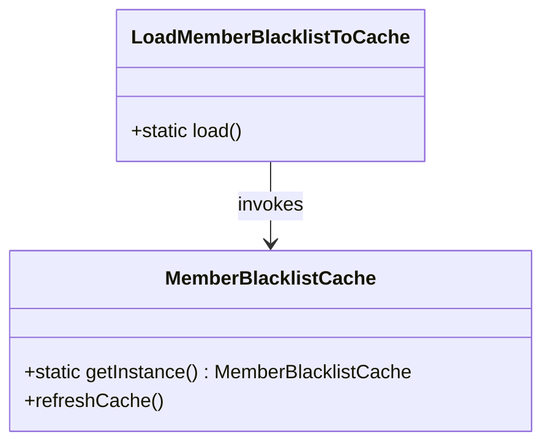
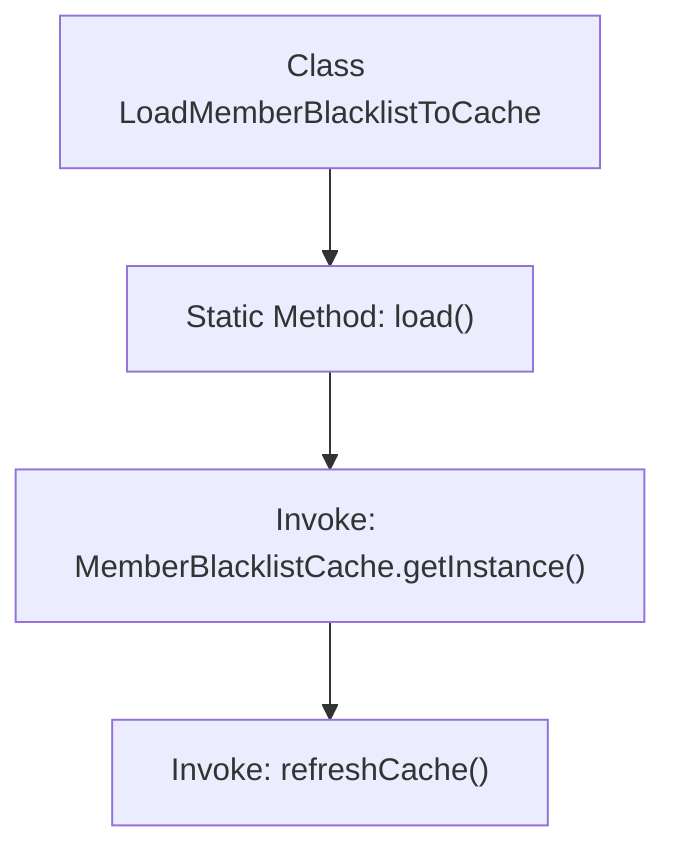

# Basic Information

|      |      |
|------|------|
| Name | LoadMemberBlacklistToCache |
| Language | .java |
| Code Path | WeFe/gateway/src/main/java/com/welab/wefe/gateway/init/LoadMemberBlacklistToCache.java |
| Package Name | com.welab.wefe.gateway.init |
| Dependencies | ['com.welab.wefe.gateway.cache.MemberBlacklistCache'] |
| Brief Description | This is a Java class containing a static method load, which is used to refresh the member blacklist cache. The method invokes the singleton instance of MemberBlacklistCache to perform the cache refresh operation. |

# Description

The code defines a public class named `LoadMemberBlacklistToCache`, which contains a static method `load`. This method retrieves an instance by calling the `getInstance` method of the `MemberBlacklistCache` class and executes the `refreshCache` operation to refresh the cache. The core functionality is to load member blacklist data into the cache, suitable for scenarios requiring periodic updates of blacklist information. The design adopts the singleton pattern to ensure the uniqueness of the cache instance, providing a concise static method as the entry point for invocation.

# Class Summary

| Name   | Type  | Description |
|-------|------|-------------|
| LoadMemberBlacklistToCache | class | This is a Java class containing a static method `load`, which is used to refresh the member blacklist cache. The method invokes the singleton instance of `MemberBlacklistCache` to perform the cache refresh operation. |

## Class LoadMemberBlacklistToCache

|      |      |
|------|------|
| Access Modifier | public |
| Type | class |
| Name | LoadMemberBlacklistToCache |
| Description | This is a Java class containing a static method `load`, which is used to refresh the member blacklist cache. The method invokes the singleton instance of `MemberBlacklistCache` to perform the cache refresh operation. |

### UML Class Diagram

This class diagram illustrates the static invocation relationship between the utility class `LoadMemberBlacklistToCache` and the singleton class `MemberBlacklistCache`. `LoadMemberBlacklistToCache` contains only one static method `load()`, which retrieves the cache instance via `MemberBlacklistCache.getInstance()` and triggers the `refreshCache()` operation. This design implements hot-reloading functionality for blacklist data, ensuring data consistency through centralized cache management, which aligns with the application scenario of the Singleton pattern.

### Internal Method Call Graph

This flowchart illustrates the execution flow of the static method `load()` in the `LoadMemberBlacklistToCache` class. It first calls the singleton instance of `MemberBlacklistCache`, then triggers the `refreshCache()` method to update the cache. The entire process is concise and clear, demonstrating the complete chain from class method invocation to final cache refresh, suitable for timed loading scenarios of blacklist data.

### Field List

| Name  | Type  | Description |
|-------|-------|------|

### Method List

| Name  | Type  | Description |
|-------|-------|------|
| load | void | The static method `load` invokes the `refreshCache` method of the `MemberBlacklistCache` singleton to refresh the cache. |

