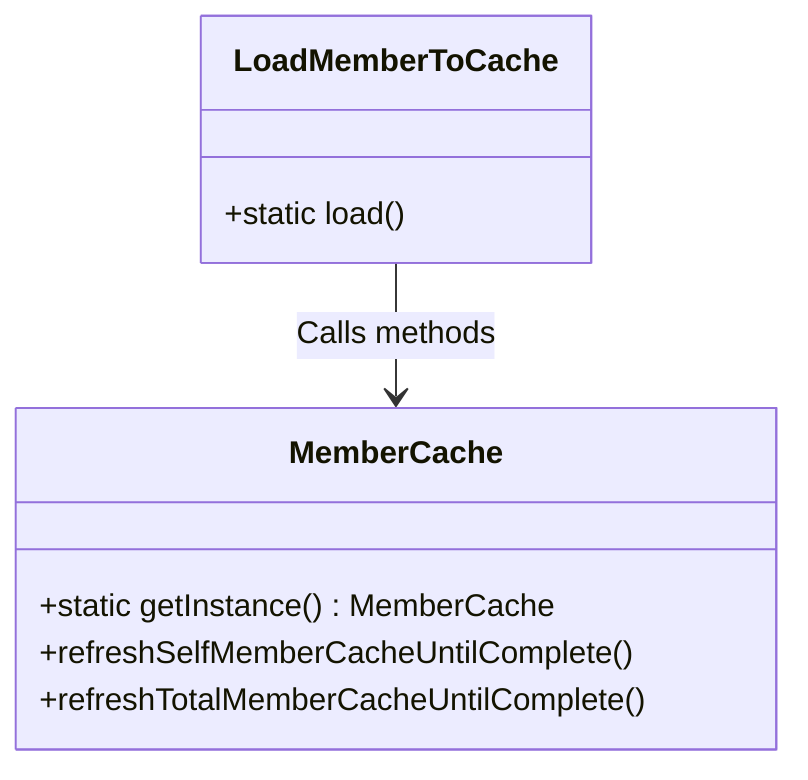
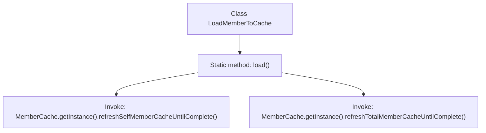

# Basic Information

|      |      |
|------|------|
| Name | LoadMemberToCache |
| Language | .java |
| Code Path | WeFe/gateway/src/main/java/com/welab/wefe/gateway/init/LoadMemberToCache.java |
| Package Name | com.welab.wefe.gateway.init |
| Dependencies | ['com.welab.wefe.gateway.cache.MemberCache'] |
| Brief Description | The class LoadMemberToCache provides a static method load(), which is used to refresh its own and all members' information into the cache until completion. |

# Description

This is a Java class named LoadMemberToCache, which contains a static method called load. The method performs two main operations: first, it calls the refreshSelfMemberCacheUntilComplete method of the MemberCache instance to load the current user's member information; then, it calls the refreshTotalMemberCacheUntilComplete method of the same instance to load all member information. Both operations will continue executing until completion, ensuring the member data is fully updated in the cache.

# Class Summary

| Name   | Type  | Description |
|-------|------|-------------|
| LoadMemberToCache | class | The `load` method of the `LoadMemberToCache` class is used to load member information into the cache, including both the member's own information and all member information. |

## Class LoadMemberToCache

|      |      |
|------|------|
| Access Modifier | public |
| Type | class |
| Name | LoadMemberToCache |
| Description | The `load` method of the `LoadMemberToCache` class is used to load member information into the cache, including both the member's own information and all member information. |

### UML Class Diagram

This class diagram illustrates the invocation relationship between the utility class LoadMemberToCache and the singleton class MemberCache. LoadMemberToCache contains only a static method load(), which obtains the cache instance via MemberCache.getInstance(), then sequentially calls two critical methods: refreshSelfMemberCacheUntilComplete() and refreshTotalMemberCacheUntilComplete(). These methods are used to load the current user's member information and all members' information into the cache, respectively. The overall design demonstrates a dependency-invocation pattern where a utility class relies on singleton cache services, making it suitable for scenarios requiring preloading or refreshing cached data.

### Internal Method Call Graph

This flowchart illustrates the execution flow of the static method load() in the LoadMemberToCache class. The method first invokes refreshSelfMemberCacheUntilComplete() through the MemberCache singleton instance to load the current user's own member information, followed by calling refreshTotalMemberCacheUntilComplete() to load all member data. These two operations are executed sequentially, collectively completing the process of loading member data into the cache, demonstrating key steps during cache initialization.

### Field List

| Name  | Type  | Description |
|-------|-------|------|

### Method List

| Name  | Type  | Description |
|-------|-------|------|
| load | void | The static method load() is used to load member information: first refresh the current member cache until completion, then refresh all member caches until completion. |

