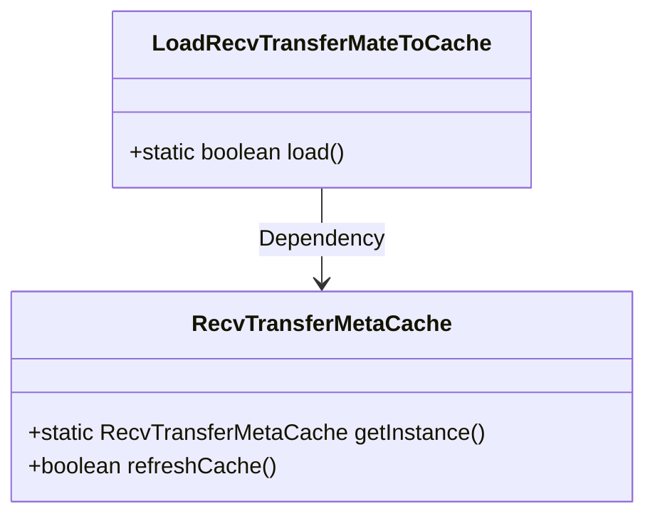
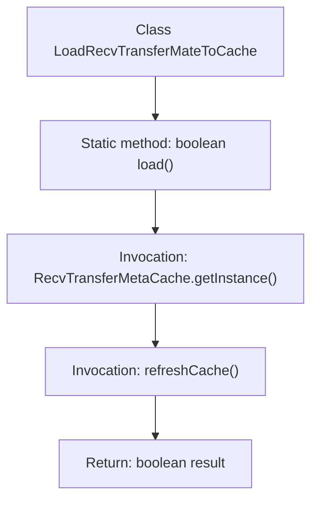

# Basic Information

|      |      |
|------|------|
| Name | LoadRecvTransferMateToCache |
| Language | .java |
| Code Path | WeFe/gateway/src/main/java/com/welab/wefe/gateway/init/LoadRecvTransferMateToCache.java |
| Package Name | com.welab.wefe.gateway.init |
| Dependencies | ['com.welab.wefe.gateway.cache.RecvTransferMetaCache'] |
| Brief Description | This is a Java class containing a static method load(), which is used to refresh the received transmission metadata cache and returns whether the operation was successful. |

# Description

This is a Java class named LoadRecvTransferMateToCache, which contains a static method called load. The method refreshes the cache by invoking the refreshCache method of the singleton instance of the RecvTransferMetaCache class and returns a boolean value indicating whether the operation was successful. The entire class has a single responsibility, focusing solely on the cache refresh operation.

# Class Summary

| Name   | Type  | Description |
|-------|------|-------------|
| LoadRecvTransferMateToCache | class | The class `LoadRecvTransferMateToCache` provides a static method `load`, which invokes the `refreshCache` method of the singleton `RecvTransferMetaCache` to refresh the cache and return the result. |

## Class LoadRecvTransferMateToCache

|      |      |
|------|------|
| Access Modifier | public |
| Type | class |
| Name | LoadRecvTransferMateToCache |
| Description | The class `LoadRecvTransferMateToCache` provides a static method `load`, which invokes the `refreshCache` method of the singleton `RecvTransferMetaCache` to refresh the cache and return the result. |

### UML Class Diagram

This code snippet illustrates a simple class diagram structure where the LoadRecvTransferMateToCache class invokes the singleton instance of RecvTransferMetaCache via its static load() method to perform cache refresh operations. The RecvTransferMetaCache class provides the getInstance() method for obtaining the singleton instance and the refreshCache() method for cache refreshing. A dependency relationship exists between the two classes, with LoadRecvTransferMateToCache relying on RecvTransferMetaCache to fulfill its core functionality. The overall design demonstrates the application of the Singleton pattern and the principle of separation of concerns.

### Internal Method Call Graph

This flowchart illustrates the core logic of the `LoadRecvTransferMateToCache` class. The static method `load()` retrieves the singleton instance of `RecvTransferMetaCache`, invokes its `refreshCache()` method to update the cache, and ultimately returns the operation result. The entire process is concise and efficient, demonstrating a typical combination of the singleton pattern and cache refresh, with arrows clearly depicting the complete chain from method invocation to result return.

### Field List

| Name  | Type  | Description |
|-------|-------|------|

### Method List

| Name  | Type  | Description |
|-------|-------|------|
| load | boolean | The method invokes the refreshCache method of the RecvTransferMetaCache instance to refresh the cache and returns the operation result. |

