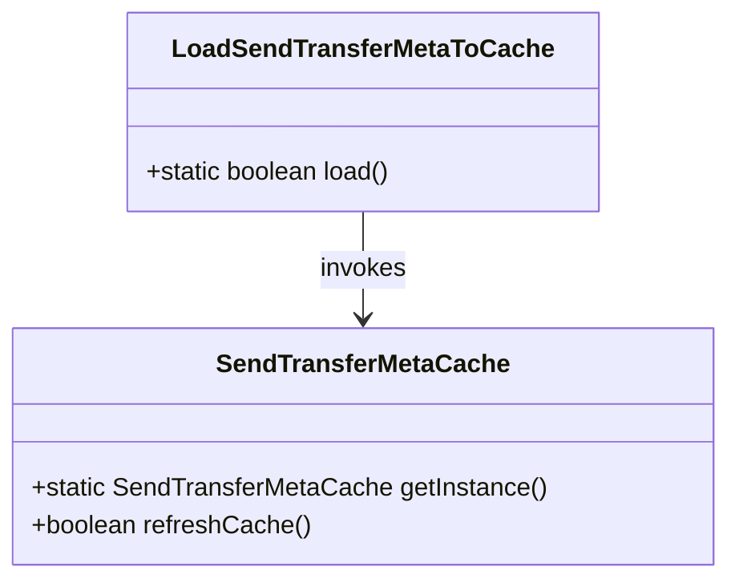
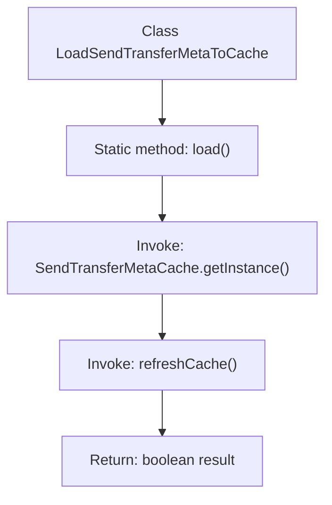

# Basic Information

|      |      |
|------|------|
| Name | LoadSendTransferMetaToCache |
| Language | .java |
| Code Path | WeFe/gateway/src/main/java/com/welab/wefe/gateway/init/LoadSendTransferMetaToCache.java |
| Package Name | com.welab.wefe.gateway.init |
| Dependencies | ['com.welab.wefe.gateway.cache.SendTransferMetaCache'] |
| Brief Description | The class `LoadSendTransferMetaToCache` provides a static method `load`, which invokes the `refreshCache` method of the `SendTransferMetaCache` singleton to refresh the cache and return the result. |

# Description

The content describes a public class named LoadSendTransferMetaToCache, which includes a static method called load. This method retrieves an instance by invoking the getInstance method of the SendTransferMetaCache class and performs a refreshCache operation to update the cache. The method returns a boolean value indicating the success or failure of the cache refresh operation. The design is concise, focusing solely on the single responsibility of cache refreshing.

# Class Summary

| Name   | Type  | Description |
|-------|------|-------------|
| LoadSendTransferMetaToCache | class | The class `LoadSendTransferMetaToCache` contains a static method `load`, which invokes the `refreshCache` method of the `SendTransferMetaCache` singleton to refresh the cache and return the result. |

## Class LoadSendTransferMetaToCache

|      |      |
|------|------|
| Access Modifier | public |
| Type | class |
| Name | LoadSendTransferMetaToCache |
| Description | The class `LoadSendTransferMetaToCache` contains a static method `load`, which invokes the `refreshCache` method of the `SendTransferMetaCache` singleton to refresh the cache and return the result. |

### UML Class Diagram

This code illustrates a simple cache loading scenario where the `LoadSendTransferMetaToCache` class invokes the singleton `SendTransferMetaCache`'s `refreshCache()` method via its static `load()` method. The class diagram clearly depicts this unidirectional dependency relationship. `SendTransferMetaCache` serves as the cache management class, providing instance retrieval and cache refresh functionalities, while the main class acts solely as an invocation entry point. This design adheres to the Single Responsibility Principle, decoupling cache operations from actual business logic.

### Internal Method Call Graph

This flowchart illustrates the core logic of the LoadSendTransferMetaToCache class. The process starts with the static method load(), which first obtains the singleton instance of SendTransferMetaCache, then calls its refreshCache() method to update the cache, and finally returns the operation result as a boolean value. The entire procedure demonstrates a concise chained invocation structure, highlighting the collaborative relationships between classes.

### Field List

| Name  | Type  | Description |
|-------|-------|------|

### Method List

| Name  | Type  | Description |
|-------|-------|------|
| load | boolean | The method invokes the refreshCache method of the SendTransferMetaCache instance to refresh the cache and returns a boolean result. |

