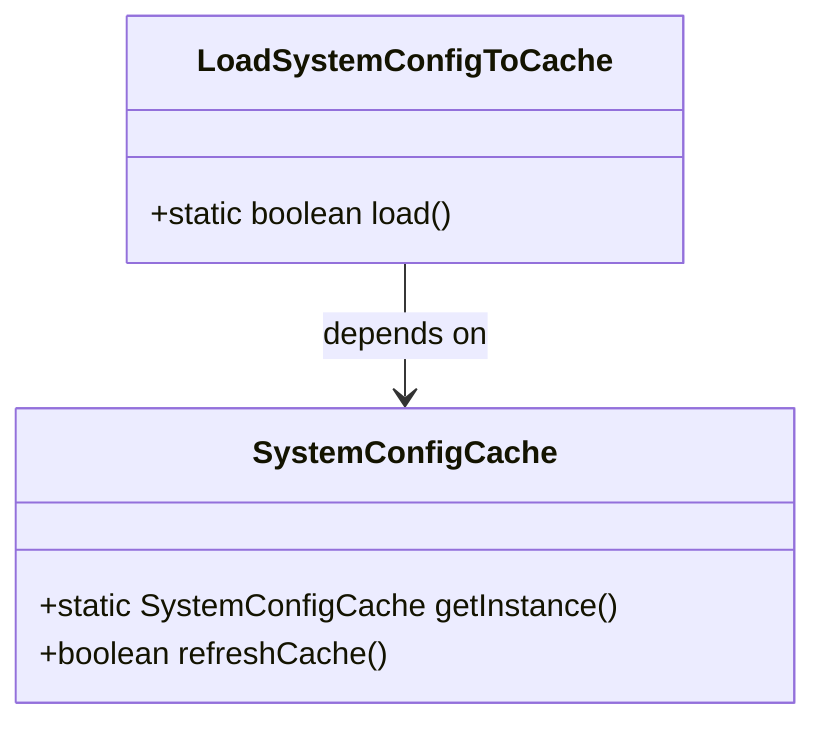
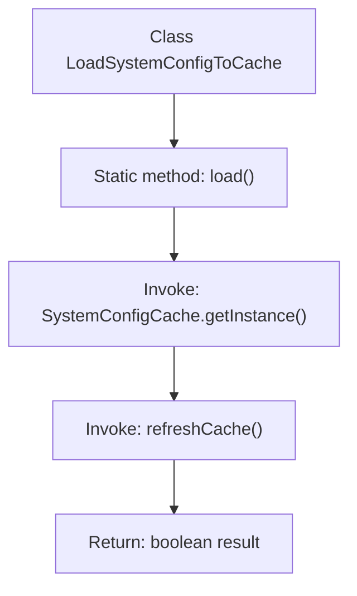

# Basic Information

|      |      |
|------|------|
| Name | LoadSystemConfigToCache |
| Language | .java |
| Code Path | WeFe/gateway/src/main/java/com/welab/wefe/gateway/init/LoadSystemConfigToCache.java |
| Package Name | com.welab.wefe.gateway.init |
| Dependencies | ['com.welab.wefe.gateway.cache.SystemConfigCache'] |
| Brief Description | The class LoadSystemConfigToCache provides a static method load, which invokes the refreshCache method of the SystemConfigCache singleton to refresh the cache and return the result. |

# Description

This is a public class named LoadSystemConfigToCache, which contains a static method called load. The method refreshes the system configuration cache by invoking the refreshCache method of the singleton instance of the SystemConfigCache class and returns a boolean value indicating whether the operation was successful. The purpose of the entire class is to load system configurations into the cache.

# Class Summary

| Name   | Type  | Description |
|-------|------|-------------|
| LoadSystemConfigToCache | class | The class `LoadSystemConfigToCache` provides a static method `load`, which invokes the `refreshCache` method of the `SystemConfigCache` singleton to refresh the cache and return the result. |

## Class LoadSystemConfigToCache

|      |      |
|------|------|
| Access Modifier | public |
| Type | class |
| Name | LoadSystemConfigToCache |
| Description | The class `LoadSystemConfigToCache` provides a static method `load`, which invokes the `refreshCache` method of the `SystemConfigCache` singleton to refresh the cache and return the result. |

### UML Class Diagram

This code demonstrates a simple configuration loading system where the `LoadSystemConfigToCache` class invokes the `refreshCache()` method of the `SystemConfigCache` singleton via its static `load()` method. The class diagram clearly illustrates this dependency relationship, with `LoadSystemConfigToCache` as the caller relying on the cache refresh functionality provided by `SystemConfigCache`. The entire design adheres to the Single Responsibility Principle, separating configuration loading logic from cache implementation for easier maintenance and extensibility.

### Internal Method Call Graph

This flowchart illustrates the core logic of the LoadSystemConfigToCache class. The process starts with the static method load(), which first retrieves the singleton instance of SystemConfigCache, then calls its refreshCache() method to update the cache, and finally returns a boolean result. The entire process is concise and efficient, demonstrating a typical combination of the singleton pattern and cache refresh, suitable for system configuration loading scenarios.

### Field List

| Name  | Type  | Description |
|-------|-------|------|

### Method List

| Name  | Type  | Description |
|-------|-------|------|
| load | boolean | The static method `load` invokes the `refreshCache` method of the `SystemConfigCache` instance to refresh the cache and return the result. |

