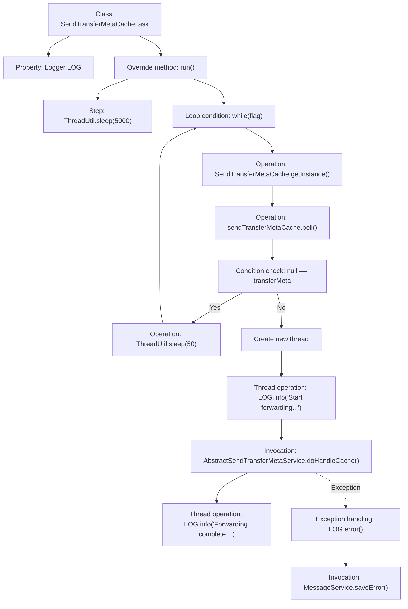

# Basic Information

|      |      |
|------|------|
| Name | SendTransferMetaCacheTask |
| Language | .java |
| Code Path | WeFe/gateway/src/main/java/com/welab/wefe/gateway/init/SendTransferMetaCacheTask.java |
| Package Name | com.welab.wefe.gateway.init |
| Dependencies | ['com.welab.wefe.common.util.ThreadUtil', 'com.welab.wefe.gateway.GatewayServer', 'com.welab.wefe.gateway.api.meta.basic.GatewayMetaProto', 'com.welab.wefe.gateway.cache.SendTransferMetaCache', 'com.welab.wefe.gateway.service.MessageService', 'com.welab.wefe.gateway.service.base.AbstractSendTransferMetaService', 'org.slf4j.Logger', 'org.slf4j.LoggerFactory'] |
| Brief Description | SendTransferMetaCacheTask is a thread class. After startup, it first sleeps for 5 seconds to wait for the GRPC service initialization, then continuously checks and forwards TransferMeta messages in the cache. Processing failures will be logged as error messages. |

# Description

SendTransferMetaCacheTask is a thread class designed to handle transfer metadata in the cache. Upon startup, it first sleeps for 5 seconds to avoid uninitialized GRPC services, then enters a loop to continuously retrieve data from the SendTransferMetaCache instance. If no data is available, it sleeps for 50 milliseconds before retrying. Upon obtaining data, it spawns a new thread to process it: logging the event and invoking AbstractSendTransferMetaService to handle the cached data, followed by another log entry upon completion. If an exception occurs during processing, an error log is recorded and the error message is saved via MessageService. The entire process continues running until a flag is changed.

# Class Summary

| Name   | Type  | Description |
|-------|------|-------------|
| SendTransferMetaCacheTask | class | The `SendTransferMetaCacheTask` thread class, after startup, delays for 5 seconds and then cyclically processes the `TransferMeta` messages in the cache. It forwards the messages by invoking services via a new thread and logs the process, while saving error information in case of exceptions. |


## Class SendTransferMetaCacheTask

|      |      |
|------|------|
| Access Modifier | public |
| Type | class |
| Name | SendTransferMetaCacheTask |
| Description | The `SendTransferMetaCacheTask` thread class, after startup, delays for 5 seconds and then cyclically processes the `TransferMeta` messages in the cache. It forwards the messages by invoking services via a new thread and logs the process, while saving error information in case of exceptions. |


### UML Class Diagram

```mermaid
classDiagram
    class SendTransferMetaCacheTask {
        -Logger LOG
        +run() void
    }

    class ThreadUtil {
        <<static>>
        +sleep(long millis) void
    }

    class SendTransferMetaCache {
        <<static>>
        +getInstance() SendTransferMetaCache
        +poll() GatewayMetaProto$TransferMeta
    }

    class GatewayMetaProto$TransferMeta {
        +getSessionId() String
    }

    class GatewayServer {
        <<static>>
        -CONTEXT: ApplicationContext
    }

    class AbstractSendTransferMetaService {
        <<Interface>>
        +doHandleCache(GatewayMetaProto$TransferMeta transferMeta) void
    }

    class MessageService {
        +saveError(String title, String msg, GatewayMetaProto$TransferMeta meta) void
    }

    SendTransferMetaCacheTask --> ThreadUtil : calls
    SendTransferMetaCacheTask --> SendTransferMetaCache : gets instance
    SendTransferMetaCacheTask --> GatewayMetaProto$TransferMeta : processes message
    SendTransferMetaCacheTask --> GatewayServer : acquires service
    GatewayServer --> AbstractSendTransferMetaService : depends
    GatewayServer --> MessageService : depends
```

This code demonstrates the implementation flow of a message forwarding task thread. The SendTransferMetaCacheTask extends the Thread class, retrieves pending messages from SendTransferMetaCache through polling, and asynchronously forwards messages using GRPC services. The core process includes mechanisms such as 5-second initialization delay, empty message detection, and exception handling, involving collaboration among multiple components like static utility classes, singleton caches, and interface service invocations, reflecting the robust design of the message forwarding system.


### Internal Method Call Graph



This code describes a background thread task primarily designed to process cached transfer metadata. The flowchart illustrates the complete processing flow after thread startup: an initial 5-second delay followed by entering a loop that continuously retrieves data from the cache. If no data is available, it briefly sleeps before continuing polling; upon obtaining data, it creates a new thread for asynchronous processing, including logging, invoking services to handle data, and capturing exceptions with error saving. The entire process demonstrates a combination of the producer-consumer pattern and asynchronous processing.

### Field List

| Name  | Type  | Description |
|-------|-------|------|
| LOG = LoggerFactory.getLogger(SendTransferMetaCacheTask.class) | Logger | The private static log object LOG defined in the SendTransferMetaCacheTask class is used to record log information. |

### Method List

| Name  | Type  | Description |
|-------|-------|------|
| run | void | After the method starts, it first sleeps for 5 seconds to ensure the GRPC service initialization is complete, then enters a loop to check and process the transfer metadata in the cache. If the cache is empty, it briefly sleeps before continuing the check; otherwise, a new thread handles the metadata, logs the activity, and captures any exceptions. |


