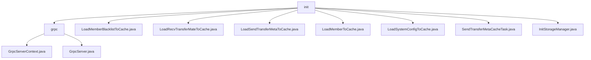

# Basic Information

|      |      |
|------|------|
| Name | init |
| Language | .java |
| Code Path | WeFe/gateway/src/main/java/com/welab/wefe/gateway/init |
| Package Name | docs.gateway.src.main.java.com.welab.wefe.gateway.init |
| Brief Description | This module manages the gRPC server lifecycle, supporting dual-channel communication and dynamic TLS configuration, including startup/shutdown control and interceptor management. The key structures are GrpcServerContext and TLS certificate context. It depends on MemberService and ServerCertService. Other classes are responsible for cache loading (blacklist, member information, transport metadata, etc.) and storage initialization (persistence, function computation). |

# Description

## Overview  
The core responsibility of this module is to manage the gRPC server lifecycle and multi-type cache loading, employing a dual-channel communication isolation and dynamic TLS configuration mechanism, similar to a gateway proxy pattern. Unified interface specifications include server control (start/stop/TLS switching), cache refresh (blacklist/transfer metadata/system configuration), and storage initialization (ClickHouse/cloud functions). Key data structures consist of GrpcServerContext, various Cache singletons (e.g., MemberBlacklistCache), and TLS certificate contexts. External dependencies only involve MemberService, ServerCertService, and cloud platform configurations. For example, metadata asynchronous processing is achieved via SendTransferMetaCacheTask.

## Primary Business Scenarios  
Typical applications include dual-channel gRPC initialization (internal plaintext/external dynamic TLS) and multi-cache hot loading, resembling a dual-firewall strategy combined with data preheating. The complete process encompasses port validation, service registration, cache refresh (e.g., LoadMemberToCache loading full member data), and exception rollback (e.g., automatic termination upon startup failure). The interaction mode controls multiple instances through singletons, supporting TLS hot updates and cache asynchronous processing (e.g., SendTransferMetaCacheTask polling mechanism). API types focus on lifecycle management (restartExternalServer) and cache operations (refreshCache), with storage services supporting forced reinitialization (InitStorageManager.initFC).

### Package Internal Structure View

This flowchart illustrates the hierarchical structure of the WeFe gateway initialization module. The root node "init" contains 7 direct child nodes, where "grpc" is a directory node and the rest are Java file nodes. The "grpc" directory further includes two specific implementation class files. All nodes retain the terminal names of their original paths, clearly presenting the file organization relationship within the initialization module.

# File List

| Name   | Type  | Description |
|-------|------|-------------|
| [LoadMemberBlacklistToCache.java](LoadMemberBlacklistToCache.md) | file | This is a Java class containing a static method `load`, which is used to refresh the member blacklist cache. The method invokes the singleton instance of `MemberBlacklistCache` to perform the cache refresh operation. |
| [LoadRecvTransferMateToCache.java](LoadRecvTransferMateToCache.md) | file | This is a Java class containing a static method load(), which is used to refresh the received transmission metadata cache and returns whether the operation was successful. |
| [LoadSendTransferMetaToCache.java](LoadSendTransferMetaToCache.md) | file | The class `LoadSendTransferMetaToCache` provides a static method `load`, which invokes the `refreshCache` method of the `SendTransferMetaCache` singleton to refresh the cache and return the result. |
| [LoadMemberToCache.java](LoadMemberToCache.md) | file | The class LoadMemberToCache provides a static method load(), which is used to refresh its own and all members' information into the cache until completion. |
| [LoadSystemConfigToCache.java](LoadSystemConfigToCache.md) | file | The class `LoadSystemConfigToCache` provides a static method `load`, which invokes the `refreshCache` method of the `SystemConfigCache` singleton to refresh the cache and return the result. |
| [SendTransferMetaCacheTask.java](SendTransferMetaCacheTask.md) | file | SendTransferMetaCacheTask is a thread class that, upon startup, first sleeps for 5 seconds to wait for the GRPC service initialization, then continuously checks and forwards TransferMeta messages in the cache. Failed processing will log error messages. |
| [InitStorageManager.java](InitStorageManager.md) | file | The InitStorageManager class is used to initialize persistent storage and FC storage services, featuring forced retry and configuration check capabilities, and supports configurations for Alibaba Cloud and Tencent Cloud. |
| [grpc](grpc/_module.md) | package | GrpcServerContext is a singleton class that manages the lifecycle of internal and external gRPC servers, checks port configurations, handles TLS settings, and supports restart and dynamic TLS updates. The GrpcServer class manages server properties, startup, and shutdown, supports TLS encryption and interceptor configuration, and handles exceptions and state transitions. |

