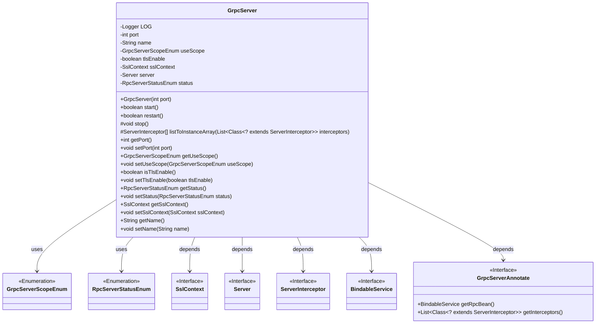

# Basic Information

|      |      |
|------|------|
| Name | GrpcServer |
| Language | .java |
| Code Path | WeFe/gateway/src/main/java/com/welab/wefe/gateway/init/grpc/GrpcServer.java |
| Package Name | com.welab.wefe.gateway.init.grpc |
| Dependencies | ['com.welab.wefe.gateway.base.GrpcServerAnnotate', 'com.welab.wefe.gateway.common.GrpcConstant', 'com.welab.wefe.gateway.common.RpcServerStatusEnum', 'com.welab.wefe.gateway.common.GrpcServerScopeEnum', 'com.welab.wefe.gateway.util.ClassUtil', 'io.grpc', 'io.grpc.netty.NettyServerBuilder', 'io.netty.handler.ssl.SslContext', 'org.apache.commons.collections4.CollectionUtils', 'org.slf4j.Logger', 'org.slf4j.LoggerFactory', 'java.util.List', 'java.util.Map', 'java.util.concurrent.TimeUnit'] |
| Brief Description | The GrpcServer class implements gRPC server functionality, including attributes such as port, name, TLS configuration, and service status, while providing methods for starting, restarting, stopping, and handling interceptors. |

# Description

The `GrpcServer` class is a Java class designed to manage the lifecycle of a gRPC server, encompassing attributes such as port, name, usage scope, TLS enablement status, SSL context, and server state. It provides methods for starting, restarting, and stopping the server, supporting TLS encryption and interceptor configuration. During startup, it loads gRPC service classes within the specified scope, sets maximum message size and connection parameters, and registers shutdown hooks. The restart and stop methods ensure proper server state transitions and handle exceptional cases. The class also includes property accessors and utility methods, such as converting a list of interceptor classes into an instance array.

# Class Summary

| Name   | Type  | Description |
|-------|------|-------------|
| GrpcServer | class | The GrpcServer class implements gRPC server functionality, including attributes such as port, name, and TLS configuration. It provides methods for starting, restarting, and stopping, and supports interceptors and SSL encryption. |

## Class GrpcServer

|      |      |
|------|------|
| Access Modifier | public |
| Type | class |
| Name | GrpcServer |
| Description | The GrpcServer class implements gRPC server functionality, including attributes such as port, name, and TLS configuration. It provides methods for starting, restarting, and stopping, and supports interceptors and SSL encryption. |

### UML Class Diagram

Class diagram description: The GrpcServer class is a gRPC server implementation containing configuration attributes such as port, name, and scope, providing methods to start, restart, and stop services. It depends on multiple interfaces and enumeration classes, such as SslContext for TLS encryption, ServerInterceptor for request interception, and BindableService representing bindable gRPC services. Services are loaded via the GrpcServerAnnotate annotation class, supporting TLS encryption and connection parameter configuration, making it a comprehensive gRPC service management class.

### Internal Method Call Graph

```mermaid
graph TD
    A["Class GrpcServer"]
    B["Property: Logger LOG"]
    C["Property: int port"]
    D["Property: String name"]
    E["Property: GrpcServerScopeEnum useScope"]
    F["Property: boolean tlsEnable"]
    G["Property: SslContext sslContext"]
    H["Property: Server server"]
    I["Property: RpcServerStatusEnum status"]
    J["Constructor: GrpcServer(int port)"]
    K["Method: boolean start()"]
    L["Method: boolean restart()"]
    M["Method: protected void stop()"]
    N["Method: ServerInterceptor[] listToInstanceArray()"]
    O["Getter/Setter Methods"]

    A --> B
    A --> C
    A --> D
    A --> E
    A --> F
    A --> G
    A --> H
    A --> I
    A --> J
    A --> K
    A --> L
    A --> M
    A --> N
    A --> O

    K --> K1["Load RPC classes: ClassUtil.loadRpcClassBeans()"]
    K --> K2["Configure NettyServerBuilder"]
    K --> K3["Add service interceptors"]
    K --> K4["Set up TLS/SSL"]
    K --> K5["Start server: server.start()"]
    K --> K6["Register shutdown hook"]

    L --> L1["Shutdown existing server: server.shutdown()"]
    L --> L2["Invoke start() method"]
    
    M --> M1["Graceful shutdown: server.shutdown()"]
    M --> M2["Update status to SHUTDOWN"]
```

This code implements a gRPC server management class with core functionalities including server start(start), restart(restart), and stop(stop) operations. The flowchart illustrates the class structure relationships, where the start() method encompasses the complete service initialization process: loading RPC service classes, configuring Netty server parameters, handling interceptors, setting up secure connections, etc. The restart() method achieves rebooting through a stop-then-start approach, while the stop() method implements graceful shutdown. The class contains multiple configuration properties and corresponding getter/setter methods, supporting parameter configurations such as port, name, scope, etc.

### Field List

| Name  | Type  | Description |
|-------|-------|------|
| status = RpcServerStatusEnum.SHUTDOWN | RpcServerStatusEnum | The private variable status is initialized to RpcServerStatusEnum.SHUTDOWN, indicating the RPC server status is shutdown. |
| sslContext | SslContext | Private SSL context variables for secure communication configuration. |
| tlsEnable | boolean | Boolean flag to enable TLS encryption. |
| useScope | GrpcServerScopeEnum | The private variable `useScope` of type `GrpcServerScopeEnum` is used to define the usage scope of the gRPC server. |
| name | String | private String variable name |
| port | int | Private integer port variable. |
| server | Server | Private server instance variables. |
| LOG = LoggerFactory.getLogger(GrpcServer.class) | Logger | The GrpcServer class declares a private immutable Logger instance for logging purposes. |

### Method List

| Name  | Type  | Description |
|-------|-------|------|
| setStatus | void | Methods for setting the RPC server status, with the parameter being the enumeration type RpcServerStatusEnum. |
| isTlsEnable | boolean | This method returns a boolean value indicating whether TLS is enabled. |
| listToInstanceArray | ServerInterceptor[] | Convert the interceptor class list into an instance array, create an instance of each class through reflection, and return the array. Handle exceptions including illegal access and instantiation failure. |
| getPort | int | The method returns the port number. |
| setTlsEnable | void | A public method to set the TLS enable status, with a boolean parameter `tlsEnable`. |
| getUseScope | GrpcServerScopeEnum | Get the value of the useScope attribute of type GrpcServerScopeEnum. |
| restart | boolean | This method is used to restart the gRPC server by first shutting down the running server and then restarting it. It returns true if successful, or logs the failure and returns false. |
| stop | void | Stop the gRPC server. If it is running, wait for 10 seconds before shutting it down, set the status to SHUTDOWN, and log an error message in case of exceptions. |
| setPort | void | This is a Java method used to set the port number, which assigns the incoming `port` parameter to the class's member variable `port`. |
| setUseScope | void | Defines a public method setUseScope for setting the value of the useScope property of type GrpcServerScopeEnum. |
| start | boolean | Method to start the gRPC server: Check available services, bind ports, configure interceptors, message size, connection parameters, and TLS, then start the service and register shutdown hooks. Returns true on success; logs errors and returns false on failure. |
| getSslContext | SslContext | The method returns an SSL context object. |
| setSslContext | void | The method to set the SSL context assigns the incoming SslContext object to the sslContext field of the current object. |
| getName | String | This is a Java method that returns the value of the private member variable name. |
| setName | void | This is a Java method used to set the name property of an object. The method takes a string parameter name and assigns it to the name field of the current object. |
| getStatus | RpcServerStatusEnum | Methods to obtain the current status of RpcServer, returning an RpcServerStatusEnum enumeration value. |

