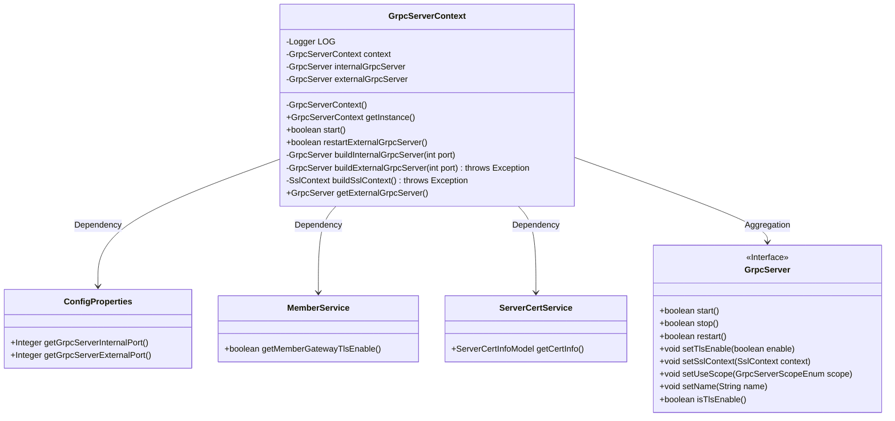
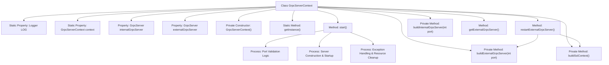

# Basic Information

|      |      |
|------|------|
| Name | GrpcServerContext |
| Language | .java |
| Code Path | WeFe/gateway/src/main/java/com/welab/wefe/gateway/init/grpc/GrpcServerContext.java |
| Package Name | com.welab.wefe.gateway.init.grpc |
| Dependencies | ['java.security.PrivateKey', 'java.security.cert.X509Certificate', 'org.slf4j.Logger', 'org.slf4j.LoggerFactory', 'com.webank.cert.toolkit.utils.CertUtils', 'com.webank.cert.toolkit.utils.KeyUtils', 'com.welab.wefe.common.util.AESUtil', 'com.welab.wefe.common.wefe.dto.global_config.ServerCertInfoModel', 'com.welab.wefe.gateway.GatewayServer', 'com.welab.wefe.gateway.cache.MemberCache', 'com.welab.wefe.gateway.common.GrpcServerScopeEnum', 'com.welab.wefe.gateway.config.ConfigProperties', 'com.welab.wefe.gateway.service.MemberService', 'com.welab.wefe.gateway.service.ServerCertService', 'io.grpc.netty.GrpcSslContexts', 'io.netty.handler.ssl.SslContext', 'io.netty.handler.ssl.SslContextBuilder', 'io.netty.handler.ssl.SslProvider'] |
| Brief Description | The `GrpcServerContext` class manages the gRPC server, including internal and external server instances. During startup, it checks port configurations, builds, and launches the server. It supports restarting the external server and SSL configuration. A singleton pattern is adopted. |

# Description

The `GrpcServerContext` class is a singleton class designed to manage the lifecycle of internal and external gRPC servers. It contains two `GrpcServer` instances, dedicated to internal and external communication respectively. During startup, it checks port configurations to ensure ports are non-empty and distinct. The internal server has TLS disabled by default, while the external server's TLS usage is determined by the `MemberService` configuration. If startup fails, it automatically stops any already launched servers. It provides functionality to restart the external server, allowing dynamic updates to TLS configurations. The TLS context is constructed by fetching certificate information via the `ServerCertService`.

# Class Summary

| Name   | Type  | Description |
|-------|------|-------------|
| GrpcServerContext | class | The GrpcServerContext class manages the gRPC server, including internal and external server instances. It provides functionalities for starting and restarting the external server, with support for TLS configuration. During startup, it checks port validity and automatically cleans up resources upon failure. The internal server does not use TLS, while the external server enables TLS and builds an SSL context based on configuration. |

## Class GrpcServerContext

|      |      |
|------|------|
| Access Modifier | public |
| Type | class |
| Name | GrpcServerContext |
| Description | The GrpcServerContext class manages the gRPC server, including internal and external server instances. It provides functionalities for starting and restarting the external server, with support for TLS configuration. During startup, it checks port validity and automatically cleans up resources upon failure. The internal server does not use TLS, while the external server enables TLS and builds an SSL context based on configuration. |

### UML Class Diagram

Class Diagram Description: GrpcServerContext is a singleton class responsible for managing the lifecycle of internal and external gRPC servers. It depends on ConfigProperties to obtain port configurations, MemberService for TLS settings, ServerCertService for SSL certificate information, and manages GrpcServer instances through aggregation. Key functionalities include starting servers, restarting external servers, and building SSL contexts.

### Internal Method Call Graph

This code implements a gRPC server context management class using the singleton pattern to control the lifecycle of internal and external gRPC servers. Core processes include: 1) Port validation, server instance construction, and startup via the start() method; 2) TLS-configured external server restart through restartExternalGrpcServer(); 3) Comprehensive exception handling and resource cleanup mechanisms. Key features encompass dynamic SSL certificate loading, dual-server isolation management (INTERNAL/EXTERNAL), and configuration retrieval via Spring context. All operations are accompanied by robust error logging to ensure service reliability.

### Field List

| Name  | Type  | Description |
|-------|-------|------|
| LOG = LoggerFactory.getLogger(GrpcServerContext.class) | Logger | The GrpcServerContext class defines a protected static logger LOG for recording log information. |
| externalGrpcServer | GrpcServer | Private GrpcServer instance for external communication. |
| internalGrpcServer | GrpcServer | Private GrpcServer instance internalGrpcServer. |
| context = new GrpcServerContext() | GrpcServerContext | The private static variable context is initialized as an instance of GrpcServerContext. |

### Method List

| Name  | Type  | Description |
|-------|-------|------|
| getInstance | GrpcServerContext | Get the singleton instance of GrpcServerContext. |
| restartExternalGrpcServer | boolean | Restarting the external gRPC server method: Check the TLS activation status. If enabled, set the SSL context, attempt to restart the server, and return false with an error log if the operation fails. |
| buildExternalGrpcServer | GrpcServer | Build an external gRPC server, configure the port, name, and external scope, enable TLS based on the member service configuration, and set up the SSL context. |
| buildInternalGrpcServer | GrpcServer | Build an internal gRPC server, specify the port, disable TLS, set the name as INTERNAL, and limit the scope to internal. |
| start | boolean | Check and start the gRPC server, verify that the internal and external ports are non-empty and different, return true upon successful startup, and clean up resources and log errors upon failure. |
| buildSslContext | SslContext | Building SSL Context: Retrieve service certificate information, decrypt the private key and convert it to an X509 certificate, then return the SSL context after configuring the OpenSSL provider. Throw an exception if the certificate is invalid. |
| getExternalGrpcServer | GrpcServer | Methods for obtaining external gRPC server instances. |

