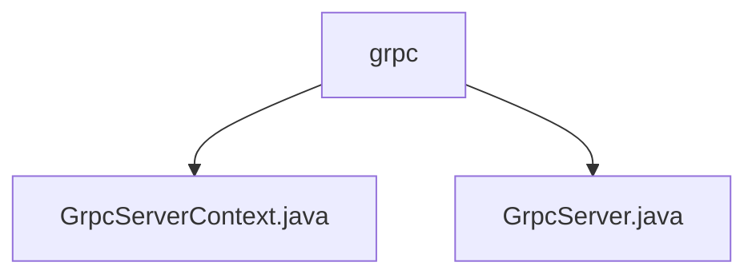

# Basic Information

|      |      |
|------|------|
| Name | grpc |
| Language | .java |
| Code Path | WeFe/gateway/src/main/java/com/welab/wefe/gateway/init/grpc |
| Package Name | docs.gateway.src.main.java.com.welab.wefe.gateway.init.grpc |
| Brief Description | GrpcServerContext is a singleton class that manages the lifecycle of internal and external gRPC servers, checks port configurations, handles TLS settings, and supports restart and dynamic TLS updates. The GrpcServer class manages server properties, startup, and shutdown, supports TLS encryption and interceptor configuration, and handles exceptions and state transitions. |

# Description

## Overview  
The core responsibility of this module is to manage the lifecycle of gRPC servers, supporting isolation between internal and external communication and dynamic TLS configuration. The interface specifications are unified for start/stop control, TLS state switching, and interceptor management, resembling a gateway proxy pattern. Key data structures include GrpcServerContext (singleton), GrpcServer (instantiated object), and TLS certificate context. External dependencies only involve MemberService configuration and ServerCertService certificate services. For example, ServerCertService dynamically constructs the TLS context.

## Primary Business Scenarios  
Typical scenarios include dual-channel server initialization: the internal channel disables TLS by default, while the external channel dynamically enables TLS based on MemberService, similar to a dual-firewall strategy. The complete process covers port validation, service registration, message size adjustment, and exception rollback, such as automatically terminating already started services upon startup failure. The interaction mode controls multiple instances through a singleton context, supporting hot updates of TLS configuration for external servers. API types focus on lifecycle management, such as the restartExternalServer() method implementing certificate hot-reloading.

### Package Internal Structure View

This flowchart illustrates the hierarchical structure of the grpc module in the WeFe gateway project. The root node is the grpc directory, which contains two Java files: GrpcServerContext.java and GrpcServer.java. These two files are directly located under the grpc directory without any deeper subdirectory structure. The entire setup is concise and clear, reflecting the basic file organization of the grpc module.

# File List

| Name   | Type  | Description |
|-------|------|-------------|
| [GrpcServerContext.java](GrpcServerContext.md) | file | The `GrpcServerContext` class manages the gRPC server, including internal and external server instances. During startup, it checks port configurations, builds, and launches the server. It supports restarting the external server and SSL configuration. A singleton pattern is adopted. |
| [GrpcServer.java](GrpcServer.md) | file | The GrpcServer class implements gRPC server functionality, including attributes such as port, name, TLS configuration, and service status, while providing methods for starting, restarting, stopping, and interceptor handling. |

