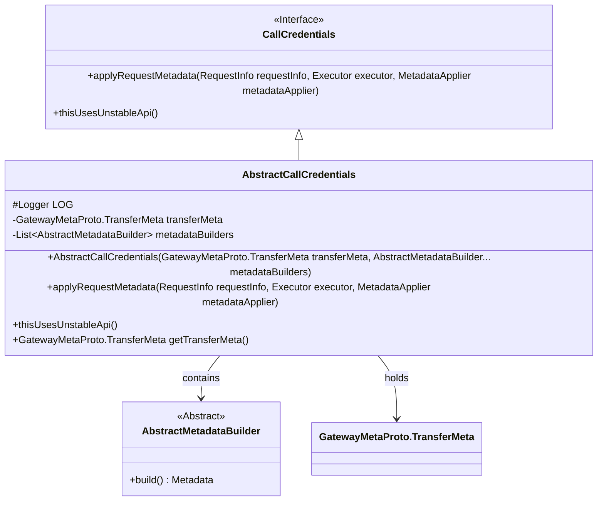
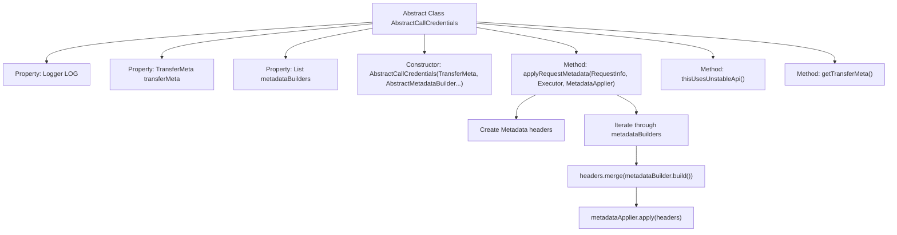

# Basic Information

|      |      |
|------|------|
| Name | AbstractCallCredentials |
| Language | .java |
| Code Path | WeFe/gateway/src/main/java/com/welab/wefe/gateway/interceptor/AbstractCallCredentials.java |
| Package Name | com.welab.wefe.gateway.interceptor |
| Dependencies | ['com.welab.wefe.gateway.api.meta.basic.GatewayMetaProto', 'io.grpc.CallCredentials', 'io.grpc.Metadata', 'org.slf4j.Logger', 'org.slf4j.LoggerFactory', 'java.util.ArrayList', 'java.util.Arrays', 'java.util.List', 'java.util.concurrent.Executor'] |
| Brief Description | The abstract class `AbstractCallCredentials` extends `CallCredentials`, containing transport metadata and a list of metadata builders, and provides a method for applying request metadata. |

# Description

AbstractCallCredentials is an abstract class that inherits from CallCredentials and is used to handle call credential-related logic. The class contains a Logger instance for logging, a transferMeta variable of type TransferMeta to store transmission metadata, and a metadataBuilders list for storing multiple AbstractMetadataBuilder instances. The constructor accepts TransferMeta and variable arguments metadataBuilders, initializing them into member variables. The applyRequestMetadata method iterates through metadataBuilders, constructs and merges Metadata headers, and finally applies these headers via metadataApplier. The class also includes an empty implementation of the thisUsesUnstableApi method, along with a getter method to retrieve transferMeta.

# Class Summary

| Name   | Type  | Description |
|-------|------|-------------|
| AbstractCallCredentials | class | The abstract class AbstractCallCredentials extends CallCredentials, containing the properties TransferMeta and metadataBuilders, which are initialized via the constructor. The applyRequestMetadata method merges the constructed metadata and applies it. |

## Class AbstractCallCredentials

|      |      |
|------|------|
| Access Modifier | public abstract |
| Type | class |
| Name | AbstractCallCredentials |
| Description | The abstract class AbstractCallCredentials extends CallCredentials, containing the properties TransferMeta and metadataBuilders, which are initialized via the constructor. The applyRequestMetadata method merges the constructed metadata and applies it. |

### UML Class Diagram

This code demonstrates an abstract class `AbstractCallCredentials` inheriting from the `CallCredentials` interface, designed for constructing and applying request metadata. The class includes a logger, transfer metadata, and a list of metadata builders, utilizing the `applyRequestMetadata` method to apply the constructed metadata to requests. The class diagram clearly illustrates the inheritance relationship, composition relationship, and the interaction logic of core methods.

### Internal Method Call Graph

This code demonstrates the implementation of an abstract class AbstractCallCredentials, primarily used for handling the construction and application of request metadata. The class contains core properties such as transferMeta and metadataBuilders, which are initialized through the constructor. The most critical method is applyRequestMetadata, which iterates through all metadataBuilders to construct and merge request header information, ultimately applying these metadata via metadataApplier. Additionally, it includes an empty implementation of the thisUsesUnstableApi method and a getter method for transferMeta. The entire process clearly illustrates the handling of request metadata.

### Field List

| Name  | Type  | Description |
|-------|-------|------|
| metadataBuilders = new ArrayList<>() | List<AbstractMetadataBuilder> | Define a private list metadataBuilders to store objects of type AbstractMetadataBuilder, initialized as an empty ArrayList. |
| LOG = LoggerFactory.getLogger(this.getClass()) | Logger | Define a protected log object LOG in the class, initializing the logger with the current class. |
| transferMeta | GatewayMetaProto.TransferMeta | The private variable `transferMeta`, of type `GatewayMetaProto.TransferMeta`. |

### Method List

| Name  | Type  | Description |
|-------|-------|------|
| thisUsesUnstableApi | void | Rewrite the method `thisUsesUnstableApi` with an empty implementation. |
| applyRequestMetadata | void | This method is used to apply request metadata, merging metadata from multiple builders and submitting it via the metadataApplier. |
| getTransferMeta | GatewayMetaProto.TransferMeta | Methods to obtain transfer metadata, returning a transferMeta object. |

