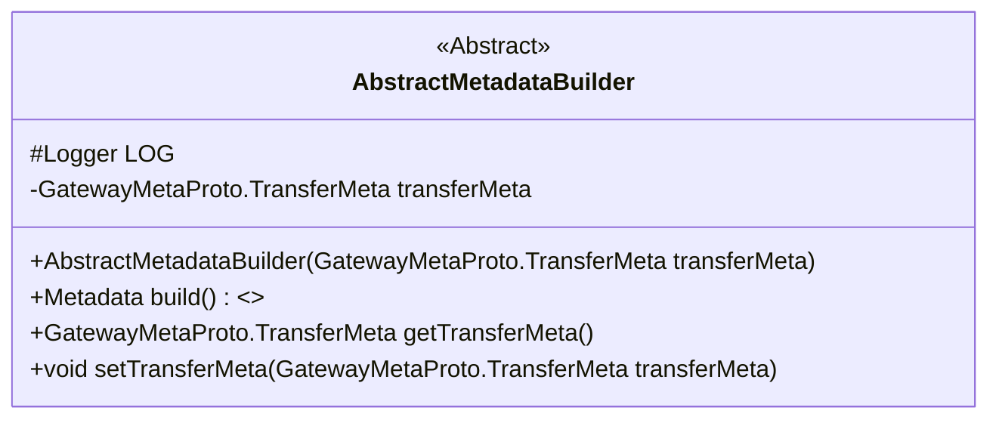
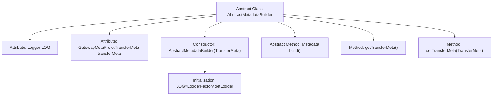

# Basic Information

|      |      |
|------|------|
| Name | AbstractMetadataBuilder |
| Language | .java |
| Code Path | WeFe/gateway/src/main/java/com/welab/wefe/gateway/interceptor/AbstractMetadataBuilder.java |
| Package Name | com.welab.wefe.gateway.interceptor |
| Dependencies | ['com.welab.wefe.gateway.api.meta.basic.GatewayMetaProto', 'io.grpc.Metadata', 'org.slf4j.Logger', 'org.slf4j.LoggerFactory'] |
| Brief Description | The abstract class `AbstractMetadataBuilder` contains the `TransferMeta` property and constructor, providing an abstract `build` method along with getter/setter methods for `TransferMeta`. |

# Description

This is an abstract class named AbstractMetadataBuilder, designed for constructing metadata. The class contains a protected Logger object for logging purposes and a private transferMeta variable that stores transfer metadata. The constructor initializes transferMeta by receiving a TransferMeta object. It provides methods to get and set transferMeta, and declares an abstract method build for constructing metadata. Serving as a base class, its concrete implementation is to be completed by subclasses.

# Class Summary

| Name   | Type  | Description |
|-------|------|-------------|
| AbstractMetadataBuilder | class | The abstract class AbstractMetadataBuilder contains the TransferMeta property and constructor, providing an abstract build method and getter/setter for TransferMeta. |

## Class AbstractMetadataBuilder

|      |      |
|------|------|
| Access Modifier | public abstract |
| Type | class |
| Name | AbstractMetadataBuilder |
| Description | The abstract class AbstractMetadataBuilder contains the TransferMeta property and constructor, providing an abstract build method and getter/setter for TransferMeta. |

### UML Class Diagram

This code defines an abstract class `AbstractMetadataBuilder`, which contains a protected logger `LOG` and a private `transferMeta` object. The class provides a constructor, an abstract method `build()` for constructing metadata, as well as methods to get and set `transferMeta`. The primary purpose of this abstract class is to provide a foundational framework for building metadata, with the specific construction logic to be implemented by subclasses.

### Internal Method Call Graph

This code describes the structure of an abstract class AbstractMetadataBuilder, including logger initialization, transfer metadata attributes, and related operation methods. The class receives a TransferMeta object through its constructor, provides getter/setter methods, and declares an abstract build method for subclass implementation. The flowchart clearly illustrates the hierarchical relationships between class members, particularly highlighting the declaration position of abstract methods and the timing of logger initialization.

### Field List

| Name  | Type  | Description |
|-------|-------|------|
| LOG = LoggerFactory.getLogger(this.getClass()) | Logger | Define a protected log object LOG in the class, initializing the logger with the current class. |
| transferMeta | GatewayMetaProto.TransferMeta | The private variable `transferMeta`, of type `GatewayMetaProto.TransferMeta`. |

### Method List

| Name  | Type  | Description |
|-------|-------|------|
| getTransferMeta | GatewayMetaProto.TransferMeta | Methods for obtaining transmission metadata, with a return type of GatewayMetaProto.TransferMeta. |
| setTransferMeta | void | This is a Java method used to set the value of the transferMeta property, with the parameter type being GatewayMetaProto.TransferMeta. |
| build | Metadata | Abstract method used to construct and return a metadata object. |

