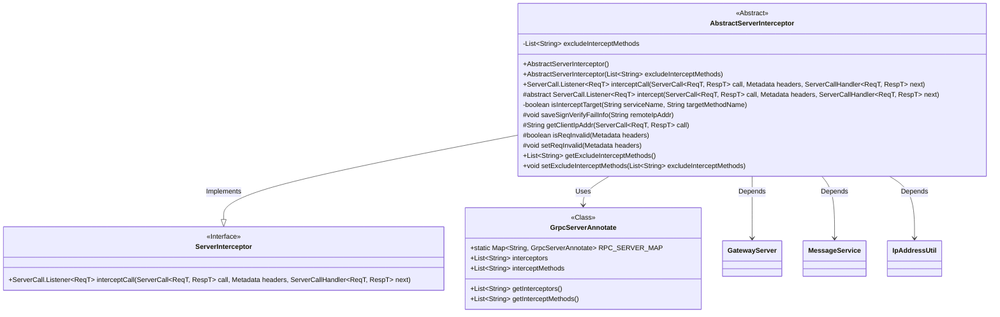
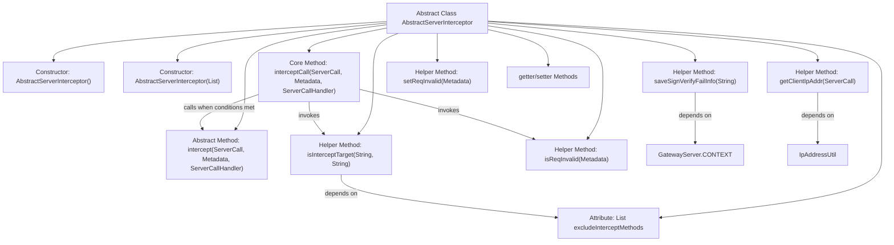

# Basic Information

|      |      |
|------|------|
| Name | AbstractServerInterceptor |
| Language | .java |
| Code Path | WeFe/gateway/src/main/java/com/welab/wefe/gateway/interceptor/AbstractServerInterceptor.java |
| Package Name | com.welab.wefe.gateway.interceptor |
| Dependencies | ['com.welab.wefe.common.util.IpAddressUtil', 'com.welab.wefe.gateway.GatewayServer', 'com.welab.wefe.gateway.base.GrpcServerAnnotate', 'com.welab.wefe.gateway.common.GrpcConstant', 'com.welab.wefe.gateway.service.MessageService', 'io.grpc', 'org.springframework.util.CollectionUtils', 'java.net.InetSocketAddress', 'java.util.ArrayList', 'java.util.List', 'java.util.Map'] |
| Brief Description | The abstract class AbstractServerInterceptor implements the ServerInterceptor interface, providing gRPC service interception capabilities, including support for excluding method interception, request validity checks, and client IP retrieval. Subclasses must implement specific interception logic. |

# Description

AbstractServerInterceptor is an abstract class that implements the ServerInterceptor interface, designed to intercept gRPC service calls. It includes an exclusion list named `excludeInterceptMethods` for methods that should bypass interception, which can be configured via the constructor or setter methods. The core method `interceptCall` checks whether the target method requires interception, proceeding directly to the next step if not. The actual interception logic is implemented by subclasses through the `intercept` method. The class also provides functionalities such as validating request validity, setting invalid request statuses, retrieving client IP addresses, and storing signature verification failure information. The `isInterceptTarget` method determines whether to intercept the target method based on annotation configurations, with priority given to checking the exclusion list.

# Class Summary

| Name   | Type  | Description |
|-------|------|-------------|
| AbstractServerInterceptor | class | The abstract class `AbstractServerInterceptor` implements the `ServerInterceptor` interface, providing foundational interceptor functionalities, including an exclusion method list, request validation, client IP retrieval, and interceptor logic determination. Subclasses are required to implement specific interception methods. |

## Class AbstractServerInterceptor

|      |      |
|------|------|
| Access Modifier | public abstract |
| Type | class |
| Name | AbstractServerInterceptor |
| Description | The abstract class `AbstractServerInterceptor` implements the `ServerInterceptor` interface, providing foundational interceptor functionalities, including an exclusion method list, request validation, client IP retrieval, and interceptor logic determination. Subclasses are required to implement specific interception methods. |

### UML Class Diagram

This code demonstrates an abstract implementation class AbstractServerInterceptor for a gRPC server interceptor, which implements the ServerInterceptor interface. The class manages a list of excluded interception methods via excludeInterceptMethods, providing core functionalities such as request validation, client IP retrieval, and signature failure logging. Its key method interceptCall implements the interception logic chain, determining whether to intercept the current request through the isInterceptTarget method and delegating specific interception logic to subclass implementations via the abstract intercept method. The class diagram clearly illustrates dependencies with components like the GrpcServerAnnotate configuration class and GatewayServer context.

### Internal Method Call Graph

This flowchart illustrates the core structure of a gRPC server interceptor. The abstract class AbstractServerInterceptor implements interception logic through the interceptCall method, which first checks the target method and request validity before deciding whether to execute specific interception operations. The class includes constructors, core interception logic, 7 helper methods (covering functionalities like signature verification and IP retrieval), and standard getter/setter methods. The isInterceptTarget method implements dual interception judgment logic based on annotation configuration and whitelist, demonstrating flexible configurability. The overall design adopts the template method pattern, delegating concrete interception implementation to subclasses.

### Field List

| Name  | Type  | Description |
|-------|-------|------|
| excludeInterceptMethods = new ArrayList<>() | List<String> | Define a private list `excludeInterceptMethods` to store the method names that need to be excluded from interception. |

### Method List

| Name  | Type  | Description |
|-------|-------|------|
| getClientIpAddr | String | Methods to obtain the gRPC client IP address, extracting the remote address via the ServerCall property and converting it to a string. |
| saveSignVerifyFailInfo | void | This method is used to save signature verification failure information, record the client IP, and prompt access denial. |
| getExcludeInterceptMethods | List<String> | Get the list of methods to bypass interception. |
| setReqInvalid | void | The method `setReqInvalid` sets a key-value pair in the Metadata header to mark the request as invalid, with the key being `GrpcConstant.INTERCEPTOR_VERIFIED_REQ_INVALID_HEADER_KEY` and the value as `"true"`. |
| isReqInvalid | boolean | Check if the flag in the request header indicates an invalid request, and return true if it is "true". |
| intercept | ServerCall.Listener<ReqT> | The abstract method `intercept` is used to intercept service calls, accepting parameters `ServerCall`, `Metadata`, and `ServerCallHandler`, and returns a `ServerCall.Listener`. |
| isInterceptTarget | boolean | Method checks whether the target service and method require interception: returns false if the service has no configuration or the interceptor is empty; returns false if the method is in the exclusion list; returns true if there is no specific interception method configuration or the method is in the interception list. |
| interceptCall | ServerCall.Listener<ReqT> | Rewrite the gRPC interceptor method to check the service name and method name, skip if no interception is required or the request is invalid, otherwise execute the interception logic. |
| setExcludeInterceptMethods | void | Methods list to exclude from blocking. |

