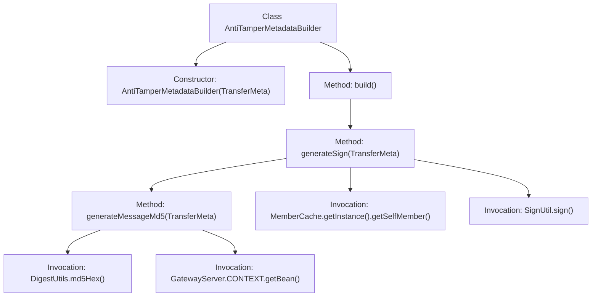
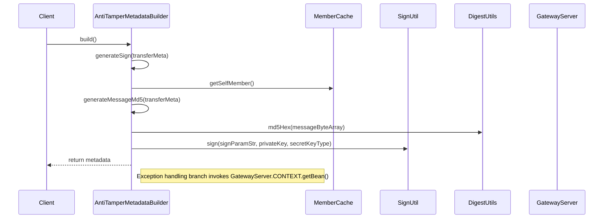

# Basic Information

|      |      |
|------|------|
| Name | AntiTamperMetadataBuilder |
| Language | .java |
| Code Path | WeFe/gateway/src/main/java/com/welab/wefe/gateway/interceptor/AntiTamperMetadataBuilder.java |
| Package Name | com.welab.wefe.gateway.interceptor |
| Dependencies | ['com.welab.wefe.common.util.JObject', 'com.welab.wefe.common.util.SignUtil', 'com.welab.wefe.gateway.GatewayServer', 'com.welab.wefe.gateway.api.meta.basic.GatewayMetaProto', 'com.welab.wefe.gateway.cache.MemberCache', 'com.welab.wefe.gateway.common.GrpcConstant', 'com.welab.wefe.gateway.entity.MemberEntity', 'com.welab.wefe.gateway.service.MessageService', 'com.welab.wefe.gateway.util.GrpcUtil', 'io.grpc.Metadata', 'org.apache.commons.codec.digest.DigestUtils', 'java.math.BigDecimal', 'java.math.RoundingMode', 'java.util.Map', 'java.util.TreeMap'] |
| Brief Description | The `AntiTamperMetadataBuilder` class is used to generate anti-tampering metadata signatures. It creates an MD5 hash from `TransferMeta`, combines it with a member ID and private key to produce a signature, ensuring secure data transmission. It includes exception handling and performance logging. |

# Description

The `AntiTamperMetadataBuilder` class inherits from `AbstractMetadataBuilder` and is used to construct anti-tampering metadata. Its core functionality involves creating a `Metadata` object containing a digital signature through the `build` method. The `generateSign` method is responsible for generating the signature, utilizing a `TreeMap` to store signature parameters (including the message MD5 value and member ID) and signing the parameters with a private key. The `generateMessageMd5` method calculates the MD5 hash of the transmitted message, recording the message size and computation time. In exceptional cases, error logs are recorded along with the corresponding error messages. The entire process involves message serialization, hash computation, and digital signature generation.

# Class Summary

| Name   | Type  | Description |
|-------|------|-------------|
| AntiTamperMetadataBuilder | class | The `AntiTamperMetadataBuilder` class is used to construct anti-tampering metadata, ensuring data integrity by generating message MD5 signatures, and includes signature parameter processing and exception logging. |


## Class AntiTamperMetadataBuilder

|      |      |
|------|------|
| Access Modifier | public |
| Type | class |
| Name | AntiTamperMetadataBuilder |
| Description | The `AntiTamperMetadataBuilder` class is used to construct anti-tampering metadata, ensuring data integrity by generating message MD5 signatures, and includes signature parameter processing and exception logging. |


### UML Class Diagram

```mermaid
classDiagram
    class AbstractMetadataBuilder {
        <<Abstract>>
        +build() Metadata
    }
    
    class AntiTamperMetadataBuilder {
        +AntiTamperMetadataBuilder(GatewayMetaProto$TransferMeta transferMeta)
        +build() Metadata
        -generateSign(GatewayMetaProto$TransferMeta transferMeta) String
        -generateMessageMd5(GatewayMetaProto$TransferMeta transferMeta) String
    }
    
    class GatewayMetaProto$TransferMeta {
        <<Data Class>>
    }
    
    class Metadata {
        +put(Object key, Object value)
    }
    
    class MemberCache {
        +getInstance() MemberCache
        +getSelfMember() MemberEntity
    }
    
    class MemberEntity {
        -String id
        -String privateKey
        -String secretKeyType
        +getId() String
        +getPrivateKey() String
        +getSecretKeyType() String
    }
    
    class SignUtil {
        <<Utility>>
        +sign(String data, String privateKey, String secretKeyType) String
    }
    
    class DigestUtils {
        <<Utility>>
        +md5Hex(byte[] data) String
    }
    
    class GrpcUtil {
        <<Utility>>
        +getMessageProtobufferByte(GatewayMetaProto$TransferMeta meta) byte[]
    }
    
    class JObject {
        +create() JObject
        +create(Map~String,String~ map) JObject
        +append(String key, String value) JObject
        +toString() String
    }
    
    AbstractMetadataBuilder <|-- AntiTamperMetadataBuilder
    AntiTamperMetadataBuilder --> GatewayMetaProto$TransferMeta : uses
    AntiTamperMetadataBuilder --> Metadata : generates
    AntiTamperMetadataBuilder --> MemberCache : retrieves member info
    AntiTamperMetadataBuilder --> SignUtil : signs
    AntiTamperMetadataBuilder --> DigestUtils : MD5 calculation
    AntiTamperMetadataBuilder --> GrpcUtil : byte conversion
    AntiTamperMetadataBuilder --> JObject : JSON processing
    MemberCache --> MemberEntity : returns
```

Class Diagram Description: AntiTamperMetadataBuilder inherits from AbstractMetadataBuilder and is used to construct tamper-proof metadata. It retrieves member information via MemberCache, utilizes SignUtil for signing, invokes DigestUtils to generate MD5 values, and employs GrpcUtil and JObject for data transmission and JSON format conversion. The entire process involves collaboration among multiple utility classes and entity classes, ultimately generating a Metadata object containing signatures.


### Internal Method Call Graph





Flowchart Description: This flowchart illustrates the core logic of the AntiTamperMetadataBuilder class, starting from the constructor and triggering the signature generation process via the build() method. It primarily involves three key method call chains: build() calls generateSign() to generate signatures, which in turn calls generateMessageMd5() to compute message digests. The process includes interactions with external components such as MemberCache for retrieving member information, SignUtil for signature computation, and DigestUtils for MD5 generation, with errors being logged via GatewayServer's MessageService in exceptional cases. The sequence diagram details the chronological order of method invocations and component interactions.

### Field List

| Name  | Type  | Description |
|-------|-------|------|

### Method List

| Name  | Type  | Description |
|-------|-------|------|
| build | Metadata | This method overrides build(), creates a Metadata object, and stores the hash signature of Grpc request data in it. The signature is generated by transferMeta and then returns the metadata. |
| generateSign | String | This method generates a signature for transaction metadata: It uses the member ID and message MD5 as parameters, signs them with a private key and key type, and returns a JSON string containing the signature and data. If an error occurs, it logs the error and returns an empty string. |
| generateMessageMd5 | String | Method for generating message MD5 value: Calculate the size of the message byte array and convert it to KB, generate the MD5 hash value, record the time consumption and logs. Save error information in case of exceptions. |


