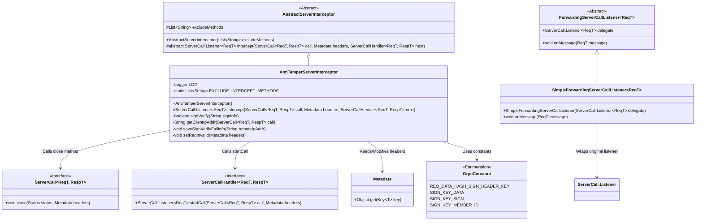
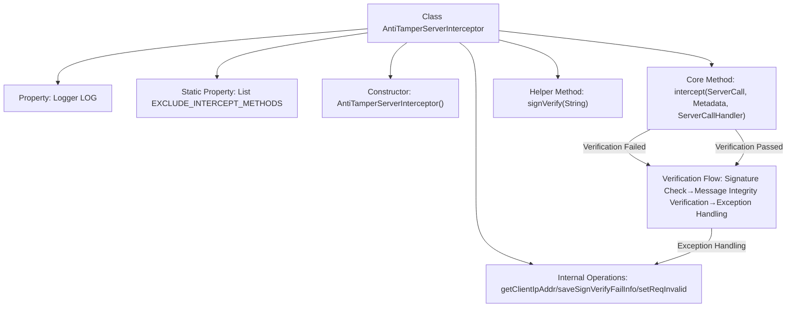
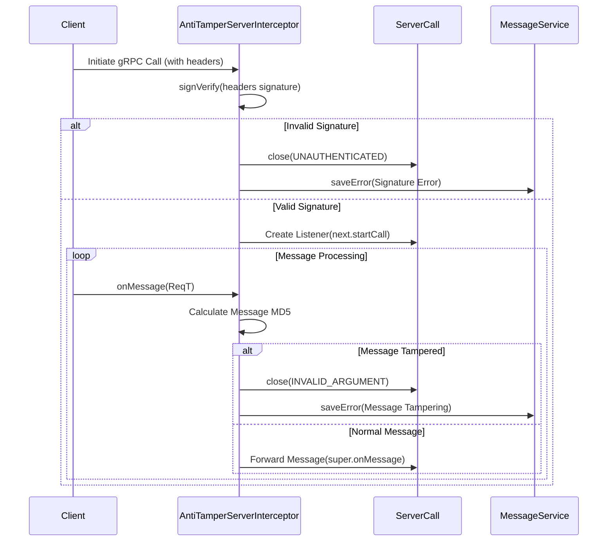

# Basic Information

|      |      |
|------|------|
| Name | AntiTamperServerInterceptor |
| Language | .java |
| Code Path | WeFe/gateway/src/main/java/com/welab/wefe/gateway/interceptor/AntiTamperServerInterceptor.java |
| Package Name | com.welab.wefe.gateway.interceptor |
| Dependencies | ['com.welab.wefe.common.constant.SecretKeyType', 'com.welab.wefe.common.util.JObject', 'com.welab.wefe.common.util.RSAUtil', 'com.welab.wefe.common.util.SignUtil', 'com.welab.wefe.common.util.StringUtil', 'com.welab.wefe.gateway.GatewayServer', 'com.welab.wefe.gateway.api.meta.basic.GatewayMetaProto', 'com.welab.wefe.gateway.cache.MemberCache', 'com.welab.wefe.gateway.common.GrpcConstant', 'com.welab.wefe.gateway.entity.MemberEntity', 'com.welab.wefe.gateway.service.MessageService', 'com.welab.wefe.gateway.util.GrpcUtil', 'io.grpc', 'org.apache.commons.codec.digest.DigestUtils', 'org.slf4j.Logger', 'org.slf4j.LoggerFactory', 'java.math.BigDecimal', 'java.math.RoundingMode', 'java.nio.charset.StandardCharsets', 'java.util.Arrays', 'java.util.List'] |
| Brief Description | The AntiTamperServerInterceptor verifies gRPC request signatures and message integrity, excluding streaming methods, and closes the connection while logging errors upon failure. |

# Description

The AntiTamperServerInterceptor is a gRPC server-side interceptor designed to prevent data tampering. It ensures request integrity by validating signature information submitted by clients. The interceptor checks signature data in request headers and performs an MD5 comparison with the received message. If signature verification fails or the message is tampered with, it logs errors and terminates the connection. This interceptor excludes interception of streaming interfaces while providing detailed logging and error-handling mechanisms. The signature verification process includes validating signature field effectiveness, member IDs, public keys, and other relevant information.

# Class Summary

| Name   | Type  | Description |
|-------|------|-------------|
| AntiTamperServerInterceptor | class | The AntiTamperServerInterceptor verifies gRPC request signatures and message integrity, excluding streaming methods, and closes connections while logging errors upon failure. |

## Class AntiTamperServerInterceptor

|      |      |
|------|------|
| Access Modifier | public |
| Type | class |
| Name | AntiTamperServerInterceptor |
| Description | The AntiTamperServerInterceptor verifies gRPC request signatures and message integrity, excluding streaming methods, and closes connections while logging errors upon failure. |

### UML Class Diagram

This class diagram illustrates the core structure and relationships of the AntiTamperServerInterceptor. As a subclass of AbstractServerInterceptor, it implements gRPC server-side interception logic through the intercept method, with key functionalities including signature verification (signVerify), request validity checks (setReqInvalid), and exception handling. The diagram clearly depicts interactions with gRPC core components (ServerCall, ServerCallHandler), dependencies on Metadata for header processing and GrpcConstant for accessing constants. The interceptor wraps the original listener via ForwardingServerCallListener to intercept messages, showcasing a combined application of the Chain of Responsibility and Decorator patterns in its design.

### Internal Method Call Graph

Flowchart Description: This flowchart illustrates the core processing logic of AntiTamperServerInterceptor, featuring dual protection mechanisms for signature verification and message tamper-proofing. When a gRPC request arrives, it first performs client signature verification (signVerify), terminating the connection immediately upon failure. After successful verification, a message listener is created. During the message processing phase, data integrity is verified by comparing MD5 values, with any tampering attempts being logged and blocked. The entire process involves exception handling, audit logging, and transitions between various verification states.

Sequence Diagram Description: The sequence diagram clearly presents the interaction between the client and the interceptor, highlighting two possible paths during the signature verification phase and message processing phase. When the signature is invalid, the session is terminated immediately with error logging. For valid signatures, the process enters a message listening loop where each message undergoes tamper detection. MD5 value comparison ensures data integrity, with exceptions triggering error reporting mechanisms and normal messages being forwarded to subsequent processors.

### Field List

| Name  | Type  | Description |
|-------|-------|------|
| LOG = LoggerFactory.getLogger(SystemTimestampVerifyServerInterceptor.class) | Logger | The class SystemTimestampVerifyServerInterceptor defines a private immutable logger LOG for recording log information. |
| EXCLUDE_INTERCEPT_METHODS = Arrays.asList("pushDataSource") | List<String> | Define a static constant list EXCLUDE_INTERCEPT_METHODS containing the method name "pushDataSource" that should not be intercepted. |

### Method List

| Name  | Type  | Description |
|-------|-------|------|
| intercept | ServerCall.Listener<ReqT> | The interceptor verifies the client request signature and message integrity. If the verification fails, it logs the event, saves the error information, and closes the connection. If successful, it checks whether the message MD5 matches. If the MD5 does not match or an exception occurs, the request is marked as invalid and the connection is closed; otherwise, processing continues. |
| signVerify | boolean | Method validates client signature information. After checking that the signature is not empty, it parses the JSON to extract data, signature, and member ID. Upon validating the field effectiveness, it performs signature verification using the member's public key and key type. If failed, it logs the error and returns false. |

