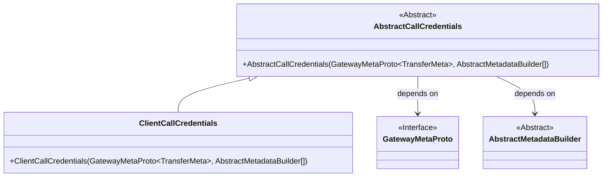
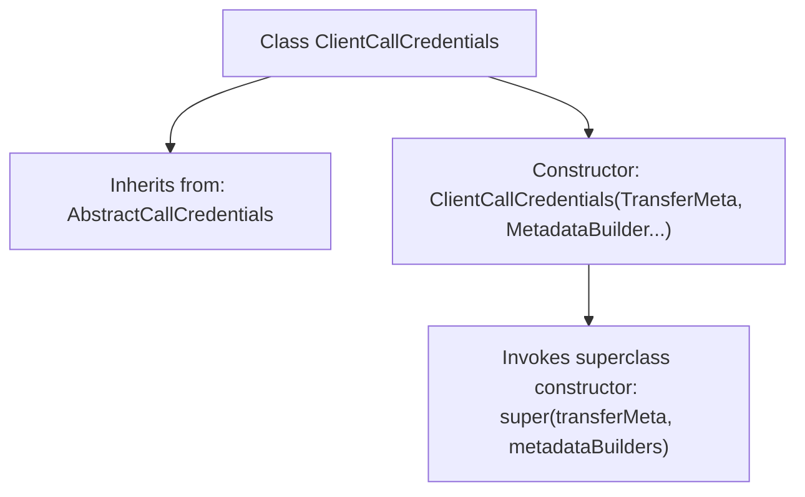

# Basic Information

|      |      |
|------|------|
| Name | ClientCallCredentials |
| Language | .java |
| Code Path | WeFe/gateway/src/main/java/com/welab/wefe/gateway/interceptor/ClientCallCredentials.java |
| Package Name | com.welab.wefe.gateway.interceptor |
| Dependencies | ['com.welab.wefe.gateway.api.meta.basic.GatewayMetaProto'] |
| Brief Description | The `ClientCallCredentials` class inherits from `AbstractCallCredentials` and receives `TransferMeta` and `MetadataBuilder` parameters through its constructor. |

# Description

The `ClientCallCredentials` class inherits from `AbstractCallCredentials` and is used to handle credential information for client calls. Its constructor accepts a `transferMeta` parameter of type `GatewayMetaProto.TransferMeta` and a variable number of `AbstractMetadataBuilder` arrays `metadataBuilders`, then passes these parameters to the parent class constructor for initialization.

# Class Summary

| Name   | Type  | Description |
|-------|------|-------------|
| ClientCallCredentials | class | The `ClientCallCredentials` class extends `AbstractCallCredentials`, accepting `TransferMeta` and an array of `MetadataBuilder` parameters through its constructor. |

## Class ClientCallCredentials

|      |      |
|------|------|
| Access Modifier | public |
| Type | class |
| Name | ClientCallCredentials |
| Description | The `ClientCallCredentials` class extends `AbstractCallCredentials`, accepting `TransferMeta` and an array of `MetadataBuilder` parameters through its constructor. |

### UML Class Diagram

This class diagram illustrates the structure where ClientCallCredentials inherits from the abstract class AbstractCallCredentials. AbstractCallCredentials depends on the generic type TransferMeta from the GatewayMetaProto interface and the abstract class AbstractMetadataBuilder. As a concrete implementation class, ClientCallCredentials initializes parent class properties through its constructor, demonstrating inheritance and dependency relationships for handling metadata construction and transmission of client call credentials.

### Internal Method Call Graph

This flowchart illustrates the structure of the ClientCallCredentials class, which is a subclass inheriting from AbstractCallCredentials. It primarily contains a constructor method that accepts a TransferMeta object and a variable number of MetadataBuilder arguments, internally invoking the superclass constructor for initialization. The class relationships clearly demonstrate the inheritance hierarchy and the parameter passing logic of the constructor method.

### Field List

| Name  | Type  | Description |
|-------|-------|------|

### Method List

| Name  | Type  | Description |
|-------|-------|------|

