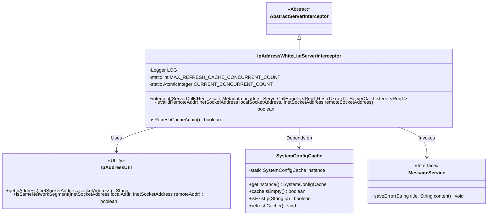
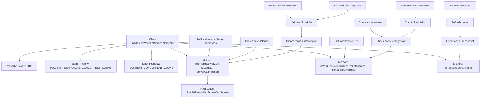
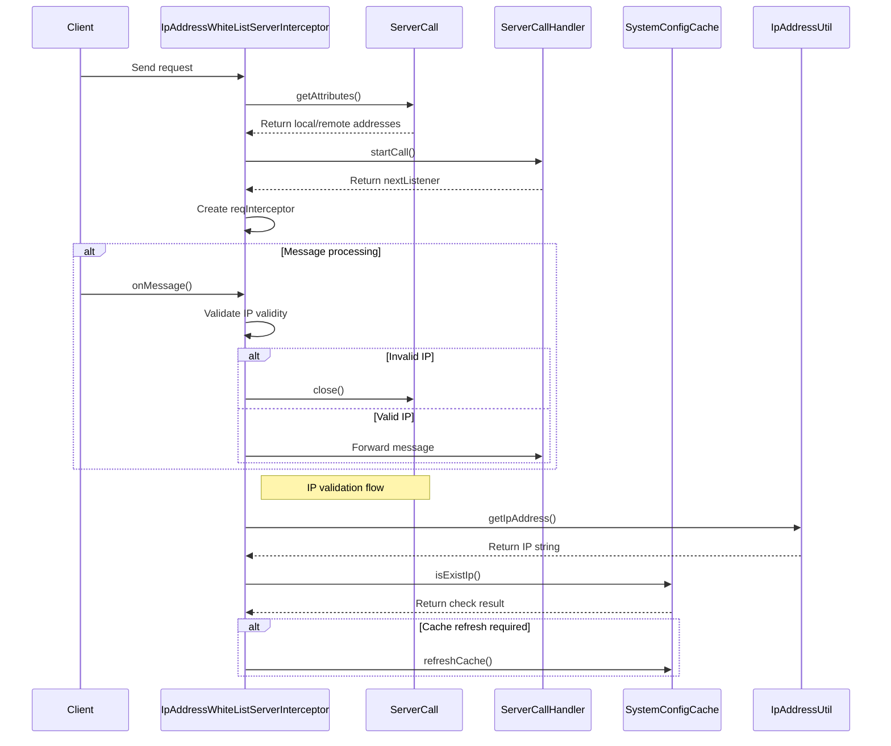

# Basic Information

|      |      |
|------|------|
| Name | IpAddressWhiteListServerInterceptor |
| Language | .java |
| Code Path | WeFe/gateway/src/main/java/com/welab/wefe/gateway/interceptor/IpAddressWhiteListServerInterceptor.java |
| Package Name | com.welab.wefe.gateway.interceptor |
| Dependencies | ['com.welab.wefe.common.util.IpAddressUtil', 'com.welab.wefe.common.wefe.enums.GatewayProcessorType', 'com.welab.wefe.gateway.GatewayServer', 'com.welab.wefe.gateway.api.meta.basic.GatewayMetaProto', 'com.welab.wefe.gateway.cache.SystemConfigCache', 'com.welab.wefe.gateway.service.MessageService', 'io.grpc', 'org.slf4j.Logger', 'org.slf4j.LoggerFactory', 'java.net.InetSocketAddress', 'java.util.concurrent.atomic.AtomicInteger'] |
| Brief Description | The IpAddressWhiteListServerInterceptor is used to check whether the client's IP address is within the whitelist. If not, access is denied. It supports cache refresh and concurrency control. |

# Description

IpAddressWhiteListServerInterceptor is a gRPC-based server interceptor designed to implement IP whitelist access control. Its core functionalities include: validating client IP legitimacy by intercepting request messages, supporting both local same-subnet access and configured whitelist modes. When no whitelist is configured, only same-subnet access is permitted by default; if an IP is not in the whitelist and the maximum concurrent refresh count (3 times) hasn't been reached, it automatically refreshes the cache for revalidation. During interception, it logs unauthorized access attempts and exceptions, while saving error records via MessageService. For illegal requests, it returns a PERMISSION_DENIED status and terminates the connection, with concurrent control mechanisms implemented during cache refresh operations.

# Class Summary

| Name   | Type  | Description |
|-------|------|-------------|
| IpAddressWhiteListServerInterceptor | class | The Java class `IpAddressWhiteListServerInterceptor` implements a gRPC server interceptor that checks whether the client IP is in the whitelist or the same network segment, otherwise denying access. It supports cache refresh with a maximum concurrency of 3. |

## Class IpAddressWhiteListServerInterceptor

|      |      |
|------|------|
| Access Modifier | public |
| Type | class |
| Name | IpAddressWhiteListServerInterceptor |
| Description | The Java class `IpAddressWhiteListServerInterceptor` implements a gRPC server interceptor that checks whether the client IP is in the whitelist or the same network segment, otherwise denying access. It supports cache refresh with a maximum concurrency of 3. |

### UML Class Diagram

This code implements a gRPC-based IP whitelist interceptor with key functionalities: 1) Validating client IPs against a whitelist via interceptor pattern; 2) Managing whitelist configurations using SystemConfigCache; 3) Implementing cache refresh rate-limiting mechanism; 4) Logging exceptions via MessageService. The core logic resides in the isValidRemoteAddr method, which checks whether the client IP belongs to the same network segment as the server or exists in the whitelist cache, triggering cache refresh retry mechanism upon misses. The class diagram clearly illustrates inheritance relationships and critical dependency components.

### Internal Method Call Graph

This flowchart demonstrates the core logic of the IP whitelist interceptor, primarily consisting of three key methods: intercept() handles gRPC call interception, isValidRemoteAddr() verifies IP legitimacy, and isRefreshCacheAgain() controls cache refresh frequency. The sequence diagram details the complete interaction process from client request to IP validation, highlighting the decision flow of IP whitelist checks and exception handling mechanisms. The entire design ensures stability in high-concurrency scenarios through a dual-cache check mechanism while strictly adhering to whitelist access control policies.

### Field List

| Name  | Type  | Description |
|-------|-------|------|
| CURRENT_CONCURRENT_COUNT = new AtomicInteger(0) | AtomicInteger | Define a static atomic integer variable CURRENT_CONCURRENT_COUNT with an initial value of 0, used for thread-safe concurrent counting. |
| MAX_REFRESH_CACHE_CONCURRENT_COUNT = 3 | int | The static constant MAX_REFRESH_CACHE_CONCURRENT_COUNT has a value of 3, which limits the maximum concurrency count for cache refresh. |
| LOG = LoggerFactory.getLogger(IpAddressWhiteListServerInterceptor.class) | Logger | The class IpAddressWhiteListServerInterceptor defines a private immutable logger LOG. |

### Method List

| Name  | Type  | Description |
|-------|-------|------|
| isValidRemoteAddr | boolean | Check if the client IP is valid: If no whitelist is set, it must be in the same network segment; if it matches the server IP, it is allowed; otherwise, check the whitelist—if not listed, reject and log the error. |
| intercept | ServerCall.Listener<ReqT> | This method intercepts gRPC requests and verifies whether the client IP is legitimate. If the IP is invalid or an exception occurs, it logs the event and closes the connection; otherwise, it proceeds with processing the request. |
| isRefreshCacheAgain | boolean | Method checks whether the current number of concurrent cache refresh requests has not exceeded the limit. If not, it refreshes the cache and returns success; otherwise, it logs the event and returns failure. |

