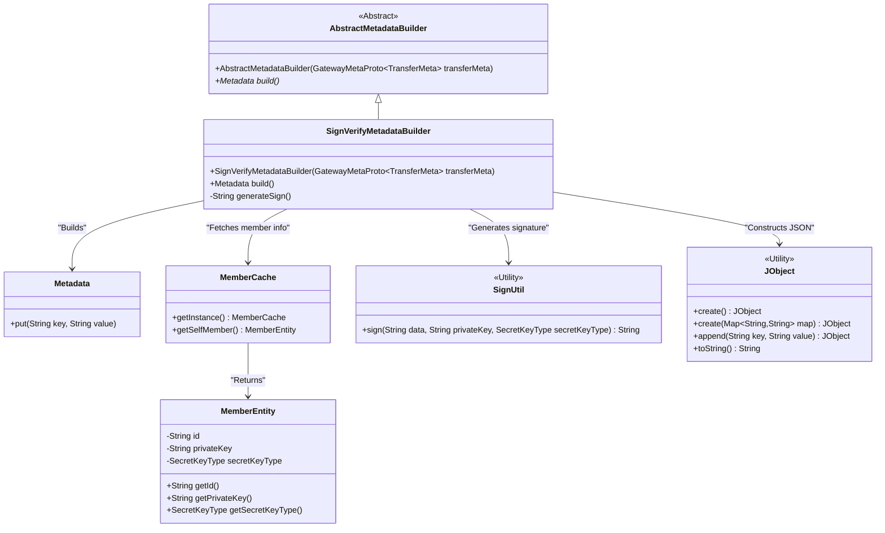
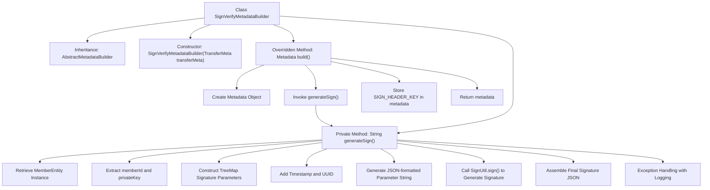

# Basic Information

|      |      |
|------|------|
| Name | SignVerifyMetadataBuilder |
| Language | .java |
| Code Path | WeFe/gateway/src/main/java/com/welab/wefe/gateway/interceptor/SignVerifyMetadataBuilder.java |
| Package Name | com.welab.wefe.gateway.interceptor |
| Dependencies | ['com.welab.wefe.common.constant.SecretKeyType', 'com.welab.wefe.common.util.JObject', 'com.welab.wefe.common.util.SignUtil', 'com.welab.wefe.gateway.api.meta.basic.GatewayMetaProto', 'com.welab.wefe.gateway.cache.MemberCache', 'com.welab.wefe.gateway.common.GrpcConstant', 'com.welab.wefe.gateway.entity.MemberEntity', 'io.grpc.Metadata', 'java.util.Map', 'java.util.TreeMap', 'java.util.UUID'] |
| Brief Description | The `SignVerifyMetadataBuilder` class inherits from `AbstractMetadataBuilder`, generating a signature using the member's private key and constructing a `Metadata` object that contains the signature. |

# Description

The `SignVerifyMetadataBuilder` is a class that inherits from `AbstractMetadataBuilder` and is used to construct metadata containing signatures. Its core method, `build()`, generates a `Metadata` object that includes a signature created via the `generateSign()` method. The `generateSign()` method uses the private key of the member entity, along with parameters such as the current timestamp and UUID, to generate a signature, which is then computed via `SignUtil.sign`. If the signing process fails, an error log is recorded, and an empty string is returned.

# Class Summary

| Name   | Type  | Description |
|-------|------|-------------|
| SignVerifyMetadataBuilder | class | The SignVerifyMetadataBuilder class inherits from AbstractMetadataBuilder and is used to construct metadata containing signatures. It generates a signature using the member's private key, which includes the member ID, timestamp, and UUID, ultimately returning a JSON string of the signature and data. |

## Class SignVerifyMetadataBuilder

|      |      |
|------|------|
| Access Modifier | public |
| Type | class |
| Name | SignVerifyMetadataBuilder |
| Description | The SignVerifyMetadataBuilder class inherits from AbstractMetadataBuilder and is used to construct metadata containing signatures. It generates a signature using the member's private key, which includes the member ID, timestamp, and UUID, ultimately returning a JSON string of the signature and data. |

### UML Class Diagram

This class diagram illustrates the core structure of the signature verification metadata builder. SignVerifyMetadataBuilder inherits from the abstract base class AbstractMetadataBuilder, retrieves current member information via MemberCache, performs signature calculation using SignUtil, and constructs JSON-formatted signature data with JObject. The entire process ultimately generates a Metadata object containing signature information for secure gRPC communication validation.

### Internal Method Call Graph

This flowchart illustrates the complete workflow of the signature verification metadata builder. The class inherits from AbstractMetadataBuilder, with its core functionality being the creation of a Metadata object containing digital signatures through the build() method. The signature generation process involves retrieving member information, constructing ordered parameter mappings, adding timestamps and random numbers, and encrypting with private keys, ultimately encapsulating the signature and original data in JSON format. Exception cases trigger error logging and return empty strings to ensure system fault tolerance.

### Field List

| Name  | Type  | Description |
|-------|-------|------|

### Method List

| Name  | Type  | Description |
|-------|-------|------|
| generateSign | String | Signature generation method: Obtain the member ID and private key, combine timestamp and UUID parameters, sign with the private key, and return the signature along with the parameters. Record errors and return null in case of exceptions. |
| build | Metadata | The method constructs a Metadata object, adds the signature header information, and then returns it. The signature is generated by generateSign(), with the key being GrpcConstant.SIGN_HEADER_KEY. |

