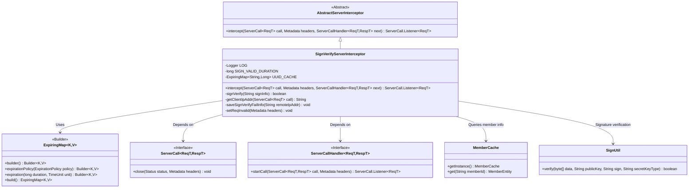

# Basic Information

|      |      |
|------|------|
| Name | SignVerifyServerInterceptor |
| Language | .java |
| Code Path | WeFe/gateway/src/main/java/com/welab/wefe/gateway/interceptor/SignVerifyServerInterceptor.java |
| Package Name | com.welab.wefe.gateway.interceptor |
| Dependencies | ['com.welab.wefe.common.util.JObject', 'com.welab.wefe.common.util.SignUtil', 'com.welab.wefe.common.util.StringUtil', 'com.welab.wefe.gateway.cache.MemberCache', 'com.welab.wefe.gateway.common.GrpcConstant', 'com.welab.wefe.gateway.entity.MemberEntity', 'io.grpc.Metadata', 'io.grpc.ServerCall', 'io.grpc.ServerCallHandler', 'io.grpc.Status', 'net.jodah.expiringmap.ExpirationPolicy', 'net.jodah.expiringmap.ExpiringMap', 'org.apache.commons.lang3.math.NumberUtils', 'org.slf4j.Logger', 'org.slf4j.LoggerFactory', 'java.nio.charset.StandardCharsets', 'java.util.concurrent.TimeUnit'] |
| Brief Description | The SignVerifyServerInterceptor is a gRPC server-side interceptor used to verify client signatures. It checks the signature validity period (5 minutes) to prevent replay attacks and terminates the connection if verification fails. |

# Description

The SignVerifyServerInterceptor is a gRPC server-side interceptor designed to verify client request signatures. It checks whether the signature information—including member ID, timestamp, and UUID—is valid, with a 5-minute expiration period set. An ExpiringMap cache is utilized to prevent replay attacks. Upon verification failure, it logs the event and closes the connection. The signature verification process involves validating field completeness, member validity, timestamp freshness, and UUID uniqueness, followed by signature verification using the member's public key.

# Class Summary

| Name   | Type  | Description |
|-------|------|-------------|
| SignVerifyServerInterceptor | class | The SignVerifyServerInterceptor is a gRPC server-side interceptor designed to verify client signatures, prevent replay attacks, with a signature validity period of 5 minutes. Failed verification results in connection termination. |


## Class SignVerifyServerInterceptor

|      |      |
|------|------|
| Access Modifier | public |
| Type | class |
| Name | SignVerifyServerInterceptor |
| Description | The SignVerifyServerInterceptor is a gRPC server-side interceptor designed to verify client signatures, prevent replay attacks, with a signature validity period of 5 minutes. Failed verification results in connection termination. |


### UML Class Diagram



This diagram illustrates the class structure of SignVerifyServerInterceptor and its key dependencies. As a subclass of AbstractServerInterceptor, it implements gRPC request authentication interception through UUID caching and signature verification mechanisms. Core functionalities include: 1) Preventing replay attacks via ExpiringMap; 2) Retrieving member information via MemberCache; 3) Performing signature verification using SignUtil; 4) Implementing request interception logic compliant with the ServerCall interface. All verification failures are logged and connections are terminated, strictly adhering to the 5-minute validity period and anti-replay mechanism.


### Internal Method Call Graph

```mermaid
graph TD
    A["SignVerifyServerInterceptor Class"]
    B["Property: Logger LOG"]
    C["Property: long SIGN_VALID_DURATION"]
    D["Property: ExpiringMap<String, Long> UUID_CACHE"]
    E["Method: intercept(ServerCall<ReqT, RespT>, Metadata, ServerCallHandler<ReqT, RespT>)"]
    F["Method: signVerify(String)"]
    G["Method: getClientIpAddr(ServerCall)"]
    H["Method: saveSignVerifyFailInfo(String)"]
    I["Method: setReqInvalid(Metadata)"]

    A --> B
    A --> C
    A --> D
    A --> E
    A --> F
    E --> G
    E --> H
    E --> I
    E --> F
    F -->|Calls| MemberCache.getInstance()
    F -->|Calls| SignUtil.verify()
```


This flowchart illustrates the core structure and invocation relationships of SignVerifyServerInterceptor, including the signature verification interceptor and anti-replay attack mechanism. The sequence diagram details the complete process from receiving a gRPC request to completing signature verification, encompassing client IP retrieval, signature header extraction, multi-step validation (JSON parsing, member cache query, timestamp validation, UUID replay check), and final digital signature verification. The entire process strictly adheres to a 5-minute validity period, ensuring communication security and timeliness.

### Field List

| Name  | Type  | Description |
|-------|-------|------|
| SIGN_VALID_DURATION = 5 | long | Define a static constant with a signature validity duration of 5 seconds. |
| LOG = LoggerFactory.getLogger(SignVerifyServerInterceptor.class) | Logger | The class SignVerifyServerInterceptor defines a private static log object LOG for recording log information. |
| UUID_CACHE = ExpiringMap            .builder()            .expirationPolicy(ExpirationPolicy.ACCESSED)            .expiration(SIGN_VALID_DURATION + 1, TimeUnit.MINUTES)            .build() | ExpiringMap<String, Long> | Create a time-based access cache to store string and long integer key-value pairs, with an expiration time of SIGN_VALID_DURATION plus 1 minute. |

### Method List

| Name  | Type  | Description |
|-------|-------|------|
| signVerify | boolean | Method for verifying client signature information. It checks whether the signature exists, has the correct format, contains valid fields, has a valid member ID, an unexpired timestamp, and no duplicate submission. Finally, it verifies the signature using the public key. Failure is returned if any condition is not met. |
| intercept | ServerCall.Listener<ReqT> | This is a gRPC server interceptor method used to verify client signatures. If verification fails, it logs the event, stores the failure information, and closes the connection; if verification succeeds, it proceeds with processing the request. |


