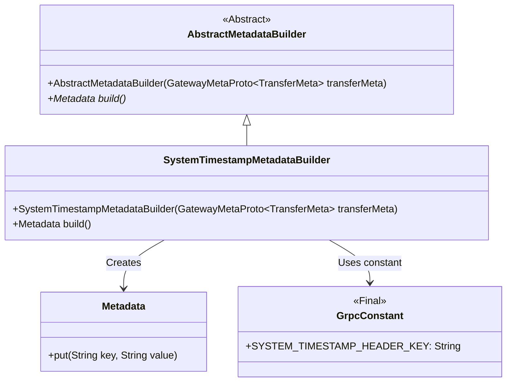
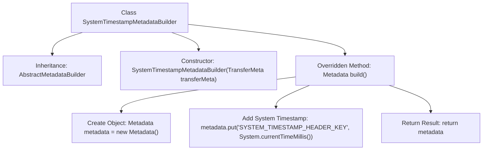

# Basic Information

|      |      |
|------|------|
| Name | SystemTimestampMetadataBuilder |
| Language | .java |
| Code Path | WeFe/gateway/src/main/java/com/welab/wefe/gateway/interceptor/SystemTimestampMetadataBuilder.java |
| Package Name | com.welab.wefe.gateway.interceptor |
| Dependencies | ['com.welab.wefe.gateway.api.meta.basic.GatewayMetaProto', 'com.welab.wefe.gateway.common.GrpcConstant', 'io.grpc.Metadata'] |
| Brief Description | The SystemTimestampMetadataBuilder class inherits from AbstractMetadataBuilder and generates a Metadata object containing a system timestamp through the build method. |

# Description

The SystemTimestampMetadataBuilder class inherits from AbstractMetadataBuilder and is used to construct metadata containing system timestamps. The constructor takes a GatewayMetaProto.TransferMeta object and invokes the parent class constructor. The build method creates a Metadata instance, stores the current system timestamp as a string with the key GrpcConstant.SYSTEM_TIMESTAMP_HEADER_KEY, and finally returns this metadata object.

# Class Summary

| Name   | Type  | Description |
|-------|------|-------------|
| SystemTimestampMetadataBuilder | class | The `SystemTimestampMetadataBuilder` class inherits from `AbstractMetadataBuilder` and creates a `Metadata` object containing a system timestamp through the `build` method. |

## Class SystemTimestampMetadataBuilder

|      |      |
|------|------|
| Access Modifier | public |
| Type | class |
| Name | SystemTimestampMetadataBuilder |
| Description | The `SystemTimestampMetadataBuilder` class inherits from `AbstractMetadataBuilder` and creates a `Metadata` object containing a system timestamp through the `build` method. |

### UML Class Diagram

Class diagram description: SystemTimestampMetadataBuilder inherits from the abstract class AbstractMetadataBuilder and implements the build() method to create a Metadata object containing system timestamps. It depends on GrpcConstant to obtain constant key names and stores timestamp data via the put method of Metadata. This design implements the functional extension of using system time as metadata, complying with the builder pattern specification.

### Internal Method Call Graph

This flowchart illustrates the structure and workflow of the SystemTimestampMetadataBuilder class. Inheriting from AbstractMetadataBuilder, its primary function is to create a Metadata object containing a system timestamp through the build() method. The process starts with the constructor, with the core being the overridden build() method that instantiates a Metadata object, stores the current timestamp as a string under a specified key-value pair, and finally returns the constructed metadata object. The entire procedure is concise and efficient, standardizing metadata construction.

### Field List

| Name  | Type  | Description |
|-------|-------|------|

### Method List

| Name  | Type  | Description |
|-------|-------|------|
| build | Metadata | This method creates a Metadata object, stores the current system timestamp, and returns it. |

