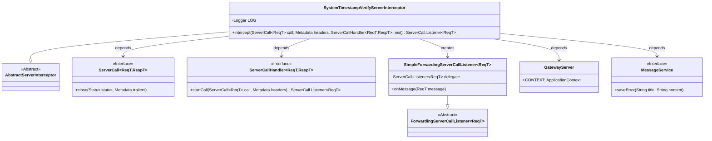

# Basic Information

|      |      |
|------|------|
| Name | SystemTimestampVerifyServerInterceptor |
| Language | .java |
| Code Path | WeFe/gateway/src/main/java/com/welab/wefe/gateway/interceptor/SystemTimestampVerifyServerInterceptor.java |
| Package Name | com.welab.wefe.gateway.interceptor |
| Dependencies | ['com.welab.wefe.common.util.DateUtil', 'com.welab.wefe.common.util.StringUtil', 'com.welab.wefe.gateway.GatewayServer', 'com.welab.wefe.gateway.api.meta.basic.GatewayMetaProto', 'com.welab.wefe.gateway.common.GrpcConstant', 'com.welab.wefe.gateway.service.MessageService', 'io.grpc', 'org.apache.commons.lang3.math.NumberUtils', 'org.slf4j.Logger', 'org.slf4j.LoggerFactory', 'java.util.Date'] |
| Brief Description | This is a gRPC server interceptor designed to validate whether the client request timestamp is valid. It checks if the timestamp is empty or exceeds the threshold difference from the server time, rejecting the request and logging an error if invalid. |

# Description

The `SystemTimestampVerifyServerInterceptor` is a gRPC server-side interceptor designed to validate the system timestamp in client requests. It checks whether the timestamp in the request header is empty and verifies if the time difference between the client and server exceeds the predefined maximum value (`GrpcConstant.MAX_SYSTEM_TIMESTAMP_DIFF`). If validation fails, it logs an error and saves the error message via the `MessageService`, then returns a `FAILED_PRECONDITION` status. This interceptor specifically handles potential underscore-related issues in request headers when forwarded through nginx.

# Class Summary

| Name   | Type  | Description |
|-------|------|-------------|
| SystemTimestampVerifyServerInterceptor | class | This is a gRPC server interceptor designed to validate the timestamp submitted by clients. It checks whether the timestamp is empty or exceeds a threshold deviation from the server time, rejecting the request and logging an error if invalid. |

## Class SystemTimestampVerifyServerInterceptor

|      |      |
|------|------|
| Access Modifier | public |
| Type | class |
| Name | SystemTimestampVerifyServerInterceptor |
| Description | This is a gRPC server interceptor designed to validate the timestamp submitted by clients. It checks whether the timestamp is empty or exceeds a threshold deviation from the server time, rejecting the request and logging an error if invalid. |

### UML Class Diagram

Class diagram description: This diagram illustrates the inheritance and dependency relationships of the SystemTimestampVerifyServerInterceptor class. It inherits from AbstractServerInterceptor and implements gRPC server interceptor functionality, primarily validating the timestamp submitted by clients. It depends on the ServerCall and ServerCallHandler interfaces to handle gRPC calls, uses SimpleForwardingServerCallListener to intercept request messages, and logs error information through GatewayServer and MessageService. The core logic for timestamp validation and exception handling is implemented in the intercept method.

### Internal Method Call Graph

This code implements a gRPC server interceptor to validate the system timestamp in client requests. The main workflow includes: retrieving the client timestamp header, creating a message listener, checking whether the timestamp is empty or exceeds the threshold difference from server time (configured via GrpcConstant.MAX_SYSTEM_TIMESTAMP_DIFF) upon message arrival. If validation fails, it logs error messages and terminates the request; otherwise, it proceeds with subsequent processing. The entire process incorporates exception handling and multiple error scenario management to ensure system time synchronization security.

### Field List

| Name  | Type  | Description |
|-------|-------|------|
| LOG = LoggerFactory.getLogger(SystemTimestampVerifyServerInterceptor.class) | Logger | The class SystemTimestampVerifyServerInterceptor defines a private static log object LOG for logging purposes. |

### Method List

| Name  | Type  | Description |
|-------|-------|------|
| intercept | ServerCall.Listener<ReqT> | The gRPC interceptor validates the client timestamp, checking if it is empty or exceeds the allowable time difference from the server time. If invalid, the request is rejected and an error is logged. |

