# Basic Information

|      |      |
|------|------|
| Name | interceptor |
| Language | .java |
| Code Path | WeFe/gateway/src/main/java/com/welab/wefe/gateway/interceptor |
| Package Name | docs.gateway.src.main.java.com.welab.wefe.gateway.interceptor |
| Brief Description | SystemTimestampMetadataBuilder constructs metadata with timestamps. AntiTamperServerInterceptor verifies signatures to prevent tampering. SignVerifyServerInterceptor checks signature validity. SignVerifyMetadataBuilder generates signature metadata. AbstractServerInterceptor provides foundational interceptor functionality. AbstractCallCredentials handles credential logic. ClientCallCredentials initializes client credentials. AbstractMetadataBuilder serves as the base class for metadata construction. SystemTimestampVerifyServerInterceptor verifies timestamps. AntiTamperMetadataBuilder generates tamper-proof signatures. IpAddressWhiteListServerInterceptor implements IP whitelist control. |

# Description

## Overview  
This module serves as a security interceptor system for the gRPC gateway, with its core responsibility being the construction of security metadata and validation of request legitimacy, akin to an authorization center in an API gateway. The interface specifications comprise three categories: metadata builders (e.g., SystemTimestampMetadataBuilder), credential processors (e.g., AbstractCallCredentials), and server interceptors (e.g., AntiTamperServerInterceptor). Key data structures include TransferMeta for transmission metadata, Metadata for header key-value pairs, and ExpiringMap for anti-replay caching. External dependencies involve the gRPC framework, MD5 hash computation, and JWT signing utilities. For instance, AntiTamperMetadataBuilder employs TreeMap to sort signature parameters, while SignVerifyServerInterceptor utilizes ExpiringMap to cache UUIDs.  

## Primary Business Scenarios  
The typical workflow involves clients adding signature/timestamp metadata via CallCredentials, with the server interceptor chain sequentially validating IP whitelists, timestamp deviations (e.g., allowing ±5 minutes), signature validity, and tamper-proof MD5. The interaction model adopts a chained processing approach, similar to Servlet filters. Comprehensive functionality covers request admission (IpAddressWhiteListServerInterceptor), anti-replay (SignVerifyServerInterceptor), and message integrity (AntiTamperServerInterceptor). Typical applications include API call authentication, such as SystemTimestampVerifyServerInterceptor handling underscore header issues during Nginx forwarding. API types encompass unary RPC and streaming interfaces (excluding interception scenarios).

### Package Internal Structure View

```mermaid
graph TD
    interceptor --> SystemTimestampMetadataBuilder.java
    interceptor --> AntiTamperServerInterceptor.java
    interceptor --> SignVerifyServerInterceptor.java
    interceptor --> SignVerifyMetadataBuilder.java
    interceptor --> AbstractServerInterceptor.java
    interceptor --> AbstractCallCredentials.java
    interceptor --> ClientCallCredentials.java
    interceptor --> AbstractMetadataBuilder.java
    interceptor --> SystemTimestampVerifyServerInterceptor.java
    interceptor --> AntiTamperMetadataBuilder.java
    interceptor --> IpAddressWhiteListServerInterceptor.java
```

This flowchart illustrates the file structure of the interceptor module in the WeFe gateway project, where all files are directly located under the interceptor directory. These files include various interceptor implementation classes (e.g., AntiTamperServerInterceptor), metadata builders (e.g., SignVerifyMetadataBuilder), and credential abstract classes (e.g., AbstractCallCredentials), collectively forming the gateway's request interception processing system. They are used to implement security features such as signature verification, anti-tampering, and IP whitelisting.

# File List

| Name   | Type  | Description |
|-------|------|-------------|
| [SystemTimestampMetadataBuilder.java](SystemTimestampMetadataBuilder.md) | file | The SystemTimestampMetadataBuilder class inherits from AbstractMetadataBuilder and generates a Metadata object containing system timestamps through the build method. |
| [AntiTamperServerInterceptor.java](AntiTamperServerInterceptor.md) | file | The AntiTamperServerInterceptor verifies gRPC request signatures and message integrity, excluding streaming methods, and terminates connections while logging errors upon failure. |
| [SignVerifyServerInterceptor.java](SignVerifyServerInterceptor.md) | file | The SignVerifyServerInterceptor is a gRPC server interceptor used to verify client signatures. It checks the signature validity period of 5 minutes to prevent replay attacks and terminates the connection if verification fails. |
| [SignVerifyMetadataBuilder.java](SignVerifyMetadataBuilder.md) | file | The SignVerifyMetadataBuilder class inherits from AbstractMetadataBuilder, generating a signature using the member's private key and constructing a Metadata object containing the signature. |
| [AbstractServerInterceptor.java](AbstractServerInterceptor.md) | file | The abstract class AbstractServerInterceptor implements the ServerInterceptor interface, providing gRPC service interception capabilities, including excluded method interception, request validity checks, and client IP retrieval. Subclasses must implement specific interception logic. |
| [AbstractCallCredentials.java](AbstractCallCredentials.md) | file | The abstract class AbstractCallCredentials extends CallCredentials, containing transport metadata and a list of metadata builders, and provides a method for applying request metadata. |
| [ClientCallCredentials.java](ClientCallCredentials.md) | file | The `ClientCallCredentials` class inherits from `AbstractCallCredentials` and accepts `TransferMeta` and `MetadataBuilder` parameters through its constructor method. |
| [AbstractMetadataBuilder.java](AbstractMetadataBuilder.md) | file | The abstract class AbstractMetadataBuilder contains the TransferMeta property and constructor, providing the abstract build method and getter/setter for TransferMeta. |
| [SystemTimestampVerifyServerInterceptor.java](SystemTimestampVerifyServerInterceptor.md) | file | This is a gRPC server interceptor used to validate whether the client request timestamp is valid. It checks if the timestamp is empty or exceeds the threshold difference from the server time, rejecting the request and logging an error if invalid. |
| [AntiTamperMetadataBuilder.java](AntiTamperMetadataBuilder.md) | file | The `AntiTamperMetadataBuilder` class is used to generate anti-tampering metadata signatures. It creates an MD5 hash from `TransferMeta`, combines it with a member ID and private key to produce a signature, ensuring secure data transmission. It includes exception handling and performance logging. |
| [IpAddressWhiteListServerInterceptor.java](IpAddressWhiteListServerInterceptor.md) | file | The IpAddressWhiteListServerInterceptor is used to check whether the client's IP address is within the whitelist. If not, access will be denied. It supports cache refresh and concurrency control. |

