# Basic Information

|      |      |
|------|------|
| Name | InitListener |
| Language | .java |
| Code Path | WeFe/gateway/src/main/java/com/welab/wefe/gateway/listener/InitListener.java |
| Package Name | com.welab.wefe.gateway.listener |
| Dependencies | ['com.welab.wefe.gateway.cache.CaCertificateCache', 'com.welab.wefe.gateway.cache.PartnerConfigCache', 'com.welab.wefe.gateway.init', 'com.welab.wefe.gateway.init.grpc.GrpcServerContext', 'org.slf4j.Logger', 'org.slf4j.LoggerFactory', 'org.springframework.boot.context.event.ApplicationStartedEvent', 'org.springframework.context.ApplicationListener', 'org.springframework.stereotype.Component'] |
| Brief Description | InitListener monitors application startup events, initializes storage services, loads various data into the cache, and starts gRPC services and message forwarding tasks. The system exits upon failure. |

# Description

The code defines a Spring component called InitListener, which listens for application startup events. Upon application startup, it performs a series of initialization operations: initializing storage services, loading member information, IP whitelists, received data, pending forwarded metadata, member blacklists, partner configurations, and CA certificates into the cache. It also starts the gRPC service, and the system exits if this fails. Additionally, it launches the message forwarding task. If loading system configurations fails, it forces an exit. All operations log critical statuses.

# Class Summary

| Name   | Type  | Description |
|-------|------|-------------|
| InitListener | class | The InitListener monitors application startup events, initializes storage services, loads various types of data into the cache (members, IP whitelists, forwarding metadata, etc.), and starts the gRPC service and message forwarding tasks. The system exits if any of these steps fail. |

## Class InitListener

|      |      |
|------|------|
| Access Modifier | @Component;public |
| Type | class |
| Name | InitListener |
| Description | The InitListener monitors application startup events, initializes storage services, loads various types of data into the cache (members, IP whitelists, forwarding metadata, etc.), and starts the gRPC service and message forwarding tasks. The system exits if any of these steps fail. |

### UML Class Diagram

```mermaid
classDiagram
    class InitListener {
        -Logger LOG
        +onApplicationEvent(ApplicationStartedEvent event) void
        -startGrpcServer() void
        -loadSystemConfigInfo() void
    }
    class ApplicationStartedEvent
    class InitStorageManager {
        +init() void
    }
    class LoadMemberToCache {
        +load() void
    }
    class LoadSystemConfigToCache {
        +load() boolean
    }
    class LoadRecvTransferMateToCache {
        +load() void
    }
    class LoadSendTransferMetaToCache {
        +load() void
    }
    class LoadMemberBlacklistToCache {
        +load() void
    }
    class PartnerConfigCache {
        +getInstance() PartnerConfigCache
        +refreshCache() void
    }
    class CaCertificateCache {
        +getInstance() CaCertificateCache
        +refreshCache() void
    }
    class GrpcServerContext {
        +getInstance() GrpcServerContext
        +start() boolean
    }
    class SendTransferMetaCacheTask {
        +start() void
    }

    InitListener --> ApplicationStartedEvent : Listens to
    InitListener --> InitStorageManager : Initializes
    InitListener --> LoadMemberToCache : Loads member data
    InitListener --> LoadSystemConfigToCache : Loads system config
    InitListener --> LoadRecvTransferMateToCache : Loads receiving data
    InitListener --> LoadSendTransferMetaToCache : Loads transfer metadata
    InitListener --> LoadMemberBlacklistToCache : Loads blacklist
    InitListener --> PartnerConfigCache : Refreshes partner config
    InitListener --> CaCertificateCache : Refreshes CA certificates
    InitListener --> GrpcServerContext : Starts gRPC service
    InitListener --> SendTransferMetaCacheTask : Triggers transfer task
```

This code illustrates a Spring Boot application startup listener `InitListener` that performs a series of initialization operations upon application launch. The class diagram clearly depicts the invocation relationships between the listener and various components, including storage initialization, cache loading (member data, system configuration, receiving/transfer data, blacklist, etc.), gRPC service startup, and message transfer task triggering. All operations collaborate through dependency injection and singleton patterns to complete system warm-up, with critical step failures forcing application termination.

### Internal Method Call Graph

```mermaid
graph TD
    A["Class InitListener"]
    B["Attribute: Logger LOG"]
    C["Method: onApplicationEvent(ApplicationStartedEvent event)"]
    D["Method: startGrpcServer()"]
    E["Method: loadSystemConfigInfo()"]
    F["Invocation: InitStorageManager.init()"]
    G["Invocation: LoadMemberToCache.load()"]
    H["Invocation: loadSystemConfigInfo()"]
    I["Invocation: LoadRecvTransferMateToCache.load()"]
    J["Invocation: LoadSendTransferMetaToCache.load()"]
    K["Invocation: LoadMemberBlacklistToCache.load()"]
    L["Invocation: PartnerConfigCache.getInstance().refreshCache()"]
    M["Invocation: CaCertificateCache.getInstance().refreshCache()"]
    N["Invocation: startGrpcServer()"]
    O["Invocation: new SendTransferMetaCacheTask().start()"]
    P["Condition: GrpcServerContext.start()"]
    Q["System Exit: System.exit(-1)"]
    R["Log Output: LOG.error"]
    S["Condition: LoadSystemConfigToCache.load()"]

    A --> B
    A --> C
    A --> D
    A --> E
    C --> F
    C --> G
    C --> H
    C --> I
    C --> J
    C --> K
    C --> L
    C --> M
    C --> N
    C --> O
    D --> P
    P -- Failure --> Q
    P -- Failure --> R
    E --> S
    S -- Failure --> Q
    S -- Failure --> R
```

Flowchart Description: This flowchart illustrates the complete initialization process of the InitListener class. It begins with listening to the ApplicationStartedEvent, followed by sequential execution of storage initialization, various cache loading (member information, IP whitelist, transfer metadata, etc.), gRPC service startup, and message forwarding task initiation. Two critical error handling branches are included: when gRPC service startup fails or system configuration loading fails, error logs are recorded and the system is forcibly terminated. All steps employ strict condition checks to ensure proper initialization of system-dependent services.

### Field List

| Name  | Type  | Description |
|-------|-------|------|
| LOG = LoggerFactory.getLogger(InitListener.class) | Logger | Define a private static log object LOG for the InitListener class, created using LoggerFactory. |

### Method List

| Name  | Type  | Description |
|-------|-------|------|
| onApplicationEvent | void | Initialize the storage service upon application startup, load members, IP whitelist, received data, forwarding metadata, blacklist, partner configurations, and CA certificates into the cache, and start the gRPC service and message forwarding tasks. |
| startGrpcServer | void | Start the gRPC server, log the error and exit the system if it fails. |
| loadSystemConfigInfo | void | Loading system configuration information into the cache. If it fails, log the error and exit the system. |

