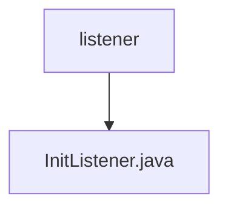

# Basic Information

|      |      |
|------|------|
| Name | listener |
| Language | .java |
| Code Path | WeFe/gateway/src/main/java/com/welab/wefe/gateway/listener |
| Package Name | docs.gateway.src.main.java.com.welab.wefe.gateway.listener |
| Brief Description | InitListener monitors application startup events, initializes storage services, loads various data into the cache, and starts gRPC services and message forwarding tasks. The system exits upon failure. |

# Description

The code defines a Spring component called InitListener, which listens for application startup events. Upon application startup, it performs a series of initialization operations: initializing storage services, loading member information, IP whitelists, received data, pending forwarding metadata, member blacklists, partner configurations, and CA certificates into the cache. It also starts the gRPC service, and the system exits if this fails. Additionally, it launches the message forwarding task. If loading system configurations fails, it forces an exit. All operations log critical statuses.

### Package Internal Structure View

This flowchart illustrates the simple structure of the listener module in the WeFe gateway project. The root node "listener" contains a specific listener implementation file "InitListener.java," indicating that this is an implementation class for an initialization listener. The entire structure clearly reflects the sole file hierarchy within the listener module.

# File List

| Name   | Type  | Description |
|-------|------|-------------|
| [InitListener.java](InitListener.md) | file | The InitListener monitors application startup events, initializes storage services, loads various types of data into the cache, and starts gRPC services and message forwarding tasks. The system exits upon failure. |

