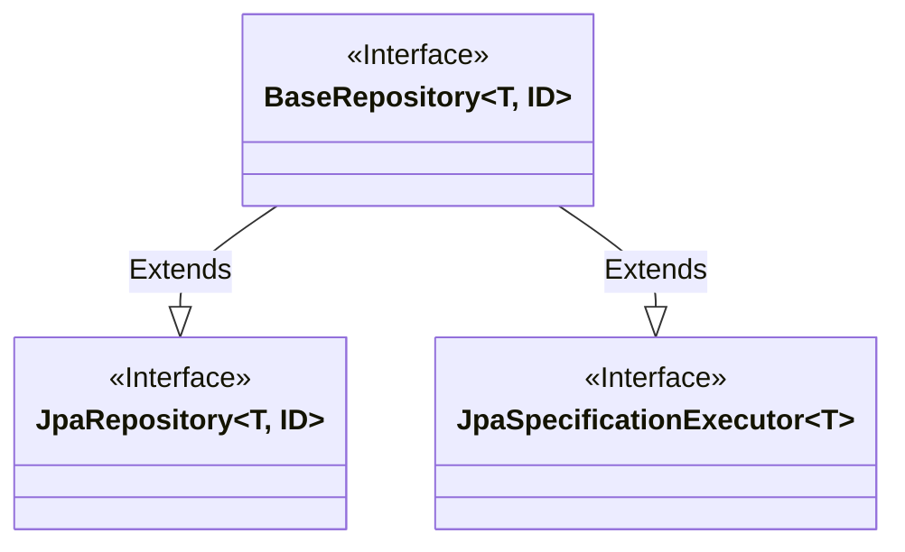
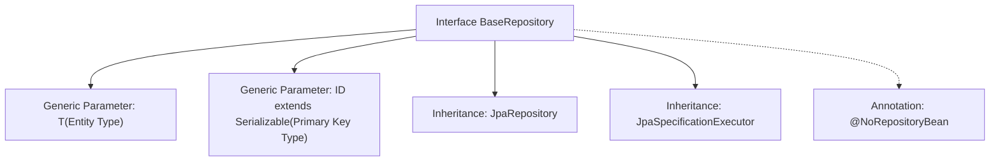

# Basic Information

|      |      |
|------|------|
| Name | BaseRepository |
| Language | .java |
| Code Path | WeFe/gateway/src/main/java/com/welab/wefe/gateway/repository/BaseRepository.java |
| Package Name | com.welab.wefe.gateway.repository |
| Dependencies | ['org.springframework.data.jpa.repository.JpaRepository', 'org.springframework.data.jpa.repository.JpaSpecificationExecutor', 'org.springframework.data.repository.NoRepositoryBean', 'java.io.Serializable'] |
| Brief Description | This is a basic Spring Data JPA repository interface that extends both JpaRepository and JpaSpecificationExecutor, supporting generic entity type T and serializable ID type ID, annotated to prevent the generation of an actual repository Bean. |

# Description

The content defines a Java interface named BaseRepository, annotated with @NoRepositoryBean to indicate it should not be instantiated as a Spring Data repository. This interface extends two core Spring Data JPA interfaces, JpaRepository and JpaSpecificationExecutor, providing basic CRUD operations and dynamic query capabilities. Designed with generics, T represents the entity type and ID represents the serializable primary key type, making it adaptable to various entity classes. This base interface typically serves as a parent interface for other concrete repository interfaces, unifying common operations.

# Class Summary

| Name   | Type  | Description |
|-------|------|-------------|
| BaseRepository | interface | This is a basic Spring Data JPA repository interface that extends both JpaRepository and JpaSpecificationExecutor, supporting generic entity types and IDs, and marked to not generate concrete implementations. |

## Class BaseRepository

|      |      |
|------|------|
| Access Modifier | @NoRepositoryBean;public |
| Type | interface |
| Name | BaseRepository |
| Description | This is a basic Spring Data JPA repository interface that extends both JpaRepository and JpaSpecificationExecutor, supporting generic entity types and IDs, and marked to not generate concrete implementations. |

### UML Class Diagram

This class diagram illustrates the design of a base repository interface in Spring Data JPA. BaseRepository is a generic interface (with type parameters T and ID) that extends both JpaRepository and JpaSpecificationExecutor, two core interfaces. The @NoRepositoryBean annotation indicates that this interface should not be instantiated directly but serves as a parent interface for other concrete repository interfaces, providing common JPA operations and dynamic query capabilities. This design pattern achieves multiple interface inheritance, unifying the specification for basic CRUD and complex query operations.

### Internal Method Call Graph

This flowchart illustrates the structural design of the BaseRepository interface in Spring Data JPA. As a foundational repository interface, it supports arbitrary entity types and serializable primary keys through generic parameters T and ID, while inheriting CRUD functionality from JpaRepository and integrating dynamic query capabilities via JpaSpecificationExecutor. The @NoRepositoryBean annotation indicates this interface serves solely as a parent for other concrete repository interfaces and will not be instantiated as a Bean. This design pattern is commonly used to build extensible persistence layer architectures.

### Field List

| Name  | Type  | Description |
|-------|-------|------|

### Method List

| Name  | Type  | Description |
|-------|-------|------|

