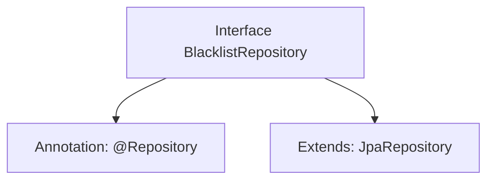

# Basic Information

|      |      |
|------|------|
| Name | BlacklistRepository |
| Language | .java |
| Code Path | WeFe/gateway/src/main/java/com/welab/wefe/gateway/repository/BlacklistRepository.java |
| Package Name | com.welab.wefe.gateway.repository |
| Dependencies | ['com.welab.wefe.gateway.entity.BlacklistEntity', 'org.springframework.data.jpa.repository.JpaRepository', 'org.springframework.stereotype.Repository'] |
| Brief Description | Blacklist repository interface, extends JPA repository, operates on the Blacklist entity with primary key type as String. |

# Description

The content defines a Spring Data JPA repository interface named `BlacklistRepository`. This interface is annotated with `@Repository`, indicating it is a Spring-managed persistence layer component. It extends the generic `JpaRepository` interface, specifying the entity type as `BlacklistEntity` and the primary key type as `String`. By inheriting from `JpaRepository`, this interface automatically acquires basic CRUD operations and pagination query capabilities without requiring manual implementation of these methods. This design adheres to the Spring Data JPA specification, enabling data access functionality through interface declarations alone.

# Class Summary

| Name   | Type  | Description |
|-------|------|-------------|
| BlacklistRepository | interface | Blacklist repository interface, extends JPA repository, operates on the Blacklist entity class with string-type primary key. |


## Class BlacklistRepository

|      |      |
|------|------|
| Access Modifier | @Repository;public |
| Type | interface |
| Name | BlacklistRepository |
| Description | Blacklist repository interface, extends JPA repository, operates on the Blacklist entity class with string-type primary key. |


### UML Class Diagram

```mermaid
classDiagram
    class BlacklistRepository {
        <<Interface>>
    }
    class JpaRepository~T, ID~ {
        <<Interface>>
    }
    BlacklistRepository --|> JpaRepository : Extends
    // The BlacklistRepository interface inherits from the generic JpaRepository interface
    // Generic parameter T is BlacklistEntity, and ID is of type String
```

This class diagram illustrates the inheritance relationship of repository interfaces in Spring Data JPA. As a data access interface, BlacklistRepository inherits basic CRUD operation capabilities by extending JpaRepository<BlacklistEntity, String>, where the generic parameters specify the entity type as BlacklistEntity and the primary key type as String. This design adheres to Spring Data's Repository pattern, automatically implementing persistence operations through interface inheritance and reducing the need for boilerplate code.


### Internal Method Call Graph



This flowchart illustrates the definition structure of a Repository interface in Spring Data JPA. The BlacklistRepository is marked as a Spring-managed repository component via the @Repository annotation and inherits basic CRUD operation capabilities by extending the JpaRepository interface, with generic parameters specifying the entity type as BlacklistEntity and the primary key type as String. This design pattern adheres to Spring Data's "convention over configuration" principle, automatically generating database operation logic without requiring method implementation.

### Field List

| Name  | Type  | Description |
|-------|-------|------|

### Method List

| Name  | Type  | Description |
|-------|-------|------|


