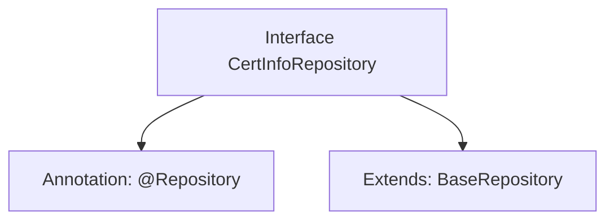

# Basic Information

|      |      |
|------|------|
| Name | CertInfoRepository |
| Language | .java |
| Code Path | WeFe/gateway/src/main/java/com/welab/wefe/gateway/repository/CertInfoRepository.java |
| Package Name | com.welab.wefe.gateway.repository |
| Dependencies | ['com.welab.wefe.gateway.entity.CertInfoEntity', 'org.springframework.stereotype.Repository'] |
| Brief Description | This is a Spring Data JPA repository interface that extends the base repository class, used for operating on the CertInfoEntity entity class with a primary key type of String. |

# Description

This is a Spring Data repository interface named CertInfoRepository, annotated with @Repository. It extends the generic base class BaseRepository, specifying CertInfoEntity as the entity type and String as the primary key type. This interface is primarily used for database operations on the CertInfoEntity entity, inheriting common CRUD methods provided by the base class.

# Class Summary

| Name   | Type  | Description |
|-------|------|-------------|
| CertInfoRepository | interface | This is a Spring repository interface that extends the base repository class, used for operating on the certificate information entity class. |


## Class CertInfoRepository

|      |      |
|------|------|
| Access Modifier | @Repository;public |
| Type | interface |
| Name | CertInfoRepository |
| Description | This is a Spring repository interface that extends the base repository class, used for operating on the certificate information entity class. |


### UML Class Diagram

```mermaid
classDiagram
    class CertInfoRepository {
        <<Interface>>
    }
    class BaseRepository~T, ID~ {
        <<Interface>>
    }
    
    CertInfoRepository --|> BaseRepository : Extends
    // BaseRepository is a generic interface, CertInfoRepository inherits it and specifies CertInfoEntity and String as type parameters
```

This class diagram illustrates the inheritance relationship between repository interfaces in Spring Data JPA. CertInfoRepository is an interface marked with @Repository, which extends the generic interface BaseRepository, specifying CertInfoEntity as the entity type and String as the ID type. This design adheres to Spring Data's repository pattern, automatically acquiring CRUD operation capabilities through inheritance of the base interface while maintaining type safety. The diagram clearly demonstrates the generic specialization and hierarchical relationship between the interfaces.


### Internal Method Call Graph



This flowchart illustrates the structure of the CertInfoRepository interface, which is a Spring Data repository interface annotated with @Repository and extends the generic base class BaseRepository. The BaseRepository specifies the entity type CertInfoEntity and the primary key type String, indicating that this interface is used to manipulate data of type CertInfoEntity, identified by a String-type primary key. This design adheres to the Spring Data JPA specification, simplifying the implementation of the database access layer.

### Field List

| Name  | Type  | Description |
|-------|-------|------|

### Method List

| Name  | Type  | Description |
|-------|-------|------|


