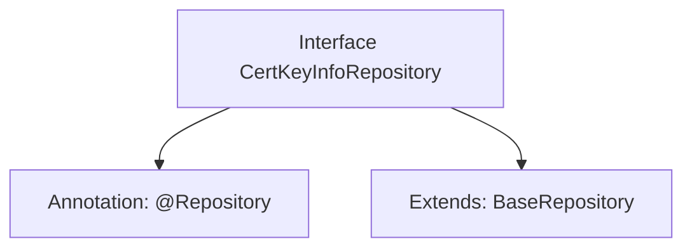

# Basic Information

|      |      |
|------|------|
| Name | CertKeyInfoRepository |
| Language | .java |
| Code Path | WeFe/gateway/src/main/java/com/welab/wefe/gateway/repository/CertKeyInfoRepository.java |
| Package Name | com.welab.wefe.gateway.repository |
| Dependencies | ['com.welab.wefe.gateway.entity.CertKeyInfoEntity', 'org.springframework.data.jpa.repository.JpaRepository', 'org.springframework.stereotype.Repository'] |
| Brief Description | This is a Spring repository interface that extends the base repository class, used for managing certificate key information entities. |

# Description

The content defines a Spring Data repository interface named `CertKeyInfoRepository`, which extends the `BaseRepository` base class. This interface is annotated with `@Repository` to identify it as a Spring-managed repository component, with generic parameters specifying the entity type as `CertKeyInfoEntity` and the primary key type as `String`. The interface does not define any additional methods, inheriting only the basic CRUD operations from the base class.

# Class Summary

| Name   | Type  | Description |
|-------|------|-------------|
| CertKeyInfoRepository | interface | The interface CertKeyInfoRepository extends BaseRepository and is used to operate on the CertKeyInfoEntity entity class, with the primary key type being String. |


## Class CertKeyInfoRepository

|      |      |
|------|------|
| Access Modifier | @Repository;public |
| Type | interface |
| Name | CertKeyInfoRepository |
| Description | The interface CertKeyInfoRepository extends BaseRepository and is used to operate on the CertKeyInfoEntity entity class, with the primary key type being String. |


### UML Class Diagram

```mermaid
classDiagram
    class CertKeyInfoRepository {
        <<Interface>>
    }
    class BaseRepository~T, ID~ {
        <<Interface>>
    }
    CertKeyInfoRepository --|> BaseRepository : extends
    // CertKeyInfoRepository is a Spring Data JPA repository interface, inheriting from the generic BaseRepository
    // Generic parameter T represents the CertKeyInfoEntity entity class, and ID represents the primary key type String
```

This class diagram illustrates a Spring Data JPA repository interface CertKeyInfoRepository, which extends the generic base interface BaseRepository. BaseRepository employs two generic parameters: T denotes the entity type (here CertKeyInfoEntity), and ID represents the primary key type (here String). Through inheritance, CertKeyInfoRepository acquires basic CRUD operation methods while maintaining type-safe operation capabilities for specific entity types.


### Internal Method Call Graph



This flowchart illustrates the structure of a typical Repository interface definition in Spring Data JPA. The CertKeyInfoRepository interface is marked as a data access component with the @Repository annotation and inherits the BaseRepository interface to obtain basic CRUD operation capabilities. The generic parameters indicate that this Repository manages objects of type CertKeyInfoEntity, with the primary key type being String. This design follows Spring Data's Repository pattern, where database operation implementations are automatically obtained through interface inheritance.

### Field List

| Name  | Type  | Description |
|-------|-------|------|

### Method List

| Name  | Type  | Description |
|-------|-------|------|


