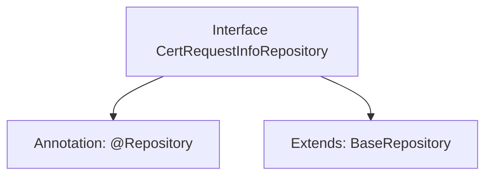

# Basic Information

|      |      |
|------|------|
| Name | CertRequestInfoRepository |
| Language | .java |
| Code Path | WeFe/gateway/src/main/java/com/welab/wefe/gateway/repository/CertRequestInfoRepository.java |
| Package Name | com.welab.wefe.gateway.repository |
| Dependencies | ['com.welab.wefe.gateway.entity.CertRequestInfoEntity', 'org.springframework.data.jpa.repository.JpaRepository', 'org.springframework.stereotype.Repository'] |
| Brief Description | The interface CertRequestInfoRepository extends BaseRepository and is used to operate the CertRequestInfoEntity entity class, with the primary key type being String. |

# Description

The content defines a Spring Data repository interface named `CertRequestInfoRepository`, marked as a persistence layer component with the `@Repository` annotation. This interface extends the generic base class `BaseRepository`, specifying the entity type as `CertRequestInfoEntity` and the primary key type as `String`. Its functionality is to provide basic CRUD operation support for the `CertRequestInfoEntity` entity without requiring manual method implementation.

# Class Summary

| Name   | Type  | Description |
|-------|------|-------------|
| CertRequestInfoRepository | interface | The interface CertRequestInfoRepository extends BaseRepository and is used to operate on the CertRequestInfoEntity entity, with the primary key type being String. |


## Class CertRequestInfoRepository

|      |      |
|------|------|
| Access Modifier | @Repository;public |
| Type | interface |
| Name | CertRequestInfoRepository |
| Description | The interface CertRequestInfoRepository extends BaseRepository and is used to operate on the CertRequestInfoEntity entity, with the primary key type being String. |


### UML Class Diagram

```mermaid
classDiagram
    class CertRequestInfoRepository {
        <<Interface>>
    }
    class BaseRepository~T, ID~ {
        <<Interface>>
    }
    CertRequestInfoRepository --|> BaseRepository~CertRequestInfoEntity, String~ // Inheritance
```

This code illustrates a Spring Data JPA repository interface `CertRequestInfoRepository`, which extends the generic interface `BaseRepository`. The class diagram clearly depicts the inheritance relationship, where `BaseRepository` is a generic interface accepting entity type `T` and ID type `ID` as parameters, while `CertRequestInfoRepository` specializes in handling entities of type `CertRequestInfoEntity` with `String` as the primary key. This design adheres to Spring Data's repository pattern, providing fundamental CRUD operations for database interactions.


### Internal Method Call Graph



The flowchart illustrates the structure of the CertRequestInfoRepository interface, which is a Spring Data interface annotated with @Repository and extends the generic BaseRepository class. The diagram clearly shows the interface's annotation marker and inheritance relationship, where BaseRepository specifies CertRequestInfoEntity as the entity type and String as the primary key type. This design is used to implement basic database operation capabilities for certificate request information entities.

### Field List

| Name  | Type  | Description |
|-------|-------|------|

### Method List

| Name  | Type  | Description |
|-------|-------|------|


