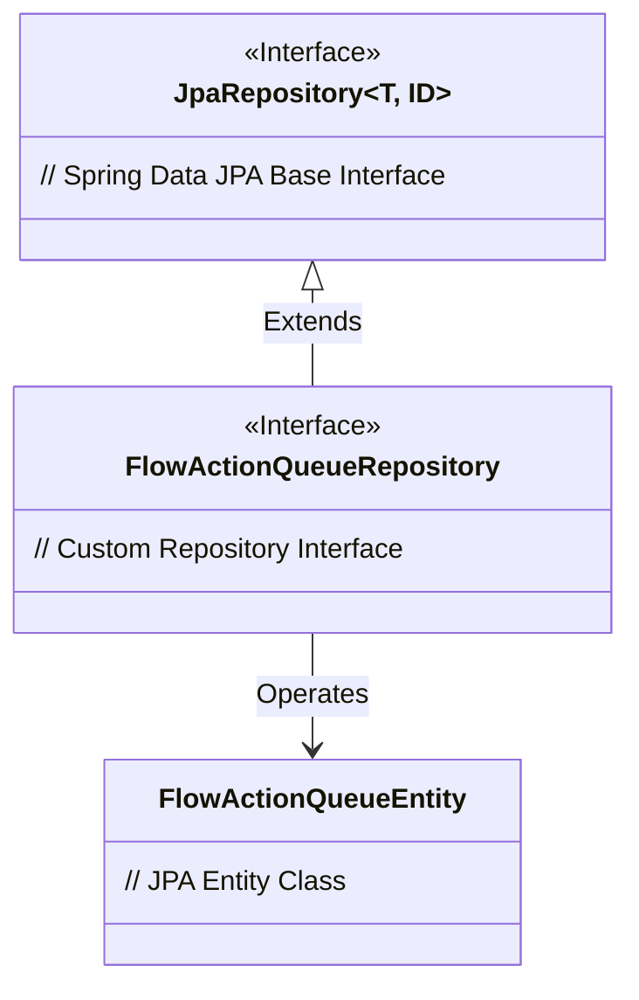
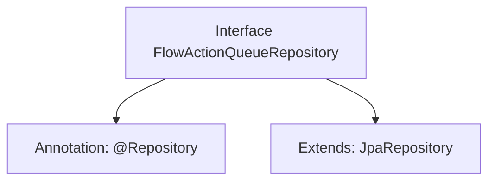

# Basic Information

|      |      |
|------|------|
| Name | FlowActionQueueRepository |
| Language | .java |
| Code Path | WeFe/gateway/src/main/java/com/welab/wefe/gateway/repository/FlowActionQueueRepository.java |
| Package Name | com.welab.wefe.gateway.repository |
| Dependencies | ['com.welab.wefe.gateway.entity.FlowActionQueueEntity', 'org.springframework.data.jpa.repository.JpaRepository', 'org.springframework.stereotype.Repository'] |
| Brief Description | This is a Spring Data JPA repository interface for operating the FlowActionQueueEntity entity, which inherits basic CRUD functionality from JpaRepository. |

# Description

The content defines a Spring Data repository interface named FlowActionQueueRepository, marked with the @Repository annotation. This interface extends the generic JpaRepository interface, specifying the entity type as FlowActionQueueEntity and the primary key type as String. This indicates that the repository is used for persistence operations on data of type FlowActionQueueEntity, supporting basic CRUD functionality.

# Class Summary

| Name   | Type  | Description |
|-------|------|-------------|
| FlowActionQueueRepository | interface | FlowActionQueueRepository is a JPA repository interface for operating on FlowActionQueueEntity with String as the primary key type. |

## Class FlowActionQueueRepository

|      |      |
|------|------|
| Access Modifier | @Repository;public |
| Type | interface |
| Name | FlowActionQueueRepository |
| Description | FlowActionQueueRepository is a JPA repository interface for operating on FlowActionQueueEntity with String as the primary key type. |

### UML Class Diagram

This class diagram illustrates the inheritance relationship of repository interfaces in Spring Data JPA. The FlowActionQueueRepository interface extends the generic JpaRepository interface (with entity type specified as FlowActionQueueEntity and primary key type as String), thereby inheriting basic CRUD operations. The diagram clearly depicts the hierarchical relationship between interfaces (denoted by <|-- for inheritance) and the dependency between the repository and entity class (denoted by --> for association), adhering to JPA design patterns.

### Internal Method Call Graph

This flowchart illustrates the structural relationships of the FlowActionQueueRepository interface. The interface is marked with the @Repository annotation, indicating it is a Spring Data access layer component. Simultaneously, it extends the generic JpaRepository interface, specifying the entity type as FlowActionQueueEntity and the primary key type as String. This design automatically equips the interface with standard JPA CRUD operation methods, eliminating the need for manual implementation of basic database operation logic.

### Field List

| Name  | Type  | Description |
|-------|-------|------|

### Method List

| Name  | Type  | Description |
|-------|-------|------|

