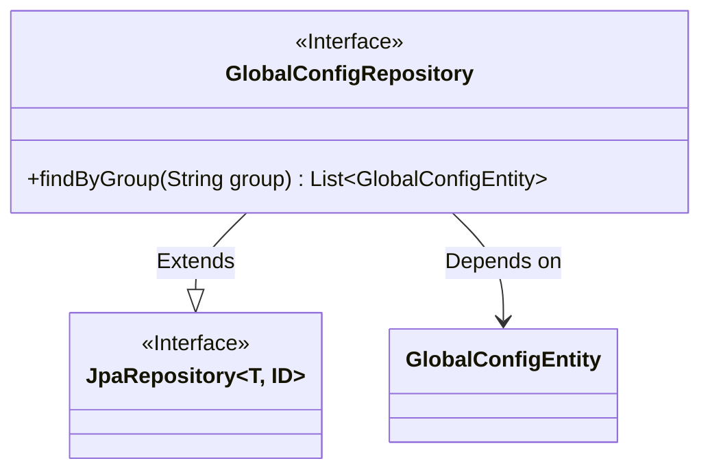
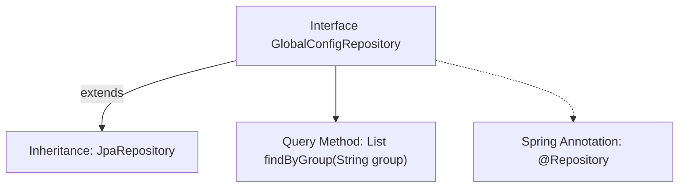

# Basic Information

|      |      |
|------|------|
| Name | GlobalConfigRepository |
| Language | .java |
| Code Path | WeFe/gateway/src/main/java/com/welab/wefe/gateway/repository/GlobalConfigRepository.java |
| Package Name | com.welab.wefe.gateway.repository |
| Dependencies | ['com.welab.wefe.gateway.entity.GlobalConfigEntity', 'org.springframework.data.jpa.repository.JpaRepository', 'org.springframework.stereotype.Repository', 'java.util.List'] |
| Brief Description | The Java interface GlobalConfigRepository extends JpaRepository and is used to manipulate GlobalConfigEntity data, providing query functionality by the group field. |

# Description

This is a Spring Data JPA repository interface named GlobalConfigRepository, which extends JpaRepository for operating on data entities of type GlobalConfigEntity with a primary key type of String. The interface defines a query method findByGroup, which accepts a group parameter to query and return a list of all GlobalConfigEntity records matching that group. The @Repository annotation indicates this is a Spring-managed persistence layer component.

# Class Summary

| Name   | Type  | Description |
|-------|------|-------------|
| GlobalConfigRepository | interface | This is a Spring Data JPA repository interface for operating on GlobalConfigEntity data, containing query methods by group. |

## Class GlobalConfigRepository

|      |      |
|------|------|
| Access Modifier | @Repository;public |
| Type | interface |
| Name | GlobalConfigRepository |
| Description | This is a Spring Data JPA repository interface for operating on GlobalConfigEntity data, containing query methods by group. |

### UML Class Diagram

This class diagram illustrates the repository interface design in Spring Data JPA. The GlobalConfigRepository interface extends the generic JpaRepository interface (parameterized with GlobalConfigEntity and String types) and adds a custom query method findByGroup. This design follows Spring Data's repository pattern, inheriting CRUD capabilities from the base JPA interface while extending specific business queries. The GlobalConfigEntity, as an entity class, is operated by the repository interface, reflecting the relationship between repositories and entities in domain-driven design.

### Internal Method Call Graph

This flowchart illustrates the structure of the GlobalConfigRepository interface in Spring Data JPA. The interface is marked as a Spring component via the @Repository annotation and inherits basic CRUD functionality from JpaRepository. The custom method findByGroup follows JPA naming conventions to implement group-based querying. The entire design embodies Spring Data JPA's "interface-as-implementation" feature, where query logic is automatically generated from method signatures.

### Field List

| Name  | Type  | Description |
|-------|-------|------|

### Method List

| Name  | Type  | Description |
|-------|-------|------|
| findByGroup | List<GlobalConfigEntity> | Query the list of global configuration entities based on grouping. |

